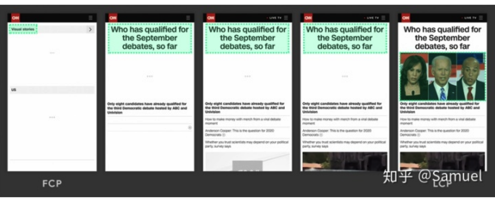
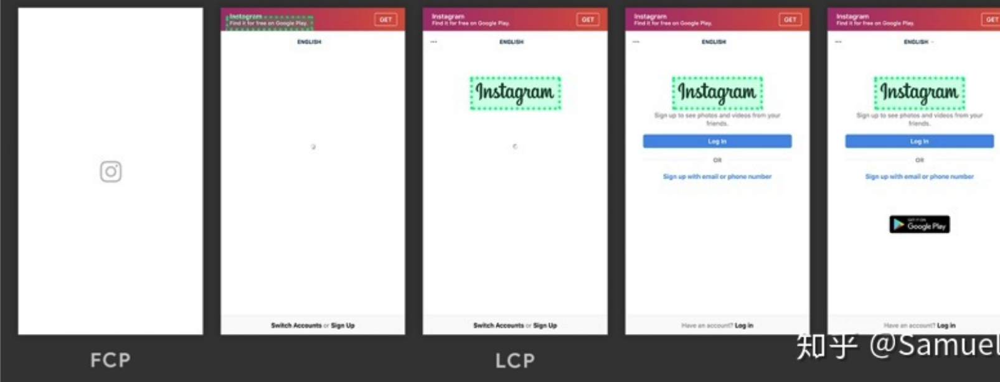
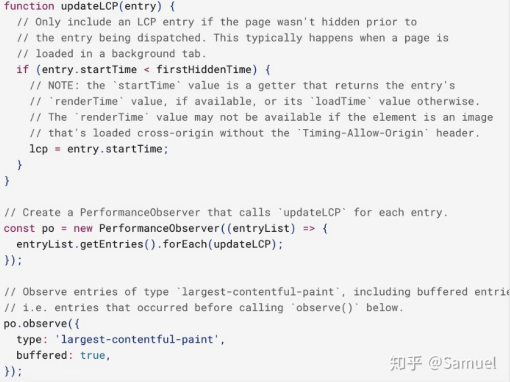

# 性能优化
  
  在过去的翻页设计，常用load和DOMContentLoaded 事件反应页面完成，淡了更精准的获取，得使用FCP指标
但是在SPA的时代，页面常常一开始是先显示一个载入图示，此时，FCP就很难反应页面初次载入直到Web能够提供使用的那个时间点。
FMP和Speed index是两个指标，FMP是页面加载完成的时间，Speed index是页面加载完成的时间和页面加载完成的时间之间的差值。
不过衡量标准过于复杂，不易推广。

WICG上则孵化了一个新的指标LCP，简单清楚地以网页Viewport 最大Element载入为基准点，衡量标准如下图，在2.5秒内载入最大Element为良好的网页载入速度。

其最大指的是实际 Element 长宽大小，Margin / Padding / Border 等 CSS 大小效果不计入。包含的种类 为 , <image>, url(…), <video> 及包含文字节点的 Block 或 Inline Element，未来可能会再加入 <svg> 。

因为网页上的 Element 可能持续加载，最大的 Element 也可能持续改变 (如文字载入完，然后载入图片) ，所以当每一个当下最大的 Element 载完，浏览器会发出一个 PerformanceEntry Metric，直到使用者可以进行 Keydown / Scrolling / Tapping 等操作，Browser才会停止发送 Entry，故只要抓到最后一次 Entry ，即能判断 LCP 的持续时间。

如下图所示，绿色区域是 LCP 不断改变的侦测对象，也能看到 FCP 与 LCP 的判断差异。



下图可以看到一开始的 <svg> 图片并没有被计入 LCP 的侦测对象。



开发者可透过 PerformanceObserver 及设定 Type 'largest-contentful-paint' 拿到 LCP 的时间，如下图所示。(建议使用 Chrome v83 以上版本)



可视元素偏移（CLS） 是指页面加载时的稳定性（也称为"视觉稳定性"）。换句话说：如果页面上的元素随着页面加载而移动，那么CLS就会变高，这是不好的。相反，你应该希望页面元素在加载时相当稳定。这样，当页面完全加载时，用户不必重新学习链接，图像和字段的位置，或者错误地点击某些内容。下面是一些可以执行的简单操作，能一定程度地减少 CLS。1.对任何媒体（视频、图片、GIF、信息图表等）使用设置大小属性维度：这样，用户的浏览器就可以确切地知道该元素将在该页面上占用多少空间。2.确保广告元素具有预留空间：否则，它们可能会突然出现在页面上，将内容向下，向上或向一侧推送。3.在首屏下方添加新的 UI 元素：这样，他们就不会将用户"期望"的内容向下推送。

## 指标

TTFB 第一个字节的时间 从点击链接到收到第一个字节内容的时间

FP 第一次绘制， 用户第一次看到任何像素内容的时间 白屏时间

FCP 第一次内容绘制  用户看到第一次有效内容的时间 首屏时间

Core Web Vitals 三大指标：

* Largest Contentful Paint (LCP): 衡量加载性能。为了提供一个好的用户体验，LCP应该在2.5秒内。
* First Input Delay (FID): 衡量可交互性。为了提供一个好的用户体验，FID应该在100毫秒内。
* Cumulative Layout Shift (CLS): 衡量视觉稳定性。为了提供一个好的用户体验，CLS应该小于0.1。


## 常见计算方式

1. 白屏时间计算

在head 标签开始加一段脚本，用于记录白屏开始时间，在head标签结束之前，加一段脚本，用于计算白屏时间，有些浏览器可以调用performance api 得出白屏结束时间，有些不支持，因此，计算方式分两种：

首屏时间计算：

对于交互少的： 由于区别不大，所以自由选择
对于大型复杂页面： 需处理更多复杂的元素，白屏时间和首屏时间相隔比较远，这时候计算白屏时间更有用
白屏时间是小于首屏时间的

performance 直接拿不到首屏时间

DOMContentLoaded 的值只能表示空白页（当前页面 body 标签里面没有内容）加载花费的时间

浏览器需要先加载 JS , 然后再通过 JS 来渲染页面内容，这个时候单页面类型首屏才算渲染完成

常见计算方式：

用户自定义打点：

MutationObserver接口

```javascript
function mountObserver () {
    if (!window.MutationObserver) {
      // 不支持 MutationObserver 的话
      console.warn('MutationObserver 不支持，首屏时间无法被采集');
      return;
    }
    
    // 每次 dom 结构改变时，都会调用里面定义的函数
    const observer = new window.MutationObserver(() => {
      const time = getTimestamp() - this.startTime; // 当前时间 - 性能开始计算时间
      
      const body = document.querySelector('body');
      let score = 0;
      
      if (body) {
        score = traverseEl(body, 1, false);
        this.observerData.push({ score, time });
      } else {
        this.observerData.push({ score: 0, time });
      }
    });
    
    // 设置观察目标，接受两个参数: target：观察目标，options：通过对象成员来设置观察选项
    // 设为 childList: true, subtree: true 表示用来监听 DOM 节点插入、删除和修改时
    observer.observe(document, { childList: true, subtree: true });
    
    this.observer = observer;
 
   
    if (document.readyState === 'complete') {
      // MutationObserver监听的最大时间，10秒，超过 10 秒将强制结束
      this.unmountObserver(10000);
    } else {
      win.addEventListener(
        'load',
        () => {
          this.unmountObserver(10000);
        },
        false
      );
    }
  }

```

lighthouse 中 我们可以得到fcp值， fcp 首次有效绘制 表示页面的主要内容开始出现在屏幕上的时间点，它是我们测量用户加载体验的主要指标。我们可以认为fcp的值就是首屏时间。

* 如果页面首屏有图片

首屏时间 = 首屏图片全部加载完毕的时刻 - window.performance.timing.navigationStart

* 如果页面首屏没有图片

首屏时间 = 页面处于稳定状态前最后一次 dom 变化的时刻 - window.performance.timing.navigationStart

FCP（First ContentFull Paint）：白屏时间（第一个文本绘制时间）

Speed Index：首屏时间

TTI（Time To Interactive）: 第一次可交互的时间

lighthouse Score（performance）：Chrome浏览器审查工具性能评分（也可以npm install -g lighthouse，编程式调用）

构建时压缩图片

排查并移除冗余依赖、静态资源

prefetch preloaded

cdn加速

gzip压缩传输

开启http2.0

白屏时间的loading动画

1. 客户端主文档/Assets 缓存
在客户端内， 利用端侧提供的静态资源缓存能力， 将HTML和基础公共的JS 等资源，推送下发至用户侧客户端缓存。 当客户端的webView 请求资源时， 端侧可根据规则来匹配已下发的缓存包， 在匹配成功后直接从本地缓存中读取对应的HTML 和 JS 资源， 而无需请求网络，大大缩短了页面的初始化时间。

2. 数据预加载
