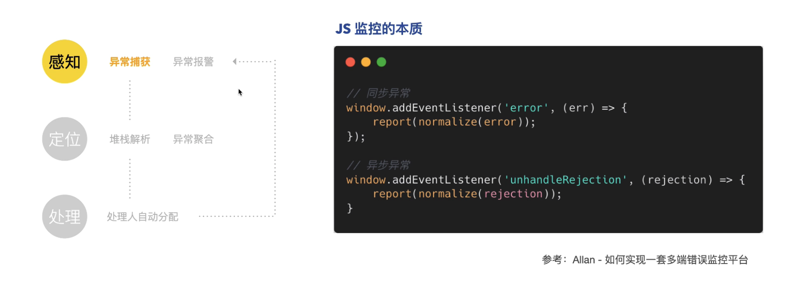
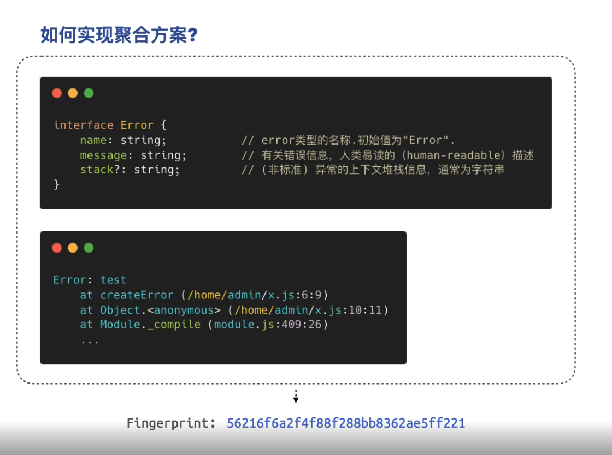
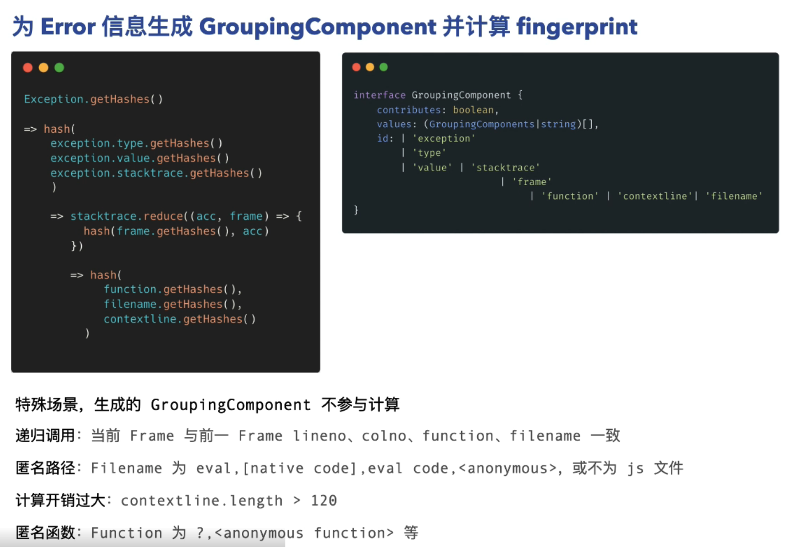
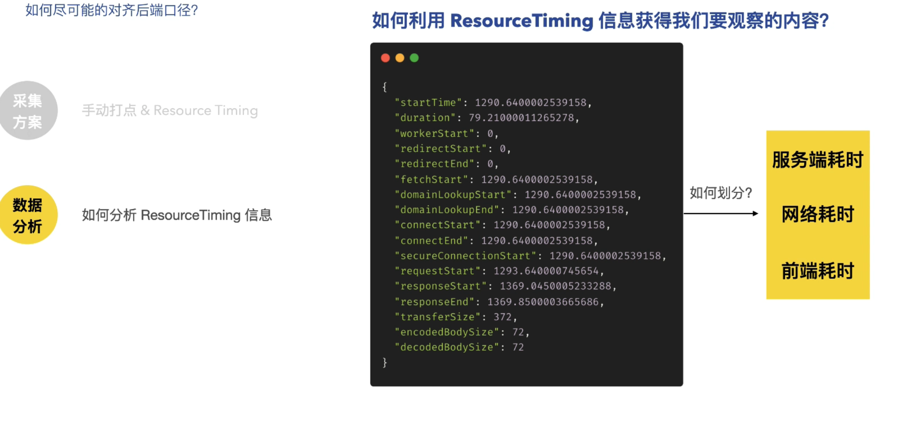
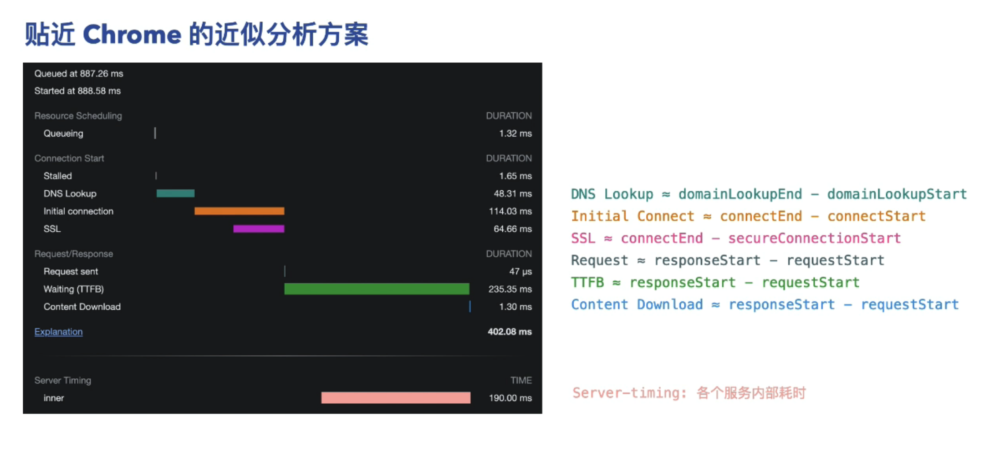
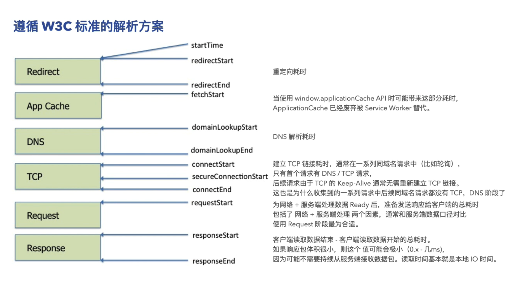
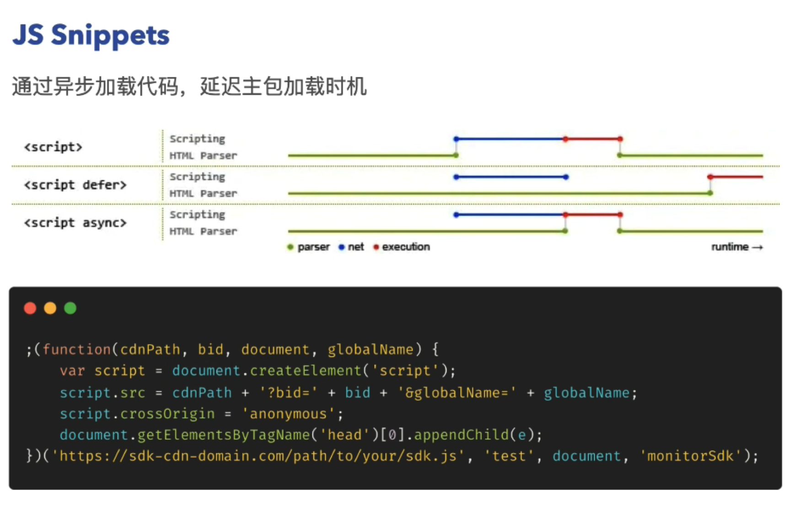
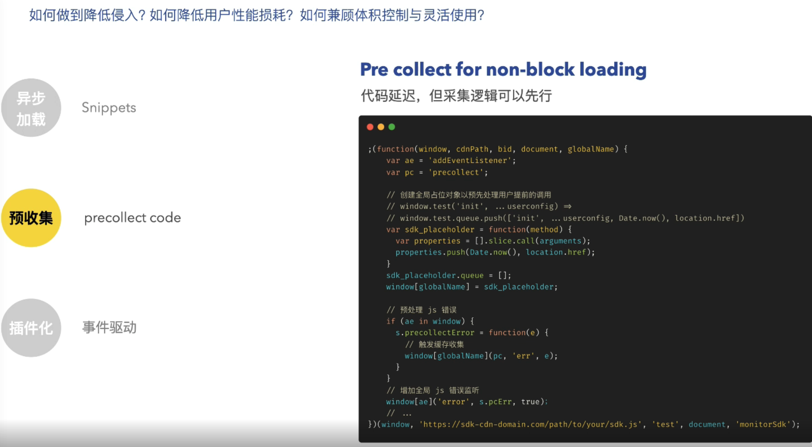
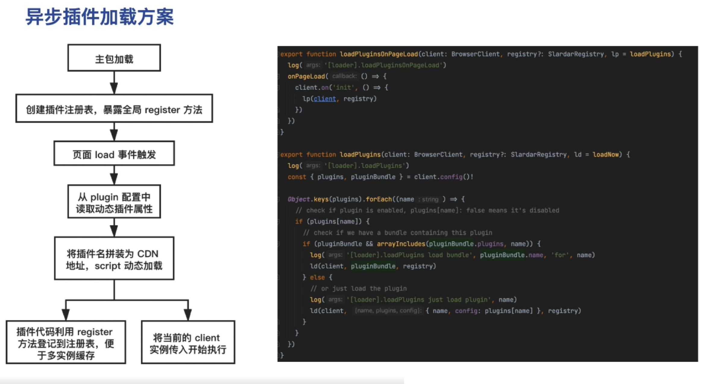

# 张皓洋：字节前端监控实践

在监控什么内容：

1. 性能监控 （包括页面加载耗时、接口耗时等各项数据统计）
2. 用户行为监控 （常见的 pv、uv、用户操作行为）

## 方式

- 数据的采集（埋点与收集）
- 数据上报与监控

## JS 异常监控

// 同步
window.addEventListener('error', function (e) {
console.log(e);
});
// 异步
window.addEventListener('unhandleRejection', function (e) {
console.log(e);
});

对 sourceMap 的进行反编译

通过 issue Grouping 聚合提交

注意落地：

1. 线上报错项目对应的源代码仓库元信息 2.线上报错代码的发生版本 3.线上报错版本的关联的起止信息

## 性能监控 性能指标

一. 指标采集： Web Vitals & Navigation Timings

二. 关联用户行为

1.采集交互事件，触发全局 action_id 记录
通过 addEventListen 记录下
2.Mutation Observer 观察 DOM，观察后续请求，静态资源加载，longtask 等数据
3.100ms 内若没有新的变更产生，则结算上报，若持续时长超过 10s，强制结算上报

三：单页面视角的性能度量

## 请求/静态资源监控

采集方案：
手动打点：
使用场景：请求耗时兜底、请求状态、请求响应相关信息
监控方式： hook XMLHttpRequest.prototype Hook fetch -> wrappedFetch
优势： 兼容性佳、采集方便
ResourceTiming：
使用场景：精确的请求耗时、静态资源耗时、分阶段观测数据
监控方式：performance.getEntriesByType('resource') PerformanceObserver.observe(type)
优势: 更精准，可以避开额外的事件队列处理耗时

## SDK 设计

### 异步加载

js nipper 异步加载 运用了 async

### 预收集

### 事件驱动

1.按需加载，不使用的代码就不拉取 2.高扩展性，允许开发自己的采集逻辑 3.降低多端开发成本

异步加载

