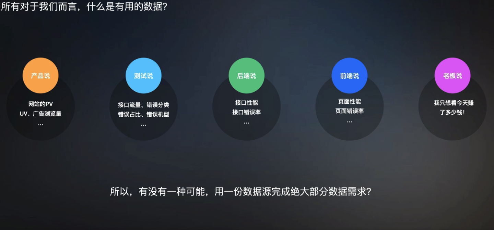
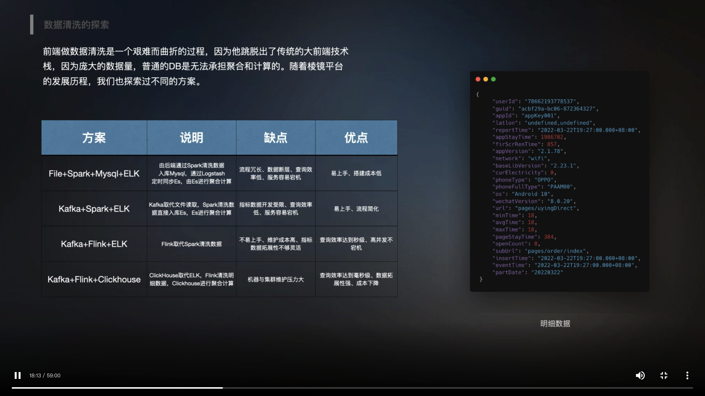
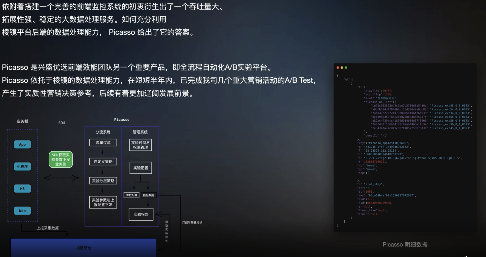

# 李港：大前端-从无到有搭建自研前端监控系统

1. 搭建一个前端监控系统需要几步

数据埋点：前端sdk埋点，精准捕获性能数据和异常数据
存储与分析：TB级数据清洗，实时入库存储
前端可视化：前端数据可视化，提供数据分析图形和报表
实时报警：设置报警规则和报警阙值，及时通知开发者

前端采集： 性能 错误 点击 停留 用户行为

要想做线上监控，分两个部分：数据采集；数据展现。数据采集部分，同样需要发布平台或者开发工具来配合，对性能数据来说，Performance API 非常好用，它是浏览器记录的性能数据，一般来说，我们用统一的代码把它上传到服务器端就够用了。

数据的展现部分就比较自由了，可以用不同的数据可视化方案来展现性能数据，没有一定之规。一般的数据监控平台，会提供报警机制，对性能来说，报警需求不是特别强烈，但是也可以设置一些条件，针对秒开率特别低的网页报警。
