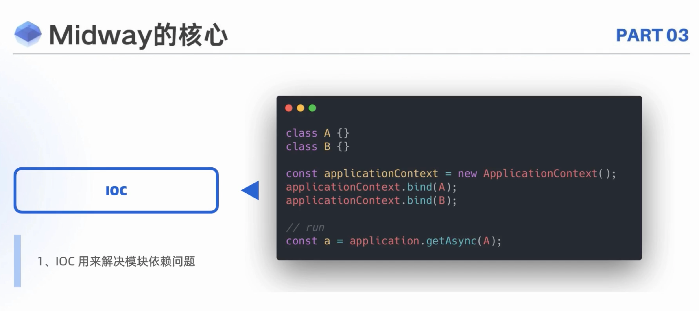
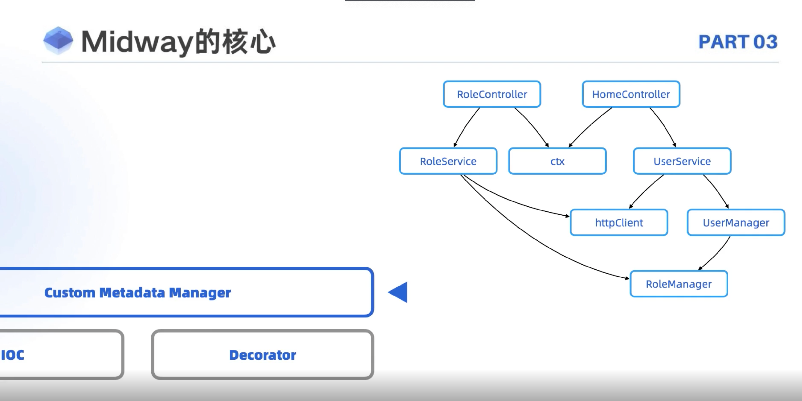

## 行业的变化

## 语言的变化

## 框架的变化

```js
第一步: 服务端拼接html
   当用户请求某个页面的时候, server端会拼接好一个页面的html结构返回给客户端, 例如下面的结构:

第二步: 客户端加载好的html展示出来了
    上面的代码可以看出, html结构加载完就可以展示出来了, 但是比如点击事假, 这类交互事件还是没有的, 需要加载/_ssr/2046328.js后页面才能有交互(活起来), 所以我们还是要请求一堆js文件到本地。

第三步: js执行hydration阶段完毕才可交互
    hydration字面意思类似'注水', 也就是通过js代码的执行, 动态的为当前页面上的dom绑定事件, 你可把当前获取到的html代码当做一根干货海参, js代码理解成水, 而hydration过程就是用水把海参泡发, 达到可以食用的状态, 也就是页面可正常交互的状态。


  看完上述ssr的流程后你有什么感觉? 有没有感觉ssr可能是个"视觉骗子", 我们简单罗列几个可优化的点:

虽然首屏展示的速度快了, 但是不可交互, 所以他的tti(页面可交互时间)并没有太大的优化, 但不可否认也是有提升的只是不太多。
下载的js仍然是比较全量的js代码。
js代码执行的时候, 仍然需要处理大量的逻辑, 还要重新处理一遍页面上的dom。


Qwik.js;
```




## 工具的变化

## 私仓部署核心命令

1. 配置文件地址～/.config/verdaccio/config.yaml
2. 底部 listen: 0.0.0.0:4873 阿里云端口
3. verdaccio 或者 pm2 start verdaccio 进行测试
4. 仓库文件地址～/.local/share/verdaccio/storage
5. 页面配置http://verdaccio.org/zh-CN/docs/webui/
