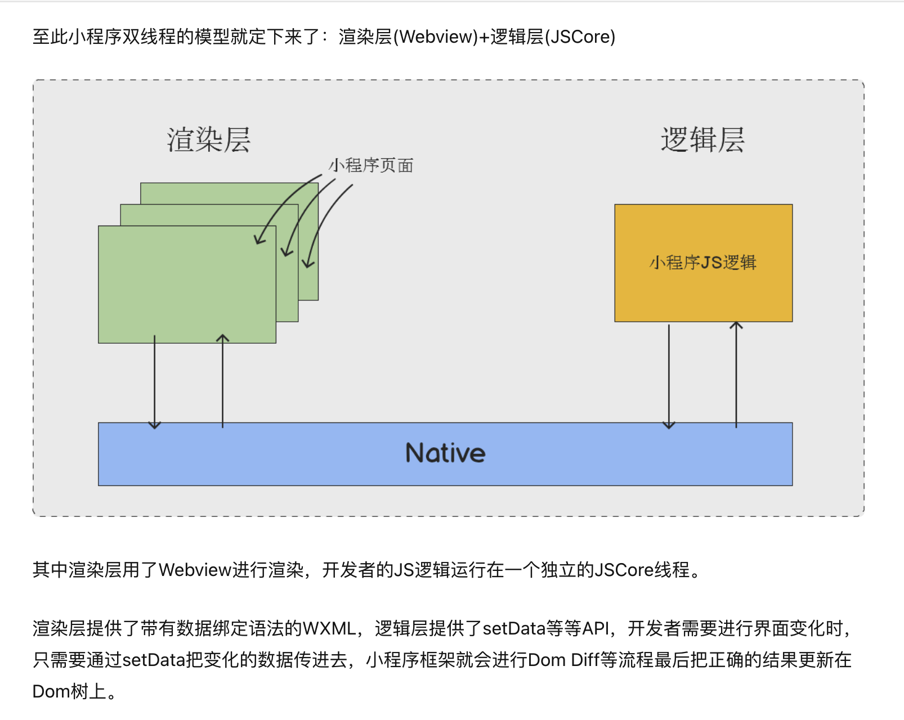

# 小程序内部实现原理

## 小程序的由来

在小程序没有出来之前，最初微信WebView逐渐成为移动web重要入口，微信发布了一整套网页开发工具包，称之为 JS-SDK. 给 web 开发者能够使用到微信的原生能力.

小程序的架构设计

1. 纯客户端原生技术渲染(与客户端同版本)
2. 纯web 技术渲染(单线程)
3. 介于客户端技术和 web 技术之间(Hybrid 技术)

## 多线程通信

为什么要多线程通信

* 小程序不希望开发者能直接操作 DOM, 因为有些涉及用户隐私的数据, 小程序只希望展示给用户看, 不希望开发者能够获取.
* 需要限制一些 API 的调用, 直接把 JavaScript 执行的逻辑层放到沙盒,一个纯 JavaScript 的执行环境, 没有浏览器的概念, 这样就没有 DOM 相关的 API, 那也得有页面,所以渲染层就单独开了一个线程.

缺点

  1. 对于开发小程序的微信工程师,逻辑层和渲染层两个线程之间的通信.
  2. 通信会有延迟,数据量少的话,还在可接受范围
  3. 很多 API 都是异步的,需要改变编写习惯,把有前后逻辑关系的写在异步回调里. 因为逻辑层和渲染层不是同一个线程, 通信有延迟

规避了 xss 攻击,微信在逻辑层给渲染层数据的时候先把数据过滤一遍.

但由于小程序是多 WebView 的架构，所以每一个页面都是不同的 WebView 渲染显示，所以单独创建了一个线程去执行 JS，也就是逻辑层，而界面渲染的任务都在 WebView 线程里执行（渲染层）。即双线程模型。


逻辑层：创建一个单独的线程去执行 JavaScript，在这里执行的都是有关小程序业务逻辑的代码，负责逻辑处理、数据请求、接口调用等

视图层：界面渲染相关的任务全都在 WebView 线程里执行，通过逻辑层代码去控制渲染哪些界面。一个小程序存在多个界面，所以视图层存在多个 WebView 线程

JSBridge 起到架起上层开发与Native（系统层）的桥梁，使得小程序可通过API使用原生的功能，且部分组件为原生组件实现，从而有良好体验


逻辑层和试图层的通信会由 Native （微信客户端）做中转，逻辑层发送网络请求也经由 Native 转发

1. 在渲染层把 WXML 转化成对应的 JS 对象。

2. 在逻辑层发生数据变更的时候，通过宿主环境提供的 setData 方法把数据从逻辑层传递到 Native，再转发到渲染层。

3. 经过对比前后差异，把差异应用在原来的 DOM 树上，更新界面。

我们通过把 WXML 转化为数据，通过 Native 进行转发，来实现逻辑层和渲染层的交互和通信。

而这样一个完整的框架，离不开小程序的基础库。

小程序的基础库可以被注入到视图层和逻辑层运行，主要用于以下几个方面：

* 在视图层，提供各类组件来组建界面的元素
* 在逻辑层，提供各类 API 来处理各种逻辑
* 处理数据绑定、组件系统、事件系统、通信系统等一系列框架逻辑

由于小程序的渲染层和逻辑层是两个线程管理，两个线程各自注入了基础库。

小程序的基础库不会被打包在某个小程序的代码包里边，它会被提前内置在微信客户端。

## Exparser 架构

Exparser是微信小程序的组件组织框架，内置在小程序基础库中，为小程序的各种组件提供基础的支持。小程序内的所有组件，包括内置组件和自定义组件，都由Exparser组织管理。

1. 基于Shadow DOM模型：模型上与WebComponents的ShadowDOM高度相似，但不依赖浏览器的原生支持，也没有其他依赖库；实现时，还针对性地增加了其他API以支持小程序组件编程。
2. 可在纯JS环境中运行：这意味着逻辑层也具有一定的组件树组织能力。
3. 高效轻量：性能表现好，在组件实例极多的环境下表现尤其优异，同时代码尺寸也较小。

关于 UI 层的渲染,有很多实现方式, 比如类似 vnode -> diff 的自定义渲染方式来实现一个简易的小程序框架.

```js
function App (props) {
  const {msg} = props;
  return () => (
    <div class="main">
      {msg}
    </div>
  )
}

render(<App msg="hello world" />)
```

核心就是通过定义@babel/plugin-transform-react-jsx插件来转换 jsx，生成Vnode，再交给Worker通过Diff，最后通过worker postmsg 来通知渲染进程更新：let index = 0;
// 得到diff差异
let diffData = diff(0, index, oldVnode, newVnode);
// 通知渲染进程更新
self.postMessage(JSON.stringify(diffData));

## 参考文章

* [小程序底层实现原理以及一些思考](https://github.com/berwin/Blog/issues/49)

至此小程序双线程的模型就定下来了：渲染层(Webview)+逻辑层(JSCore)



我们在两个线程各自注入了一份基础库，渲染层的基础库含有VD的处理以及底层组件系统的机制，对上层提供一些内置组件，例如video、image等等。逻辑层的基础库主要会提供给上层一些API，例如大家经常用到的wx.login、wx.getSystemInfo等等。

用户在屏幕点击某个按钮，开发者的逻辑层要处理一些事情，然后再通过setData引起界面变化，整个过程需要四次通信。对于一些强交互（例如拖动视频进度条）的场景，这样的处理流程会导致用户的操作很卡。

对于这种强交互的场景，我们引入了原生组件，这样用户和原生组件的交互可以节省两次通信。

原生组件和Webview不是在同一层级进行渲染，原生组件其实是叠在Webview之上，想必大家都遇到过这个问题，video、input、map等等原生组件总是盖在其他组件之上，这就是这个设计带来的问题。
