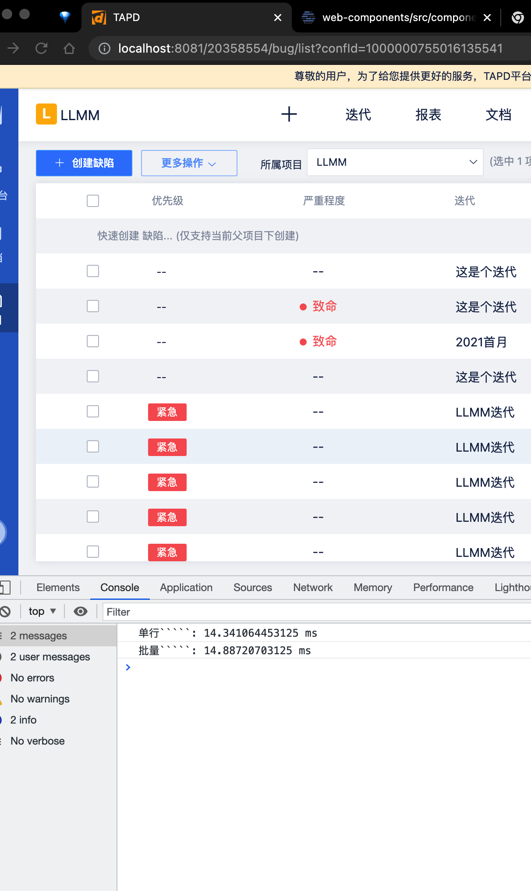

# 性能优化对比

虚拟DOM
Vdom(virtual dom),可以看作是一个使用javascript模拟了DOM结构的树形结构

其中Vnode节点对应真实DOM节点
Vdom树用于缓存真实DOM树的所有信息

为什么要采用虚拟DOM？
一切为了性能。

“直接操作 DOM 性能差”，这是因为 ——

DOM 引擎、JS 引擎相互独立，但又工作在同一线程（主线程），因此JS 代码调用DOM API时必须挂起 JS 引擎、激活 DOM 引擎，完成后再转换到 JS 引擎
引擎间切换的代价会迅速积累
强制重排的DOM API调用，哪怕只改动一个节点，也会引起整个DOM树重排，重新计算布局、重新绘制图像会引起更大的性能消耗
所以，降低引擎切换频率(减少DOM操作次数)、减小 DOM 变更规模才是DOM 性能优化的两个关键点。

虚拟 DOM +diff算法是一种可选的解决方案

基本思路：“在 JS 中缓存必要数据，计算界面更新时的数据差异，只提交最终差集”。

虚拟dom只用于缓存，而
diff算法负责--

计算出‘虚拟dom和目前真实DOM之间的数据差异’
提交最终差集
注意：“单纯VDOM是提高不了性能的，VDOM主要作用在于它的二次抽象提供了一个diff/patch和batch commit(批量提交)的机会”

## 表格性能优化对比

 在已经做分页的场景下，进行的一次优化。

  对于需要修改的长列表的优化大列表两个核心，一个分段一个区分，具体执行分为：仅渲染视窗可见的数据、进行函数节流、 减少驻留的VNode和Vue组件，不使用显示的子组件slot方式，改为手动创建虚拟DOM来切断对象引用。
### 我们先看效果

优化对比

优化前



优化后


### 核心代码

```js
  let memo
  const key = item.id;
  let cached
  if (useMemo) {
    cached = vnodeCache[key];
    if (cached && this.isRowSelectionChanged(item, cached.memo)) {
      return cached;
    }
    memo = cloneDeep(item);
  }
  const ret = (<tr
      key={idx}>
      // 代码
    </tr>);
  if (useMemo && column.length) {
    ret.memo = cloneDeep(memo);
    vnodeCache[key] = ret;
  }
  return ret;
```

 进行前后对比

```js
  isRowSelectionChanged(row, cached){
    const value = isEqual(row, cached);
    return value
  },

```

// 以空间换时间的方式进行优化

```js
export default {
  data: () => ({
      users: {}
  }),
  async created() {
      const users = await axios.get("/api/users");
      this.users = Object.freeze(users);
  }
};
```


## 探索canvas 重新绘制table


