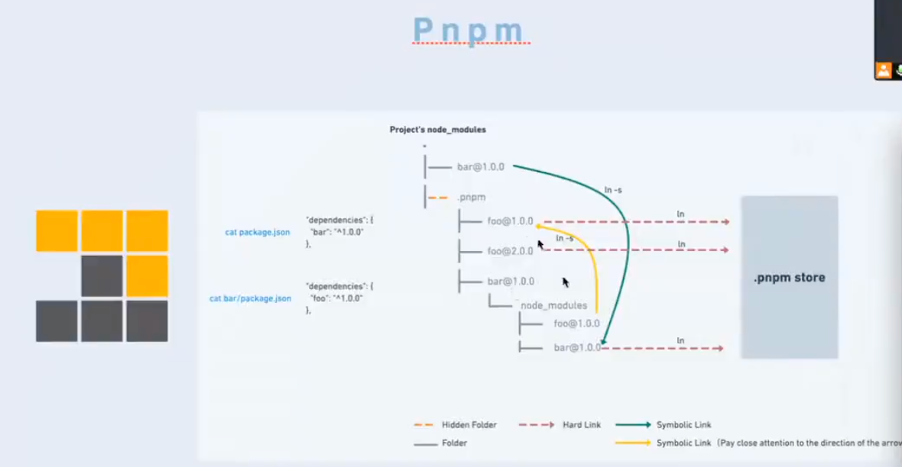
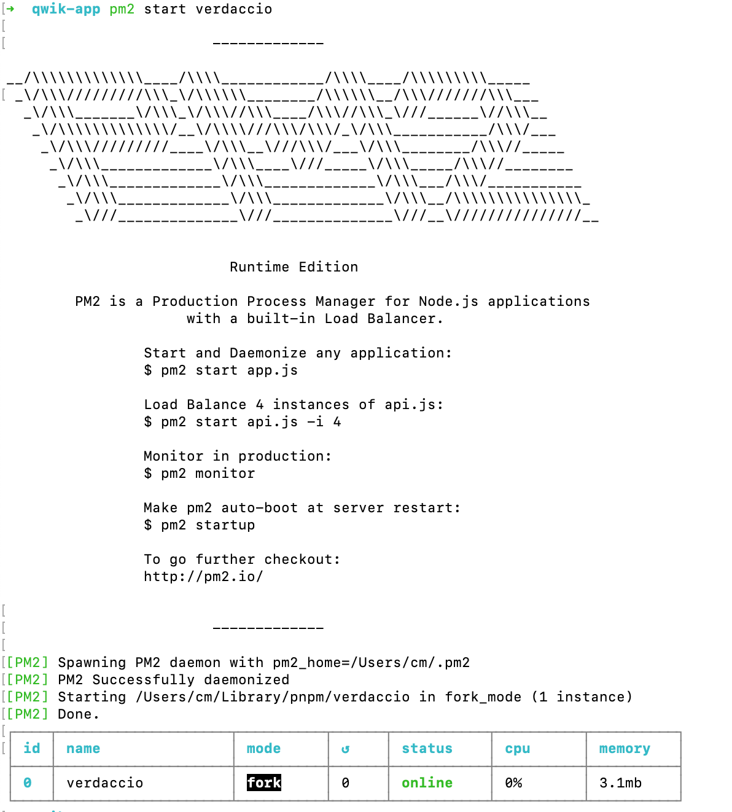
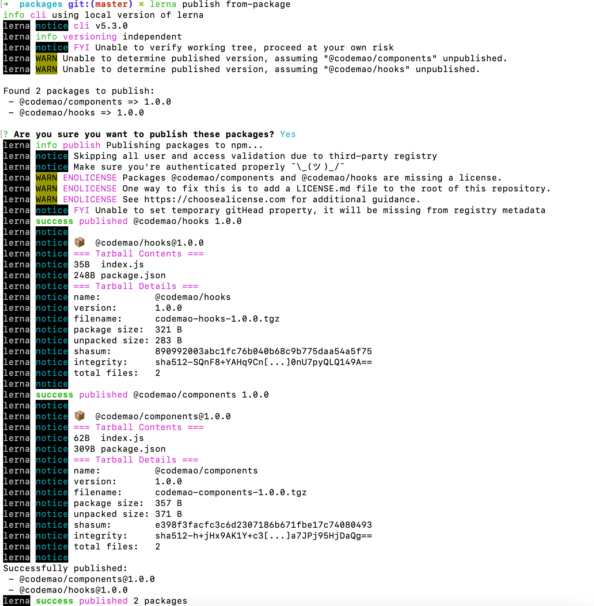

## monorepo 深入浅出

- 使用最近流行的 monorepo 管理方式，响应式，编译和运行时全部独立

- 平台无关渲染逻辑和浏览器渲染 API

## monorepo 和 multirepo

multirepo 将应用按照模块分别在不同的仓库中进行管理

monorepo 将应用中所有的模块一股脑全部放在同一个项目中

## pnpm 和 npm 区别

npm3 以下的版本在安装依赖时非常直接，它会按照包依赖的树形结构将其下载到本地 node_modules 目录中， 也就是说，每个包都会将该包的依赖放到当前包所在的 node_modules 目录中

npm3 采用扁平结构，在安装依赖包时更加智能，会按照 package.json 中声明的顺序依次安装包， 遇到新的包就把它放在第一级 node_modules 目录中。后面在安装进行时，如果遇到一级 node_modules 目录已经存在的包， 就会先判断包版本，如果版本一样则跳过安装，否则会按照 npm2 的方式安装在树形目录结构下。

## pm2 启动命令

准备工作

1. npm install pm2 -g
2. npm install --global verdaccio
3. pm2 start verdaccio
4. verdaccio

启动后

## 私仓部署核心命令

1. 配置文件地址～/.config/verdaccio/config.yaml
2. 底部 listen: 0.0.0.0:4873 阿里云端口
3. verdaccio 或者 pm2 start verdaccio 进行测试
4. 仓库文件地址～/.local/share/verdaccio/storage
5. 页面配置http://verdaccio.org/zh-CN/docs/webui/

## 安装 lerna

1. pnpm install lerna -g

## lerna 初始化

在当前根目录下执行： lerna init --independent

## pnpm 安装项目

pnpm install lerna@5.3.0 -D -w

pnpm dlx lerna init

通过 lerna add @codemao/hooks packages/components

发包 lerna publish from-package

## 删除指定的包

pnpm remove @codemao/hooks --filter @codemao/components

### 更新的工作

lerna publish

### 遇到的坑

lerna publish  主要做了以下几件事：
• 检查从上一个  git tag  之后是否有提交，没有提交就会显示  No changed packages to publish  的信息，然后退出
• 检查依赖了修改过的包的包，并更新依赖信息
• 提交相应版本的  git tag
• 发布修改的包及依赖它们的包

lerna publish --force-publish '\*'

如果 lerna.json 并没有更新，重试一下 lerna publish。
如果已经更新，您可以强制重新发布。lerna publish --force-publish $(ls packages/)
