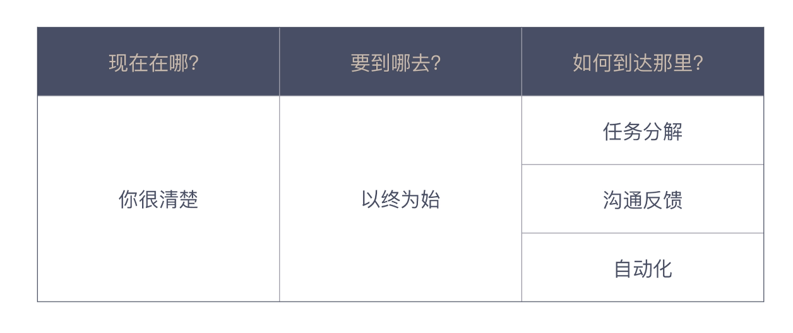

# 10x 程序员工作法

## 程序员解决的问题大部分都是重复的

软件行业里有一本名著叫《人月神话》，其中提到两个非常重要的概念：本质复杂度（Essential Complexity）和偶然复杂度（Accident Complexity）。

简单来说，本质复杂度就是解决一个问题时，无论怎么做都必须要做的事，而偶然复杂度是因为选用的做事方法不当，而导致要多做的事。

大部分程序员忙碌解决的问题，都不是程序问题，而是由偶然复杂度导致的问题。

如何减少偶然复杂度引发的问题，让软件开发工作有序、高效地进行，这正是我希望通过这个专栏帮你解决的问题。

在软件行业中，能够提供工作效率的最佳实践已经有很多了

直觉大多是错误的，最佳实践又多而琐碎，所以在这个专栏中，我会尝试给你提供一个思考框架，帮你在遇到问题时梳理自己真正要做的事情。围绕着这个框架，我还会给你一些原则。

- 以终为始

- 任务分解

- 沟通反馈

- 自动化

## 01 | 10x 程序员是如何思考的？

怎样才能把时间和精力尽可能地放在处理本质复杂度的事情上，减少在偶然复杂度上的消耗。

一个思考框架

我现在是个什么水平？

我想达到一个什么水平？

我将怎样到达那个目标？

其实，这三个问题来自一个思考框架。在给其他公司团队做咨询时，我也经常会运用到它，原来的问题是：

Where are we?（我们现在在哪？）

Where are we going?（我们要到哪儿去？）

How can we get there?（我们如何到达那里？）

这三个问题实际上是帮我们确定：

现状；目标；实现路径。

如果一个人能够清晰地回答出这三个问题，通常意味着他对要做的事有着清晰的认识。这个框架虽然看似简单，但却非常有效，它已经成为我工具箱里一件非常称手的思考工具。

四个思考原则在实际的工作中，这个思考框架会帮助我更好地了解自己的工作。比如，当一个产品经理给我交代一个要开发的功能特性时，我通常会问他这样一些问题：为什么要做这个特性，它会给用户带来怎样的价值？什么样的用户会用到这个特性，他们在什么场景下使用，他们又会怎样使用它？达成这个目的是否有其它手段？是不是一定要开发一个系统？这个特性上线之后，怎么衡量它的有效性？

解释一下，以终为始就是在工作的一开始就确定好自己的目标。我们需要看到的是真正的目标，而不是把别人交代给我们的工作当作目标。你可以看出这个原则是在帮助我们回答思考框架中，

Where are we going?（我们要到哪儿去？）这个问题。任务分解是将大目标拆分成一个一个可行的执行任务，工作分解得越细致，我们便越能更好地掌控工作，它是帮助我们回答思维框架中，

How can we get there?（我们如何到达那里？）的问题。如果说前两个原则是要在动手之前做的分析，那后面两个原则就是在通往目标的道路上，为我们保驾护航，因为在实际工作中，我们少不了与人和机器打交道。沟通反馈是为了疏通与其他人交互的渠道。

一方面，我们保证信息能够传达出去，减少因为理解偏差造成的工作疏漏；另一方面，也要保证我们能够准确接收外部信息，以免因为自我感觉良好，阻碍了进步。

自动化就是将繁琐的工作通过自动化的方式交给机器执行，这是我们程序员本职工作的一部分，我们擅长的是为其他人打造自动化的服务，但自己的工作却应用得不够，这也是我们工作中最值得优化的部分。

怎么把这四个原则用在工作中呢？我们回过头来看一下前面的场景，产品经理把要做的功能特性摆在我面前。站在以终为始的角度，我需要了解真正的目标是什么，所以，我会关心为什么要做这个特性。为了保证目标是有效的，我会关心它给用户带来的价值。有了任务分解的视角，我需要将一个大的目标进行拆解，如果我要达成这个目标，整体解决方案是远远不够的，我需要把任务分解成一个一个小的部分。

所以，我会关心一个一个具体的使用场景。一方面，我会了解到更多的细节，另一方面，当时间紧迫的时候，我会和产品经理来谈谈究竟优先实现哪个场景。为什么要学会沟通反馈？因为我需要明确，自己是否真正理解了产品经理提交的需求。所以，我要不断地问问题，确保自己的理解和产品经理交代的内容一致。

总结时刻

而想要减少偶然复杂度的消耗，就要了解一些高效的工作方式和行业的最佳实践，而这一切是可以用统一的框架进行思考的。运用这个思考框架，我们需要问自己一些问题：

Where are we?（我们现在在哪？）

Where are we going?（我们要到哪儿去？）

How can we get there?（我们如何到达那里？）

为了把这个框架应用在我们程序员的工作中，我给了你四个思考原则：

以终为始，确定好真实目标；

任务分解，找到实施路径；

沟通反馈，解决与人打交道出现的问题；

自动化，解决与机器打交道出现的问题。

# 02 | 以终为始：如何让你的努力不白费？
