# 10x 程序员工作法

## 程序员解决的问题大部分都是重复的

软件行业里有一本名著叫《人月神话》，其中提到两个非常重要的概念：本质复杂度（Essential Complexity）和偶然复杂度（Accident Complexity）。

简单来说，本质复杂度就是解决一个问题时，无论怎么做都必须要做的事，而偶然复杂度是因为选用的做事方法不当，而导致要多做的事。

大部分程序员忙碌解决的问题，都不是程序问题，而是由偶然复杂度导致的问题。

如何减少偶然复杂度引发的问题，让软件开发工作有序、高效地进行，这正是我希望通过这个专栏帮你解决的问题。

在软件行业中，能够提供工作效率的最佳实践已经有很多了

直觉大多是错误的，最佳实践又多而琐碎，所以在这个专栏中，我会尝试给你提供一个思考框架，帮你在遇到问题时梳理自己真正要做的事情。围绕着这个框架，我还会给你一些原则。

- 以终为始

- 任务分解

- 沟通反馈

- 自动化

## 01 | 10x 程序员是如何思考的？

怎样才能把时间和精力尽可能地放在处理本质复杂度的事情上，减少在偶然复杂度上的消耗。

一个思考框架

我现在是个什么水平？

我想达到一个什么水平？

我将怎样到达那个目标？

其实，这三个问题来自一个思考框架。在给其他公司团队做咨询时，我也经常会运用到它，原来的问题是：

Where are we?（我们现在在哪？）

Where are we going?（我们要到哪儿去？）

How can we get there?（我们如何到达那里？）

这三个问题实际上是帮我们确定：

现状；目标；实现路径。

如果一个人能够清晰地回答出这三个问题，通常意味着他对要做的事有着清晰的认识。这个框架虽然看似简单，但却非常有效，它已经成为我工具箱里一件非常称手的思考工具。

四个思考原则在实际的工作中，这个思考框架会帮助我更好地了解自己的工作。比如，当一个产品经理给我交代一个要开发的功能特性时，我通常会问他这样一些问题：为什么要做这个特性，它会给用户带来怎样的价值？什么样的用户会用到这个特性，他们在什么场景下使用，他们又会怎样使用它？达成这个目的是否有其它手段？是不是一定要开发一个系统？这个特性上线之后，怎么衡量它的有效性？

解释一下，以终为始就是在工作的一开始就确定好自己的目标。我们需要看到的是真正的目标，而不是把别人交代给我们的工作当作目标。你可以看出这个原则是在帮助我们回答思考框架中，

Where are we going?（我们要到哪儿去？）这个问题。任务分解是将大目标拆分成一个一个可行的执行任务，工作分解得越细致，我们便越能更好地掌控工作，它是帮助我们回答思维框架中，

How can we get there?（我们如何到达那里？）的问题。如果说前两个原则是要在动手之前做的分析，那后面两个原则就是在通往目标的道路上，为我们保驾护航，因为在实际工作中，我们少不了与人和机器打交道。沟通反馈是为了疏通与其他人交互的渠道。

一方面，我们保证信息能够传达出去，减少因为理解偏差造成的工作疏漏；另一方面，也要保证我们能够准确接收外部信息，以免因为自我感觉良好，阻碍了进步。

自动化就是将繁琐的工作通过自动化的方式交给机器执行，这是我们程序员本职工作的一部分，我们擅长的是为其他人打造自动化的服务，但自己的工作却应用得不够，这也是我们工作中最值得优化的部分。

怎么把这四个原则用在工作中呢？我们回过头来看一下前面的场景，产品经理把要做的功能特性摆在我面前。站在以终为始的角度，我需要了解真正的目标是什么，所以，我会关心为什么要做这个特性。为了保证目标是有效的，我会关心它给用户带来的价值。有了任务分解的视角，我需要将一个大的目标进行拆解，如果我要达成这个目标，整体解决方案是远远不够的，我需要把任务分解成一个一个小的部分。

所以，我会关心一个一个具体的使用场景。一方面，我会了解到更多的细节，另一方面，当时间紧迫的时候，我会和产品经理来谈谈究竟优先实现哪个场景。为什么要学会沟通反馈？因为我需要明确，自己是否真正理解了产品经理提交的需求。所以，我要不断地问问题，确保自己的理解和产品经理交代的内容一致。

总结时刻

而想要减少偶然复杂度的消耗，就要了解一些高效的工作方式和行业的最佳实践，而这一切是可以用统一的框架进行思考的。运用这个思考框架，我们需要问自己一些问题：

Where are we?（我们现在在哪？）

Where are we going?（我们要到哪儿去？）

How can we get there?（我们如何到达那里？）

为了把这个框架应用在我们程序员的工作中，我给了你四个思考原则：

以终为始，确定好真实目标；

任务分解，找到实施路径；

沟通反馈，解决与人打交道出现的问题；

自动化，解决与机器打交道出现的问题。

# 02 | 以终为始：如何让你的努力不白费？

任何事物都要经过两次创造：一次是在头脑中的创造，也就是智力上的或者第一次创造（Mental/First Creation），然后才是付诸实践，也就是实际的或第二次创造（Physical/Second Creation）。我们应该在第一次创造上多下功夫，统一集体想象，让目标更明确。“以终为始”的思维可以帮助我们更好地规划我们手头任务，也可以帮助我们发现过程中的问题。如果今天的内容你只能记住一件事，那请记住：遇到事情，倒着想。

03 | DoD 的价值：你完成了工作，为什么他们还不满意？

DoD 是一个清单，清单是由一个个的检查项组成的，用来检查我们的工作完成情况。DoD 的检查项，就是我们开发产品所需的一系列有价值的活动。比如：编写代码、编写测试代码、通过测试人员验收等。什么样的活动是有价值的，也许每个团队的认识是不同的。但如果你的团队认为除了功能代码，其他都没价值，也许这是个信号，说明你的团队整体上是缺乏职业素养的，在这样的团队工作，前景并不乐观。

DoD 的检查项应该是实际可检查的。你说代码写好了，代码在哪里；你说测试覆盖率达标了，怎么看到；你说你功能做好了，演示一下。

DoD 是团队成员间彼此汇报的一种机制。别把“汇报”想复杂了，最简单的汇报就是说一句“这个功能做完了”。当我们有了 DoD，做事只有两种状态，即“做完”和“没做完”。在团队协作中，我们经常会听到有人说“这个事做完了 80%”，对不起，那叫没做完，根本没有 80% 做完的说法。

DoD 是一个思维模式，是一种尽可能消除不确定性，达成共识的方式。我们本着“以终为始”的方式做事情，DoD 让我们能够在一开始就把“终”清晰地定义出来。

04 | 接到需求任务，你要先做哪件事？

需求描述的问题

不同的需求描述方式，可能会影响我们程序员对需求的理解

因为信息的传递是会衰减的，你不可能把你理解的信息 100% 传递给另一个人，而这中间，如何传递，也就是如何描述将直接决定衰减的比例。

扮演不同角色的时候，我们的思考模式是不同的。

05 | 持续集成：集成本身就是写代码的一个环节

一个好的做法是尽早把代码和已有代码集成到一起，而不应该等着所有代码都开发完了，再去做提交。

在软件开发中，编写代码是很重要的一环，但程序员的交付物并不应该是代码，而是一个可工作的软件。当我们在一个团队中工作的时候，把不同人的代码放在一起，使之成为一个可工作软件的过程就是集成。

目前我们团队借助 git-flow，以 git 的分支 feature、release、hotfix 和里程碑 tag 进行持续集成和构建；
release 出发测试环境构建、tag 出发生产环境部署

06 | 精益创业：产品经理不靠谱，你该怎么办？

我们必须要有自己的独立思考，多问几个为什么，尽可能减少掉到“坑”里之后再求救的次数。

精益创业的核心是“构建-度量-学习”循环，这个循环是一个闭环，每一次循环都会让我们的产品更接近用户的需求，也就是更接近我们的目标。

创业领域是不确定性最强而且又需要创造新事物的一个领域，而只要是面向不确定性在解决问题，精益创业都是一个值得借鉴的方法论。

创造价值是每个人都能理解的，但减少浪费却是很多人忽略的。所以，把这几个理念结合起来，精益创业就是在尽可能少浪费的前提下，面向不确定性创造新事物。

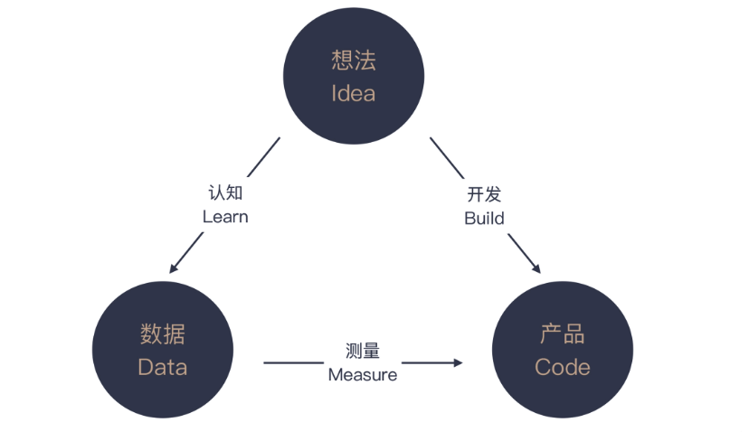

07 | 解决了很多技术问题，为什么你依然在“坑”里？

不同角色工作上真正的差异是上下文的不同

你在项目里打杂，你只能关注到一个具体的任务，而项目主力心目中是整个系统。虽然写的代码都一样，但你看到的是树木，人家看到的是森林，他更能从全局思考。

技术是一把利刃，程序员相信技术可以改变世界，但并不是所有问题都要用技术解决。有这样一种说法，手里有了锤子，眼里都是钉子。花大力气去解决一个可能并不是问题的问题，常常是很多程序员的盲区。

之所以称之为盲区，是因为很多人根本看不见它，而看不见的原因就在于上下文的缺失，也就是说，你只在程序员的维度看问题。

多问几个为什么，交流一下是不是可以换个做法，许多困惑可能就烟消云散了。而能想到问这样的问题，前提就是要跳出程序员角色思维，扩大自己工作的上下文。

虽然我不是项目主力，但不妨碍我去更深入地了解系统全貌；虽然我不是项目负责人，但不妨碍我去了解系统与其他组的接口；同样，虽然我不是项目经理，但我可以去了解一下项目经理是怎样管理项目的；虽然我不是产品经理，但了解一个产品的设计方法对我来说也是有帮助的。

当你对软件开发的全生命周期都有了认识之后，你看到的就不再是一个点了，而是一条线。

现在你知道为什么你的工作总能让老板挑出毛病了吧！没错，工作的上下文不同，看到的维度差异很大。单一维度的思考，在多维度思考者的眼里几乎就是漏洞百出的。

08 | 为什么说做事之前要先进行推演？

先从结果的角度入手，看看最终上线要考虑哪些因素。

推演出一个可以一步一步执行的上线方案，用前面考虑到的因素作为衡量指标。

根据推演出来的上线方案，总结要做的任务。

09 | 你的工作可以用数字衡量吗？

一些人说，自己靠直觉就能把事情做好，其实这是一种误解，因为那种所谓的直觉，通常是一种洞见（Insight），洞见很大程度上依赖于一个人在一个领域长期的沉淀和积累，而这其实是某种意义上的大数据。

人工智能： 算法、算力、数据

10 | 迭代 0: 启动开发之前，你应该准备什么？

技术方面

1. 基本技术准备

对于持续集成，我们通常的第一反应是搭建一个持续集成服务器。没错，但还不够。这里的重点其实是构建脚本。因为持续集成服务器运行的就是构建脚本。

- 持续集成

构建 IDE 工程、代码风格检查、常见的 bug 模式检查、测试覆盖率等等。

- 测试

把测试当作规范确定下来的办法就是把测试覆盖率加入构建脚本。

2. 发布准备

答疑解惑 ｜ 如何管理你的上级

管理上级，也就是要发挥上级的长处，不能唯命是从，应该从正确的事情入手，以上级能够接受的方式向其提出建议。

我们要敢于管理上级，对上级不合理的要求说“不”，这是一个思想上的转变。很多人受到传统官本位思想的影响，对上级的服从达到了不健康的程度。勇于改变，是有效管理上级的前提条件。如果不从思想上转变，我接下来的建议都是没有价值的。

第一，管理上级的预期。

这个过程，相当于我把自己看到的问题暴露给上级，让他选择。他有更多的上下文，他会平衡该做的事情。

第二，帮助上级丰富知识。

不是每个上级都是经验丰富的，知道所有事情。比如，有些成长得比较快的负责人，自己甚至都还没来得及了解软件开发全生命周期。在 IT 这个快速发展的行业里，这是非常可能出现的情况。所以，在某些局部，你比他了解得多是非常有可能的。

第三，说出你的想法。

如果你有自己的想法和打算，不妨提出来，主动承担一些职责。比如，你接下来打算多学点消息队列，那就大大方方地告诉上级，下次有相关的活，考虑一下自己，上级再安排工作的时候，他就会多想想。这其实就是我们熟悉的一个最简单的道理：会哭的孩子有奶吃。

不过，更可能出现的场景是，你还没去尝试改变就放弃了，将全部责任都归结于上级的问题。如果你是这种思考问题的逻辑，不论到哪个公司，结果都不会比现在更好。

第二：人家能做到，说明技术上是可行的。关于这一点，我不得不说，产品经理说得对。别人能做到，说明技术上肯定是可行的。不过，我们必须分清楚两件事：需求和技术。要做什么是需求，怎么做是技术。与产品经理要确认的是，这个需求是不是合理，该不该做。技术上能否实现，这是开发团队要考虑的事情，并不是产品经理说事的理由。

还有一种情况是，需求确实合理，但技术实现的成本极高，所需花费的时间很长。在这种情况下，你和产品经理之间很难互相说服。解决方案是，将问题升级，放到更大的上下文中，让上一层的领导来决定，此时此刻，在现有的资源约束下，是否要按照这种方式做。同时，你最好再提供一个可选的替换方案，这样领导才能更好做选择。

11 | 向埃隆·马斯克学习任务分解

正是通过将宏大目标进行任务分解，马斯克才能将一个看似不着边际的目标向前推进

一个大问题，我们都很难给出答案，但回答小问题却是我们擅长的。

任务分解是一个知难行易的过程。知道怎么分解是困难的，一旦知道了，行动反而要相对来说容易一些。

不同的可执行定义差别在于，你是否能清楚地知道这个问题该如何解决。

在实际工作中，大多数人都高估了自己可执行粒度，低估任务分解的程度。换句话说，如果你没做过任务分解的练习，你分解出来的大部分任务，粒度都会偏大。

只有能把任务拆分得非常小，你才能对自己的执行能力有一个更清楚地认识，真正的高手都是有很强的分解能力。这个差别就相当于，同样观察一个物品，你用的是眼睛，而高手用的是显微镜。在你看来，高手全是微操作。关于这个话题，后面我们再来细聊。

一旦任务分解得很小，调整也会变得很容易。很多人都在说计划赶不上变化，而真正的原因就是计划的粒度太大，没法调整。

从当年的瀑布模型到今天的迭代模型，实际上，就是缩减一次交付的粒度。几周调整一次计划，也就不存在“计划赶不上变化”的情况了，因为我的计划也一直在变。

一方面，对复杂工作而言，给出一个分解是巨大的挑战；另一方面，面对日常工作，人们更容易忽略的是，分解的任务要可执行。每个人对可执行的理解不同，只要你清楚地知道接下来的工作该怎么做，任务分解就可以告一段落。

动手做一个工作之前，请先对它进行任务分解。

12 ｜测试也是程序员的事吗？

上一个模块讲“以终为始”，就是在强调尽早发现问题。能从需求上解决的问题，就不要到开发阶段。同样，在开发阶段能解决的问题，就不要留到测试阶段。

更理想的情况是，质量保证是贯穿在软件开发全过程中，从需求开始的每一个环节，都将“测试”纳入考量，每个角色交付自己的工作成果时，都多问一句，你怎么保证交付物的质量。

需求人员要确定验收标准，开发人员则要交出自己的开发者测试。这是一个来自于精益原则的重要思想：内建质量（Build Quality In）。

所以，对于每个程序员来说，只有在开发阶段把代码和测试都写好，才有资格说，自己交付的是高质量的代码。

按照不同层次进行划分

将测试分成关注最小程序模块的单元测试、将多个模块组合在一起的集成测试，将整个系统组合在一起的系统测试。

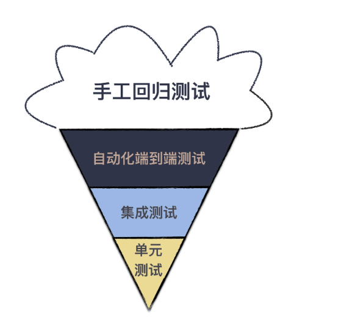

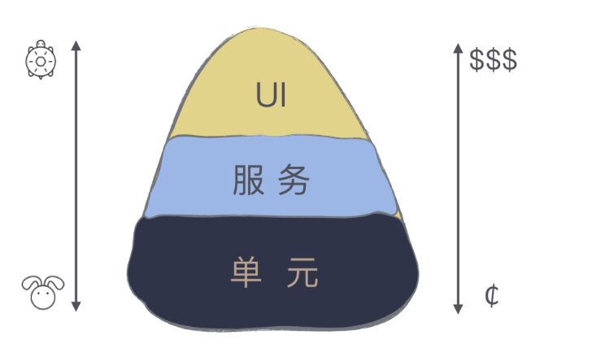

接下来，要说说另一种测试模型，也是行业里的最佳实践：测试金字塔。

想要理解测试金字塔成为行业最佳实践的缘由，我们需要理解不同层次测试的差异。越是底层的测试，牵扯到相关内容越少，而高层测试则涉及面更广。

这个模块的主题是“任务分解”，我必须强调一点：小事反馈周期短，而大事反馈周期长。小事容易做好，而大事难度则大得多。所以，以这个标准来看，底层的测试才更容易写好。

需要特别注意的是，不是用单元测试框架写的测试就是单元测试。很多人用单元测试框架写的是集成测试或是系统测试。单元测试框架只是一个自动化测试的工具而已，并不是用来定义测试类型的。

13 | 先写测试，就是测试驱动开发吗？

先写测试，后写代码的实践叫做测试先行开发

TDD（测试驱动开发）

学习 TDD 的第一步，是要记住 TDD 的节奏：“红 - 绿 - 重构”。
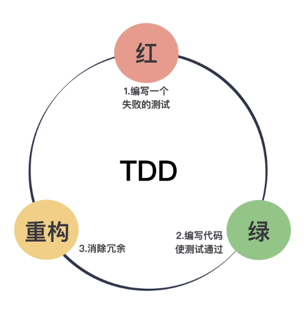

红，表示写了一个新的测试，测试还没有通过的状态；绿，表示写了功能代码，测试通过的状态；而重构，就是再完成基本功能之后，调整代码的过程。

在测试驱动开发中，重构与测试是相辅相成的：没有测试，你只能是提心吊胆地重构；没有重构，代码的混乱程度是逐步增加的，测试也会变得越来越不好写。

因为重构和测试的互相配合，它会驱动着你把代码写得越来越好。这是对“驱动”一词最粗浅的理解。

测试驱动设计

接下来，我们再来进一步理解“驱动”：由测试驱动代码的编写。

如果我们把思路反过来，我有一个测试，怎么写代码能通过它。一旦你先思考测试，设计思路就完全变了：我的代码怎么写才是能测试的，也就是说，我们要编写具有可测试性的代码。用这个角度，测试是不是就变得简单了呢？

14 | 大师级程序员的工作秘笈

Kent Beck 的做法清晰而有节奏，每个任务完成之后，代码都是可以提交的

只有把任务分解到很小，才有可能做到小步提交。你能把任务分解到很小，其实是证明你已经想清楚了。而大多数程序员之所以开发效率低，很多时候是没想清楚就动手了。

而大多数程序员之所以开发效率低，很多时候是没想清楚就动手了。

但如果任务足够小，完成一个任务，我们选择可以进入到下一个任务，也可以停下来。这样，即便被打扰，我们也可以很快收尾一个任务，不至于被影响太多。

其实，这种极其微小的原子操作在其他一些领域也有着自己的应用。有一种实践叫微习惯，以常见的健身为例，很多人难以坚持，主要是人们一想到健身，就会想到汗如雨下的健身场景，想想就放弃了。

但如果你一次只做一个俯卧撑呢？对大多数人来说，这就不是很难的一件事，那就先做一个。做完了一个如果你还想做，就接着做，不想做就不做了。

一个俯卧撑？你会说这也叫健身，一个俯卧撑确实是一个很小的动作，重要的是，一个俯卧撑是你可以坚持完成的，如果每天做 10 个，恐怕这都是大多数人做不到的。我们知道，养成一个习惯，最难的是坚持。如果你有了一个微习惯，坚持就不难了。

一个经过分解后的任务，需要关注的内容是有限的，我们就可以针对着这个任务，把方方面面的细节想得更加清晰。很多人写代码之所以漏洞百出，一个重要的原因就是因为任务粒度太大。

经过这种练习之后，任务分解也就成了我的本能，不再局限于写程序上。我遇到任何需要解决的问题，脑子里的第一反应一定是，它可以怎么一步一步地完成，确定好分解之后，解决问题就是一步一步做了。

行业中的最佳实践是，基于主分支的模型。大家都在同一个分支上进行开发，毕竟拉分支是一个麻烦事，虽然 git 的出现极大地降低了拉分支的成本。

如果你懂得任务分解，每一个分解出来的任务要改动的代码都不会太多，影响都在一个可控的范围内，代码都可以很快地合并到开发的主分支上，也就没有必要拉分支了。

在我的实际工作中，我带的团队基本上都会采用基于主分支的策略。只有在做一些实验的时候，才会拉出一个开发分支来，但它并不是常态。

总结时刻 TDD

在很多人眼中是不实用的，一来他们并不理解测试“驱动”开发的含义，但更重要的是，他们很少会做任务分解。而任务分解是做好 TDD 的关键点。只有把任务分解到可以测试的地步，才能够有针对性地写测试。

同样听到任务分解这个说法，不同的人理解依然是不一样的。我把任务分解的结果定义成微操作，它远比大多数人理解得小。我们能将任务分解到多小，就决定了我们原子操作的粒度是多大。软件开发中的许多问题正是由于粒度太大造成的，比如，分支策略。

如果今天的内容你只能记住一件事，那请记住：将任务拆小，越小越好。

15 | 一起练习：手把手带你分解任务

很多人可能更习惯一个类一个类的写，我要说，最好按照一个需求、一个需求的过程走，这样，任务是可以随时停下来的。

- 领域对象，这里就是用户。

- 数据访问层，在不同的项目里面叫法不一，有人从 J2EE 年代继承下来叫 DAO（数据访问对象，Data Access Obejct），有人跟着 Mybatis 叫 mapper，我现在更倾向于使用领域驱动设计的术语，叫 repository。

- 服务层，提供对外的应用服务，完成业务处理。

- 资源层，提供 API 接口，包括外部请求的合法性检查。

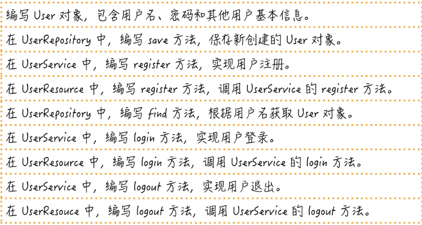

比如，第一部分就是一个完整的用户注册过程，先写 User，然后是 UserRepository 的 save 方法，接着是 UserService 的
register 方法，最后是 UserResource 的 register 方法。等这个需求开发完了，才是 login 和 logout。

考虑到我们在做的是一个 REST 服务，这个服务可能是分布到多台机器上，请求到任何一台都能提供同样的服务，我们需要把登录信息共享出去。

这里我们就采用最常见的解决方案：用 Redis 共享数据。登录成功的话，就需要把用户的 Session 信息放到 Redis 里面，退出的话，就是删除 Session 信息。在我们的任务列表里，并没有出现 Session，所以，需要引入 Session 的概念。任务调整如下。

这里我们就采用最常见的解决方案：用 Redis 共享数据。登录成功的话，就需要把用户的 Session 信息放到 Redis 里面，退出的话，就是删除 Session 信息。在我们的任务列表里，并没有出现 Session，所以，需要引入 Session 的概念。任务调整如下。

如果采用 Redis，我们还需要决定一下在 Redis 里存储对象的方式，我们可以用原生的 Java 序列化，但一般在开发中，我们会选择一个文本化的方式，这样维护起来更容易。这里选择常见的 JSON，所以，任务就又增加了两项。

至此，最基本的登录退出功能已经实现了，但我们需要问一个问题，这就够了吗？之所以要登录，通常是要限定用户访问一些资源，所以，我们还需要一些访问控制的能力。

简单的做法就是加入一个 filter，在请求到达真正的资源代码之前先做一层过滤，在这个 filter 里面，如果待访问的地址是需要登录访问的，我们就看看用户是否已经登录，现在一般的做法是用一个 Token，这个 Token 一般会从 HTTP 头里取出来。但这个 Token 是什么时候放进去的呢？答案显然是登录的时候。所以，我们继续调整任务列表。

至此，我们已经比较完整地实现了一个用户登录功能。当然，要在真实项目中应用，需求还是可以继续扩展的。比如：用户 Session 过期、用户名密码格式校验、密码加密保存以及刷新用户 Token 等等。

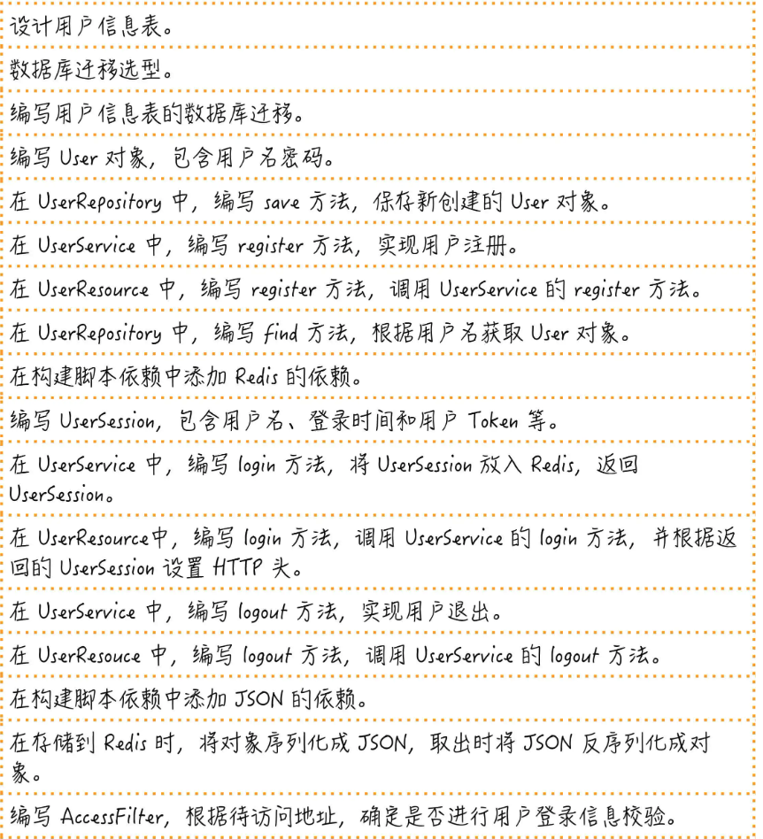

按照完整实现一个需求的顺序去安排分解出来的任务

也就是说，每做完一个任务，代码都是可以提交的。只有这样，我们才可能做到真正意义上的小步提交。

16 | 为什么你的测试不够好？

一段旅程（A-TRIP）怎么样的测试算是好的测试呢？有人做了一个总结 A-TRIP，这是五个单词的缩写，分别是

Automatic，自动化；
Thorough，全面的；
Repeatable，可重复的；
Independent，独立的；
Professional，专业的。

我必须强调一个之前讲测试驱动开发强调过的观点：编写可测试的代码。很多人写不好测试，或者觉得测试难写，关键就在于，你始终是站在写代码的视角，而不是写测试的视角。如果你都不重视测试，不给测试留好空间，测试怎么能做好呢？

17 | 程序员也可以“砍”需求吗？

大多数人可以理解需求是要分解的，但是，分解的程度不同，就是导致执行效果差异极大的根源。以我的经验而言，绝大多数问题都是由于分解的粒度太大造成的，少有因为粒度太小而出问题的。所以，需求分解的一个原则是，粒度越小越好。

评价用户故事有一个“ INVEST 原则”，这是六个单词的缩写，分别是：

Independent，独立的。一个用户故事应该完成一个独立的功能，尽可能不依赖于其它用户故事，因为彼此依赖的用户故事会让管理优先级、预估工作量都变得更加困难。如果真的有依赖，一种好的做法是，将依赖部分拆出来，重新调整。

Negotiable，可协商的。有事大家商量是一起工作的前提，我们无法保证所有的细节都能 100% 落实到用户故事里，这个时候最好的办法是大家商量。它也是满足其它评判标准的前提，就像前面提到的，一个用户故事不独立，需要分解，这也需要大家一起商量的。

Valuable，有价值的。一个用户故事都应该有其自身价值，这一项应该最容易理解，没有价值的事不做。但正如我们一直在说的那样，做任何一个事情之前，先问问价值所在。

Estimatable，可估算的。我们会利用用户故事估算的结果安排后续的工作计划。不能估算的用户故事，要么是因为有很多不确定的因素，要么是因为需求还是太大，这样的故事还没有到一个能开发的状态，还需要产品经理进一步分析。

Small，小。步子大了，不行。不能在一定时间内完成的用户故事只应该有一个结果，拆分。小的用户故事才方便调度，才好安排工作。

Testable，可测试的。不能测试谁知道你做得对不对。这个是我们在前面已经强调过的内容，也就是验收标准，你得知道怎样才算是工作完成。

“INVEST 原则”的说法是为了方便记忆，我们这里着重讨论两个点。

第一个关注点是可协商。作为实现者，我们要问问题。只是被动接受的程序员，价值就少了一半，只要你开始发问，你就会发现很多写需求的人没有想清楚的地方。

我之所以能问出问题，一方面是出于常识，另一方面就是这里说的用户故事是否有价值。用户故事，之所以是故事，就是要讲，要沟通。

所以，你会发现，任务分解是基础中的基础，不学会分解，工作就只能依赖于感觉，很难成为一个靠谱的程序员。

估算的结果是相对的，不是绝对精确的，我们不必像做科研一样，只要给出一个相对估算就好。

估算还有另外一个重要的作用：发现特别大的用户故事。一般而言，一个用户故事应该在一个迭代内完成。

如果团队可以将需求分解，需求的基本单位就会缩小，每个人看到的就不再是“铁板”一块，才能更方便地进行调整，才会有比较大的腾挪空间。

18 | 需求管理：太多人给你安排任务，怎么办？

谈到时间管理，一个有效的时间管理策略是艾森豪威尔矩阵（Eisenhower Matrix），这是由美国前总统艾森豪威尔开发出的一个工具。

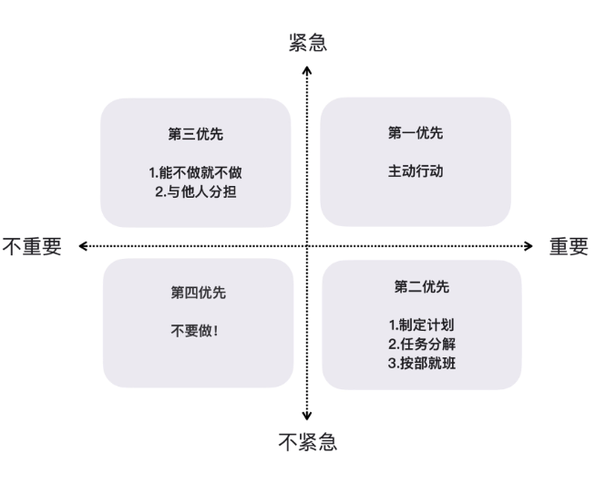

按照时间管理的理念，重要且紧急的事情要立即做。重要但不紧急的事情应该是我们重点投入精力的地方。紧急但不重要的事情，可以委托别人做。不重要不紧急的事情，尽量少做。

比如，我们放任系统不做升级改造，过多的技术债会让系统的问题越来越多，新需求实现的速度越来越慢，最后几个看起来不大的需求就足以让团队加班加点，天怒人怨。

19 | 如何用最小的代价做产品？

首先，我们必须清楚一件事，我们要做的是验证一个想法的可行性，甚至不是为了开发一个软件，开发软件只是一种验证手段。

无论是场景，还是关注点，我们要在前面先想清楚，其目的就是为了防止发散。当时间有限时，我们只能做最重要的事，这也是我在专栏中不断强调的。

但是，我这里还有一点要提醒，当你确定要使用这项技术时，请丢弃掉你的原型代码。
https://xhonglou1024.com/index/data/lists.html?pid=440000&cid=440300&page=3
20 | 为什么世界和你的理解不一样？

信源（Information Source），它负责产生信息（Message）。

发送器（Transmitter），它会对信息进行某些操作，也就是对信息编码，产生信号（Signal）。

信道（Channel），它是信号传送的媒介。

接收器（Receiver），它是对信号执行发送器的逆操作，解码信号，提取出信息。

信宿（Destination），它负责接收信息。

这就是人们往往对世界产生误解的原因。

因为每个人经历见识的差异，造成了各自编解码器的差异。

改善编解码

首先，我们要考虑一下编码器的效果。换句话说，当我们想把信息传达给别人的时候，我们得把信息编码成一个有效的信号，至少要保证在我们这里信息不丢失。

这几乎是很多程序员讲东西的通病：讲东西直奔细节。

再举一个我们身边的例子，能做程序员的人，大多是很聪明的人， 当几个人一起讨论问题时，别人往往刚开了个头，他就认为自己已经理解了别人的想法，然后开始表达自己的观点。信息都不全，何谈解码。所以，开发团队的讨论中常常出现一个人高谈阔论，却离题万里的情况。

说了编码器和解码器可能出现的问题，我们再来看另外一个可能造成影响的问题：编解码器算法，也就是怎么协调沟通双方更有效地进行沟通。

总结时刻

人生不如意之事，十有八九，之所以很多人有如此多的不如意，很大原因在于我们对真实世界有着很多不切实际的幻想，美好的愿望并不能驱动这个世界，在软件开发中也是如此。虽然人和人生活在一个世界中，但对世界的理解却是千差万别的。

改善编解码，需要从几个角度着手，分别是：编码器，让信息能输出更准确；解码器，减少信号过滤，改善解码能力；还有编解码算法，也就是各种来自行业的“最佳实践”，协调沟通的双方。

如果今天的内容你只能记住一件事，那请记住：通过沟通反馈，不断升级自己的编解码能力。

21 | 你的代码为谁而写？

编写可维护的代码

再往后，更有追求的程序员会知道，仅仅实现功能是不够的，还需要写出可维护的代码。于是，这样的程序员就会找一些经典的书来看。

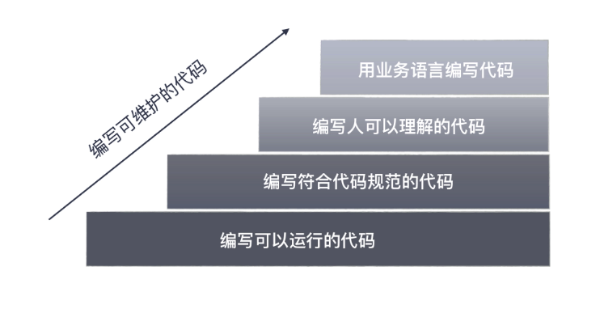

追求的程序员会知道，仅仅实现功能是不够的，还需要写出可维护的代码。

估计你开始写程序不久，就会有人告诉你不要用 a、b、c 做变量名，因为它没有意义；步入职场，就会有人扔给你一份编程规范，告诉你这是必须遵循的。

估计你开始写程序不久，就会有人告诉你不要用 a、b、c 做变量名，因为它没有意义；步入职场，就会有人扔给你一份编程规范，告诉你这是必须遵循的。

想必你知道，命名要遵循编码规范，比如：Java 风格的 camelCase，常量命名要用全大写。

名字起得是否够好，一个简单的评判标准是，拿着代码给人讲，你需要额外解释多少东西

但是，这类代码规范给出的要求，大多是格式上的要求。在我看来，这只是底线，不应该成为程序员的追求，因为现在很多编码规范的要求，都可以用静态检查工具进行扫描了。

名字起得是否够好，一个简单的评判标准是，拿着代码给人讲，你需要额外解释多少东西。

变量的命名，实际上牵扯到一个重要问题，代码到底是给谁写的？

但是，我们写代码的目的是与人沟通，因为我们要在一个团队里与人协同工作。

与人沟通，就要用与人沟通的方式和语言写代码。人和机器不同，人需要理解的不仅是语言规则，还需要将业务背景融入其中，因为人的目的不是执行代码，而是要理解，甚至扩展和维护这段代码。

人要负责将业务问题和机器执行连接起来，缺少了业务背景是不可能写出好代码的。

虽然只是一个简单的名字修改，但从理解上，这是一步巨大的跨越，缩短了其他人理解这段代码所需填补的鸿沟，工作效率自然会得到提高。

用业务语言编程

所以，更好地做法是，把这个“订单”的概念拆分了，也就有了：交易订单、物流订单和支付订单。我们原来陷入的困境，就是因为我们没有业务知识，只能笼统地用订单去涵盖各种场景。

总结时刻

如果你想详细学习如何写好代码，我推荐你去读 Robert Martin 的《代码整洁之道》（Clean Code），这本书几乎覆盖了把代码写好的方方面面。

但是，我们写代码的目的是与人沟通，因为我们要在一个团队里与人协同工作。

人要负责将业务问题和机器执行连接起来，缺少了业务背景是不可能写出好代码的。

很多程序员习惯的方式是用计算机的语言进行表达，就像前面这个例子里面的 map，这是一种数据结构的名字，是面向计算机的，而评审者给出的建议，把变量名改成 accounts，这是一个业务的名字。

用业务语言编程

有了这样的信息，你会知道一件事，虽然我们在用一个“订单”的概念，但实际上，在不同的场景下，用到信息是不同的。

对于命名，最粗浅的理解是不要起无意义的名字，遵循编码规范。但名字起得是否够好，主要看是否还需要额外的解释。很多程序员起名字习惯于采用面向实现的名字，比如，采用数据结构的名字。

｜ 开会

开会是为了解决问题，但真真实情况却是开了会又没有解决多少问题，这真是奇特的矛盾。

凡是效果特别好的会议，基本上都是用来做信息同步的。

怎么样？是不是很熟悉的感觉。为什么会这样？因为他们选错了沟通方式。

轻量级沟通

所以，改善会议的第一个行动项是，减少参与讨论的人数。

相比于会议的形式，面对面沟通因为注意力有限，参与的人数不可能太多。也因为参与的人数相对少一些，每个人的投入也会更多一些。

所以，我们的第二个行动项是，如果你要讨论，找人面对面沟通。

一旦理解了这些改进方式，我们就可以改进自己的行为方式。如果有一个问题需要讨论，我要做的是，分别找到相关人针对关心的主题进行讨论，然后，我把讨论的结果汇总再去征求大家意见。如果大家达成一致了，我才会选择开会。

这个时候，开会的目的不再是讨论，而是信息同步：我准备这么干了，相关各方已经同意了，知会大家一下，结束。

站立会议

我昨天做了什么？我今天打算做什么？我在过程中遇到了什么问题，需要请求帮助。

“做了什么” ，是为了与其他人同步进展，看事情是否在计划上。一旦偏离计划，请主动把它提出，这样，项目经理可以过问，因为这会涉及到是否要调整项目计划；

“要做什么” ，是同步你接下来的工作安排。如果涉及到与其他人协作，也就是告诉大家，让他们有个配合的心理准备；

“问题和求助”， 就是与其他人的协作，表示：我遇到不懂的问题，你们有信息的话，可以给我提供一下。

如果你想用会议的形式与别人讨论问题，最好放弃这种打算，面对面的沟通是最好的方式。因为面对面沟通很轻，人数相对少，每个人参与度就会高很多。基于这种改进，我们可以把大部分会议都改成信息同步的会，效率就会得到提高。

23 | 可视化：一种更为直观的沟通方式

技术雷达用来追踪技术，在雷达图的术语里，每一项技术表示为一个 blip，也就是雷达上的一个光点。然后用两个分类元素组织这些 blip：象限（quadrant）和圆环（ring），其中，象限表示一个 blip 的种类，目前有四个种类：技术、平台、工具，还有语言与框架。

圆环表示一个 blip 在技术采纳生命周期中所处的阶段，目前这个生命周期包含四个阶段：采用（Adopt）、试验（Trial）、评估（Assess）和暂缓（Hold）。每次技术雷达发布之后，我会特别关注一下“采用” 和 “暂缓”两项。

“采用”表示强烈推荐，我会去对比一下自己在实际应用中是否用到了，比如，在 2018 年 11 月的技术雷达中，事件风暴（Event Storming）放到了“采用”中，如果你还不了解 事件风暴 是什么，强烈建议你点击链接了解一下。

“暂缓” 则表示新项目别再用这项技术了，这会给我提个醒，这项技术可能已经有了更优秀的替代品，比如，Java 世界中最常见的构建工具 Maven 很早就放到了“暂缓”项中，但时至今日，很多人启动新项目依然会选择 Maven，多半这些人并不了解技术趋势。

雷达图是一种很好的将知识分类组织的形式，它可以让你一目了然地看到并了解所有知识点，并根据自己的需要，决定是否深入了解。

可视化的优势
就人脑的进化而言，处理图像的速度远远快于处理文字，所以，有“一图胜千言”的说法。

通过创建图像、图标或动画等进行信息交流的形式，就是可视化（Visualization）。可视化有很多种不同的分类，我们最常用的应该是数据可视化和信息可视化。

24 | 快速反馈：为什么你们公司总是做不好持续集成？

快速反馈
执行同样的操作，本地环境会快于 ci 服务器环境。

想做好持续集成的一个关键点是，用好本地构建脚本（build script），保证各种各样的检查都可以在本地环境执行。

有效反馈

持续集成监视器，也是 CI 监视器。

CI 服务器一旦检查出错，要立即修复。原因很简单，你不修，别人就不能提交，很多人的工作就会因此停顿下来，团队的工作流就会被打断，耽误的是整个团队的工作。

总结时刻持续集成是软件开发中的重要实践，做好持续集成的关键在于，快速反馈。

这里面有两个目标，怎样快速地得到反馈，以及什么样的反馈是有效的。

做好快速反馈，要把本地能做好的事情，在本地做好；

也要通过小步提交的方式，加快代码开发的节奏。

什么是有效的反馈？一是即时的反馈，二是引人注目的反馈。

有很多种持续集成相关的工具可以帮助我们达成有效的反馈。想要做好持续集成，还要有一些纪律要遵循：

- 只有 CI 服务器处于绿色的状态才能提交代码；
- CI 服务器一旦检查出错，要立即修复。

如果今天的内容你只能记住一件事，那请记住：做好持续集成的关键在于，快速反馈。

25 | 开发中的问题一再出现，应该怎么办？

回顾

一是写事实，不要写感受

所有给出的行动项应该都是可检查的，而不是一些无法验证的内容。

控制工作量怎么衡量？就是看每个阶段开发的总点数是不是比上一个阶段少了。而测试覆盖率更直接，直接写到构建脚本中，跑不过，不允许提交代码。

回顾回忆模板

- 做的好的 做的欠佳的 问题和建议
- 继续保持 开始做 停止做 多做一些 少做一些

定期复盘，找准问题根因，不断改善。

你可以思考一下，你是按什么颗粒度来安排自己工作的呢？1 天，半天，1 小时还是 15 分钟？另外，在把时间拆细的同时，也不能忽略对工作内容的分解。其实，对工作内容进行分解的颗粒度大小，同样对工作效率有很大影响。

27 | 尽早暴露问题： 为什么被指责的总是你？

重构是一种微操作

重构，也属于微操作的行列，与我们介绍的任务分解结合起来，你就能很好地理解那些重构手法的含义了：你需要把做的代码调整分解成若干可以单独进行的“重构”小动作，然后，一步一步完成它。

你现在理解了，重构不仅仅是一堆重构手法，更重要的是，你需要有的是“把调整代码的动作分解成一个个重构小动作”的能力。

学习重构，先要知道重构的定义。关于这点，Martin Fowler 给出了两个定义，一个名词和一个动词。

重构（名词）：对软件内部结构的一种调整，目的是在不改变软件可观察行为的前提下，提高其可理解性，降低其修改成本。

重构（动词）：使用一系列重构手法，在不改变软件可观察行为的前提下，调整其结构。

重构阐述为微观和宏观操作，分别对应《重构》和《重构与模式》

29 | “懒惰”应该是所有程序员的骄傲

懒惰，是一种品质，它会使你花很大力气去规避过度的精力消耗，敦促你写出节省体力的程序，别人也能很好地利用，你还会为此写出完善的文档，以免别人来问问题。

急躁，是计算机偷懒时，你会感到的一种愤怒。它会促使你写出超越预期的程序，而不只是响应需求。

傲慢，极度自信，写出（或维护）别人挑不出毛病的程序。

做有价值的事是重要的，这里面的有价值，不仅仅是“做”了什么，通过“不做”节省时间和成本也是有价值的。

在软件开发中，其它的东西都是易变的，唯有设计的可变性是你可以控制的

请谨慎地将工作自动化。

30 | 一个好的项目自动化应该是什么样子的？

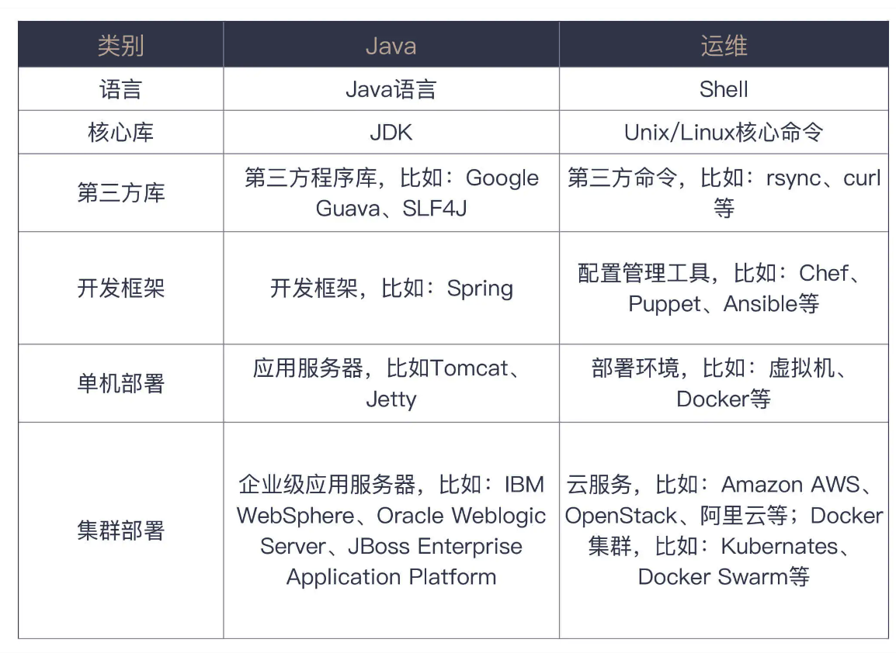

32 | 持续交付：有持续集成就够了吗？

一般来说，在构建持续交付的基础设施时，会有下面几个不同的环境。
持续集成环境，持续集成是持续交付的前提，这个过程主要是执行基本的检查，打出一个可以发布的包。

测试环境（Test），这个环境往往是单机的，主要负责功能验证，这里运行的测试基本上都是验收测试级别的，而一般把单元测试和集成测试等执行比较快的测试放到持续集成环境中执行。

预生产环境（Staging），这个环境通常与生产环境配置是相同的，比如，负载均衡，集群之类的都要有，只是机器数量上会少一些，主要负责验证部署环境，比如，可以用来发现由多机并发带来的一些问题。

生产环境（Production），这就是真实的线上环境了。

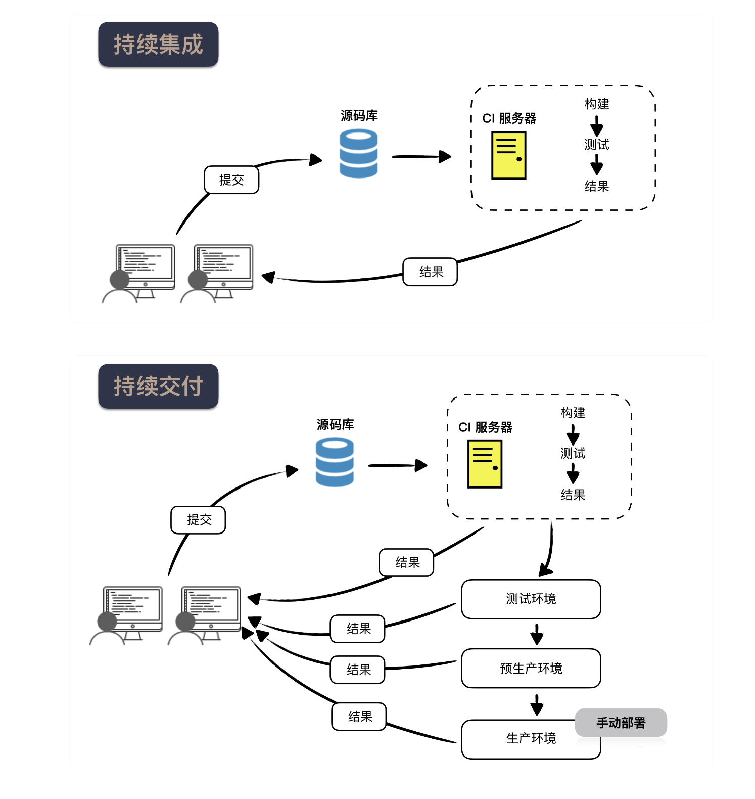

你也看出来了，每个环境的作用是有差异的，所以，通常不会将所有的验证放在一起执行，而是要分阶段的去执行，一个阶段不通过，是不能进入下一阶段的，这种按照不同阶段组织构建的方式，称之为构建流水线（Build Pipeline）。

如果把由人决定的是否上线变成自动化的，就成了另外一个实践：持续部署。

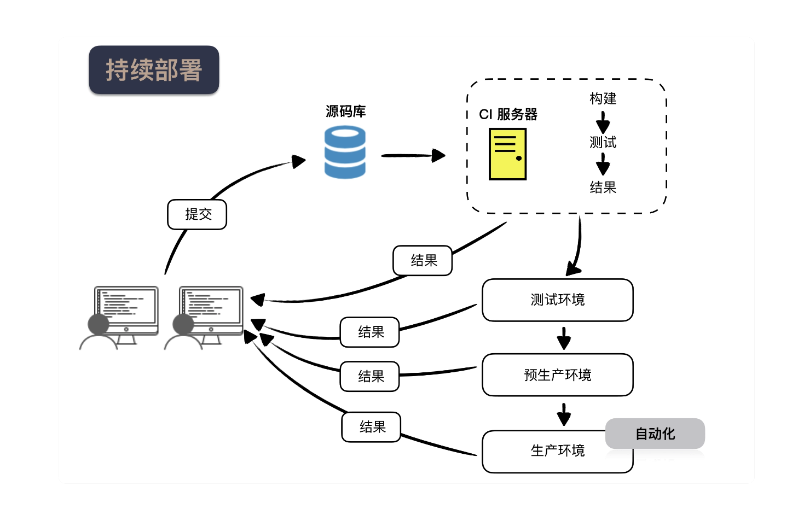

DevOps 是一种软件交付的理念和方法，目的是增强软件的可靠性。从名字便不难发现，DevOps 是将开发（Development）和运维（Operations）组合在了一起。

36 | 为什么总有人觉得 5 万块钱可以做一个淘宝？

同样的业务，不同的系统

因为作为程序员，我们需要知道自己面对的到底是一个什么样的系统。

更准确地说，不同量级的系统根本就不是一个系统。

淘宝的工程师之所以要改进系统，真实的驱动力不是技术，而是不断攀升的业务量带来的问题复杂度。

用简单技术解决问题，直到问题变复杂。

37 | 先做好 DDD 再谈微服务吧，那只是一种部署形式

微服务

怎么划分微服务，也就是一个庞大的系统按照什么样的方式分解。

领域驱动设计

领域驱动设计（Domain Driven Design，DDD）是 Eric Evans 提出的从系统分析到软件建模的一套方法论。它要解决什么问题呢？就是将业务概念和业务规则转换成软件系统中概念和规则，从而降低或隐藏业务复杂性，使系统具有更好的扩展性，以应对复杂多变的现实业务问题。

DDD 到底讲了什么呢？它把你的思考起点，从技术的角度拉到了业务上。

它限定了通用语言自由使用的边界，一旦出界，含义便无法保证。正是由于边界的存在，一个限界上下文刚好可以成为一个独立的部署单元，而这个部署单元就可以成为一个服务。

所以要做好微服务，第一步应该是识别限界上下文。

即便你学了 DDD，知道了限界上下文，也别轻易使用微服务。我推荐的一个做法是，先用分模块的方式在一个工程内，让服务先演化一段时间，等到真的觉得某个模块可以“毕业”了，再去开启微服务之旅。

答疑解惑 | 持续集成、持续交付，然后呢？

精益创业实际上是一种持续验证，验证想法的有效性，获得经过验证的认知（Validated Learning）。
