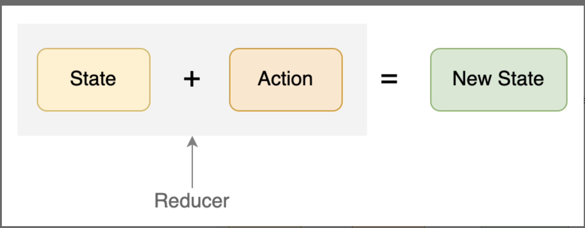

复杂状态处理：保持状态的一致性

1. 原则一：“保证状态最小化

这个状态是必须的吗？是否能通过计算得到呢？

2. 原则二：避免中间状态，确保唯一数据源

函数组件设计模式：复杂场景下的两种渲染模式：

一. 容器模式
把条件判断的结果放到两个组件中，确保真正 render UI 的组件收到的所有属性都是有值的。

```JS
// 定义一个容器组件用于封装真正的 UserInfoModal
export default function UserInfoModalWrapper({
  visible,
  ...rest, // 使用 rest 获取除了 visible 之外的属性
}) {
  // 如果对话框不显示，则不 render 任何内容
  if (!visible) return null;
  // 否则真正执行对话框的组件逻辑
  return <UserInfoModal visible {...rest} />;
}

```

受控与非受控组件

受控组件：组件的展示完全由传入的属性决定。比如说，如果一个输入框中的值完全由传入的 value 属性决定，而不是由用户输入决定，那么就是受控组件，写法是：< input value={value} onChange={handleChange} />。这也是为什么只给 < input/> 传了一个 value 值但是没有传 onChange 事件，那么键盘怎么输入都没有反应。

非受控组件：表单组件可以有自己的内部状态，而且它的展示值是不受控的。比如 input 在非受控状态下的写法是：< input onChange={handleChange}/>。也就是说，父组件不会把 value 直接传递给 input 组件。

```js
import React, { useState, useCallback } from "react";

function PriceInput({
  // 定义默认的 value 的数据结构
  value = { amount: 0, currency: "rmb" },
  // 默认不处理 onChange 事件
  onChange = () => {},
}) {
  // 定义一个事件处理函数统一处理 amount 或者 currency 变化的场景
  const handleChange = useCallback(
    (deltaValue) => {
      // 直接修改外部的 value 值，而不是定义内部 state
      onChange({
        ...value,
        ...deltaValue,
      });
    },
    [value, onChange]
  );
  return (
    <div className="exp-02-price-input">
      {/* 输入价格的数量 */}
      <input
        value={value.amount}
        onChange={(evt) => handleChange({ amount: evt.target.value })}
      />
      {/* 选择货币种类*/}
      <select
        value={value.currency}
        onChange={(evt) => handleChange({ currency: evt.target.value })}
      >
        <option value="rmb">RMB</option>
        <option value="dollar">Dollar</option>
      </select>
    </div>
  );
}
```

1.避免多余的状态：我们不需要在 PriceInput 这个自定义组件内部，去定义状态用于保存的 amount 或者 currency.

2.找到准确的唯一数据源：这里内部两个基础组件的值，其准确且唯一的来源就是 value 属性，而不是其它的任何中间状态.

2. 把判断条件放到 Hooks 中去

```JS

function useUser(id) {
  const [data, setData] = useState(null);
  const [loading, setLoading] = useState(false);
  const [error, setError] = useState(null);
  useEffect(() => {
    // 当 id 不存在，直接返回，不发送请求
    if (!id) return
    // 获取用户信息的逻辑
  });
}
```

二：使用 render props 模式重用 UI 逻辑

render props 就是把一个 render 函数作为属性传递给某个组件，由这个组件去执行这个函数从而 render 实际内容

抽象出业务逻辑， 已计数器为例子

```JS

import { useState, useCallback } from "react";

function CounterRenderProps({ children }) {
  const [count, setCount] = useState(0);
  const increment = useCallback(() => {
    setCount(count + 1);
  }, [count]);
  const decrement = useCallback(() => {
    setCount(count - 1);
  }, [count]);

  return children({ count, increment, decrement });
}
```

在要使用的地方，把 render 函数作为属性传递给 CounterRenderProps 组件

```JS

function CounterRenderPropsExample() {
  return (
    <CounterRenderProps>
      {({ count, increment, decrement }) => {
        return (
          <div>
            <button onClick={decrement}>-</button>
            <span>{count}</span>
            <button onClick={increment}>+</button>
          </div>
        );
      }}
    </CounterRenderProps>
  );
}
```

这里利用了 children 这个特殊属性，也就是组件开始 tag 和结束 tag 之间的内容，其实是会作为 children 属性传递给组件。
那么在使用的时候，是直接传递了一个函数过去，由实现计数逻辑的组件去调用这个函数，并把相关的三个参数 count，increase 和 decrease 传递给这个函数。

我们完全也可以使用其它的属性名字，而不是 children。我们只需要把这个 render 函数作为属性传递给组件就可以了，这也正是 render props 这个名字的由来。

还有一种方式是用 Hooks 实现

```JS

import { useState, useCallback }from 'react';

function useCounter() {
  // 定义 count 这个 state 用于保存当前数值
  const [count, setCount] = useState(0);
  // 实现加 1 的操作
  const increment = useCallback(() => setCount(count + 1), [count]);
  // 实现减 1 的操作
  const decrement = useCallback(() => setCount(count - 1), [count]);

  // 将业务逻辑的操作 export 出去供调用者使用
  return { count, increment, decrement };
}
```

问题 1：函数体也是每次 render 都会执行，那么，需要每次都会 render 执行的语句是放在 无依赖的 useEffect 中呢，还是直接放在函数体中比较好呢？

讲解：这两种情况的语义是不一样的。useEffect 代表副作用，是在函数 render 完后执行。而函数体中的代码，是直接影响当次 render 的结果。所以在写代码的时候，我们一定要理解每个 API 的语义，副作用一定是和当前 render 的结果没关系的，而只是 render 完之后做的一些额外的事情。

在 useCounter 这个例子中，我们是固定让数字每次加一。假如要做一个改进，允许灵活配置点击加号时应该加几，比如说每次加 10，那么应该如何实现？

```JS
function useCounter(n) {
  // 定义 count 这个 state 用于保存当前数值
  const [count, setCount] = useState(0);
  // 实现加 n 的操作
  const increment = useCallback(() => setCount(count + n), [count]);
  // 实现减 n 的操作
  const decrement = useCallback(() => setCount(count - n), [count]);
  // 重置计数器
  const reset = useCallback(() => setCount(0), []);

  // 将业务逻辑的操作 export 出去供调用者使用
  return { count, increment, decrement, reset };
}
```

只考虑 Redux 部分，对于计数器应用，目前每次是固定加减 1，如果要能够在每次调用时增加或减少指定的变量值，应该如何实现？讲解：这和上一讲的思考题几乎一样，只是这里考察的是，有没有注意到 Redux 的 action 就是一个普通的 object，我们可以在其中加入任何需要的参数，只要 reducer 能处理就可以了。

```JS

const incrementAction = {
  type: 'counter/incremented',
  n: 5, // 实现每次加5
};

function counterReducer(state = initialState, action) {
  switch (action.type) {
    case 'counter/incremented':
      // 从 action 中去拿每次加几
      return { value: state.value + action.n }
    default:
      return state
  }
```

在全局状态管理中：如何在函数组件中使用 redux
所以从这张对比图，我们可以看到 Redux Store 的两个特点：

1. Redux Store 是全局唯一的。即整个应用程序一般只有一个 Store。
2. Redux Store 是树状结构，可以更天然地映射到组件树的结构，虽然不是必须的。

我们通过把状态放在组件之外，就可以让 React 组件成为更加纯粹的表现层，那么很多对于业务数据和状态数据的管理，就都可以在组件之外去完成（后面课程会介绍的 Reducer 和 Action）。同时这也天然提供了状态共享的能力，有两个场景可以典型地体现出这一点。

- 跨组件的状态共享：当某个组件发起一个请求时，将某个 Loading 的数据状态设为 True，另一个全局状态组件则显示 Loading 的状态。

- 同组件多个实例的状态共享：某个页面组件初次加载时，会发送请求拿回了一个数据，切换到另外一个页面后又返回。这时数据已经存在，无需重新加载。设想如果是本地的组件 state，那么组件销毁后重新创建，state 也会被重置，就还需要重新获取数据。

Redux 引入的概念其实并不多，主要就是三个：State、Action 和 Reducer。其中 State 即 Store，一般就是一个纯 JavaScript Object。Action 也是一个 Object，用于描述发生的动作。而 Reducer 则是一个函数，接收 Action 和 State 并作为参数，通过计算得到新的 Store。



实现自己的 API client

一些通用的 Header。比如 Authorization Token。

服务器地址的配置。前端在开发和运行时可能会连接不同的服务器，比如本地服务器或者测试服务器，此时这个 API Client 内部可以根据当前环境判断该连接哪个 URL。

请求未认证的处理。比如如果 Token 过期了，需要有一个统一的地方进行处理，这时就会弹出对话框提示用户重新登录。
