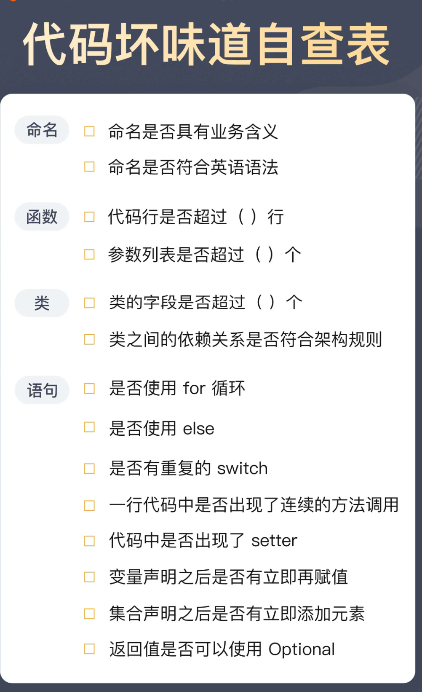
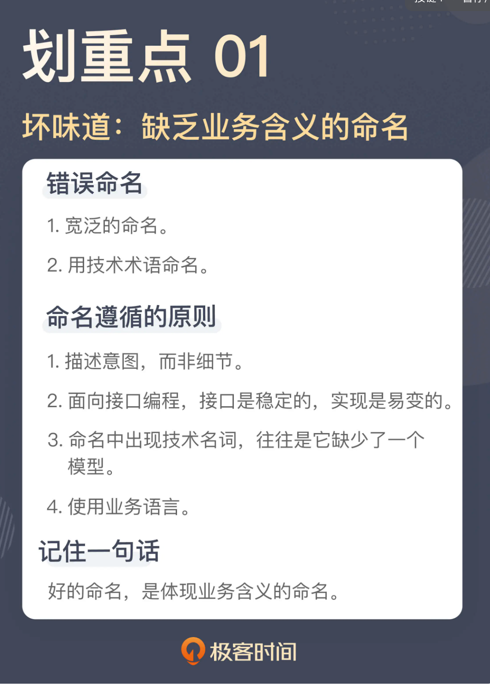
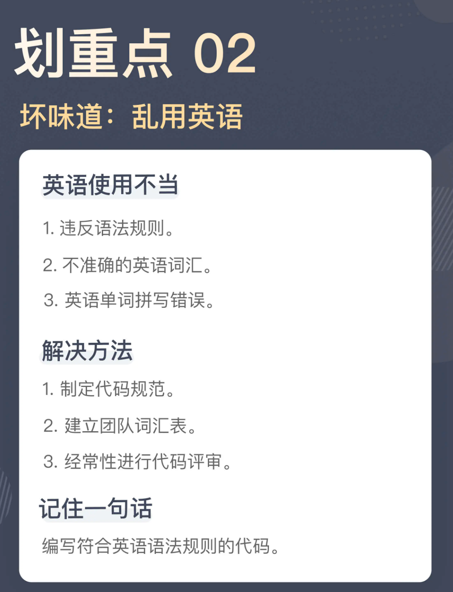
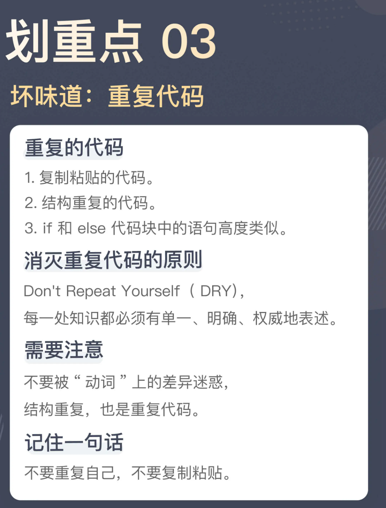
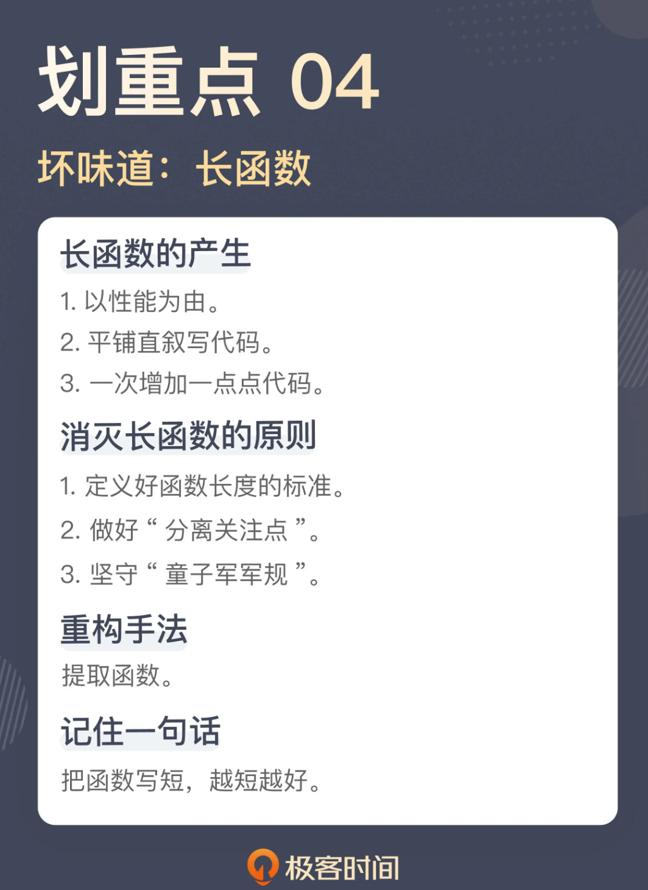
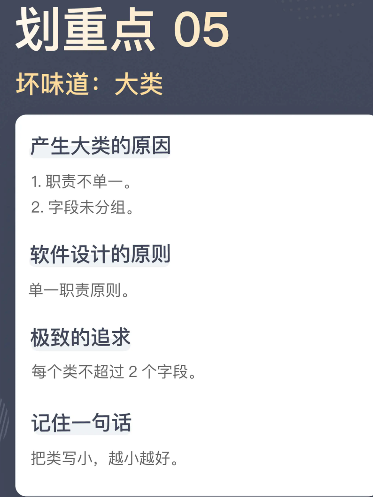
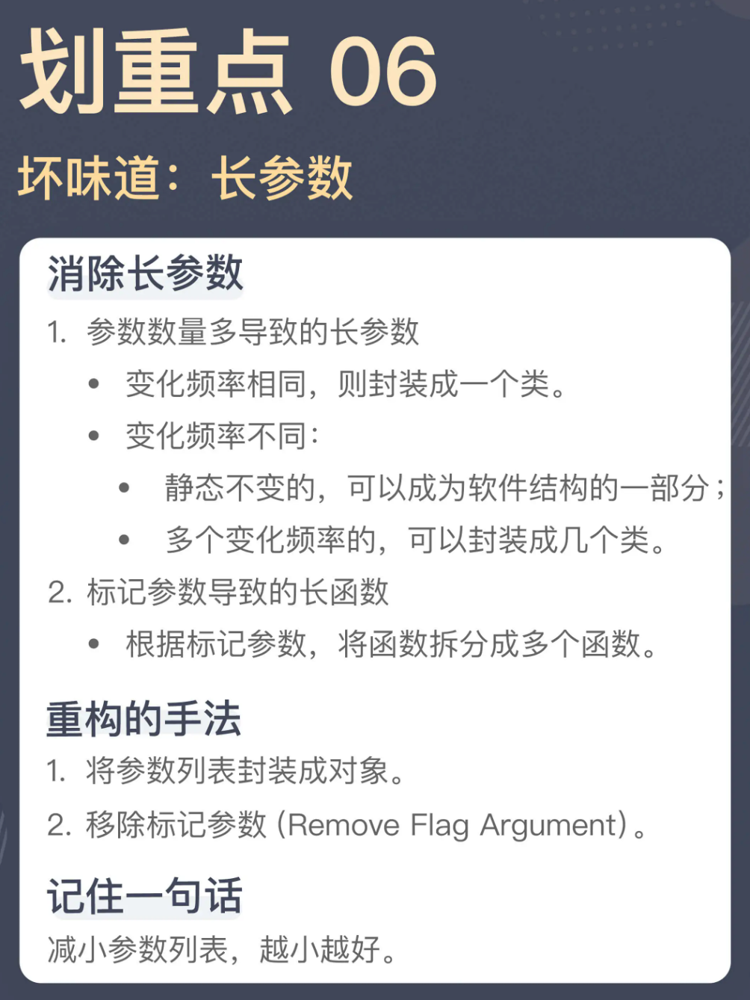
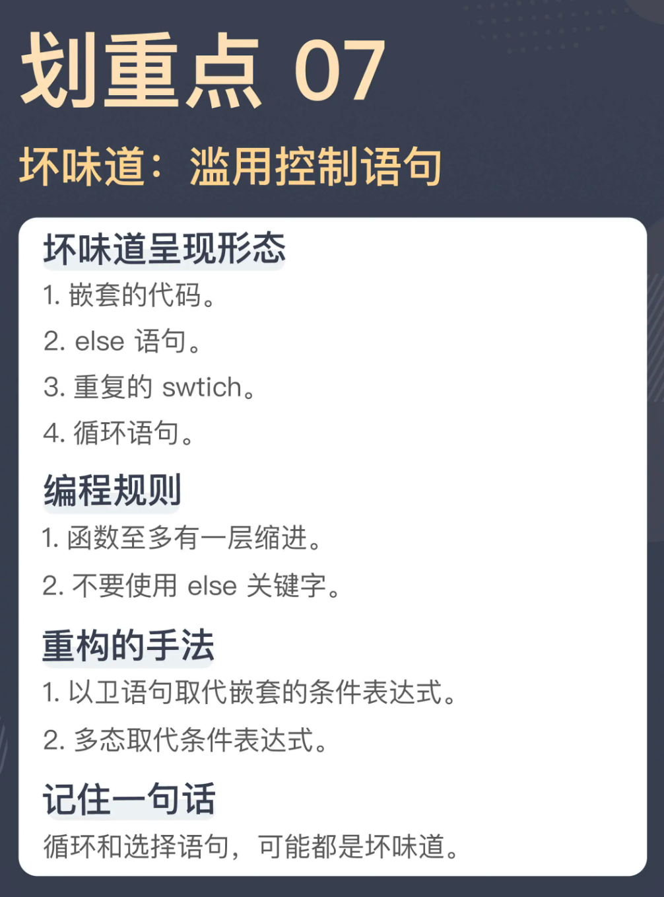
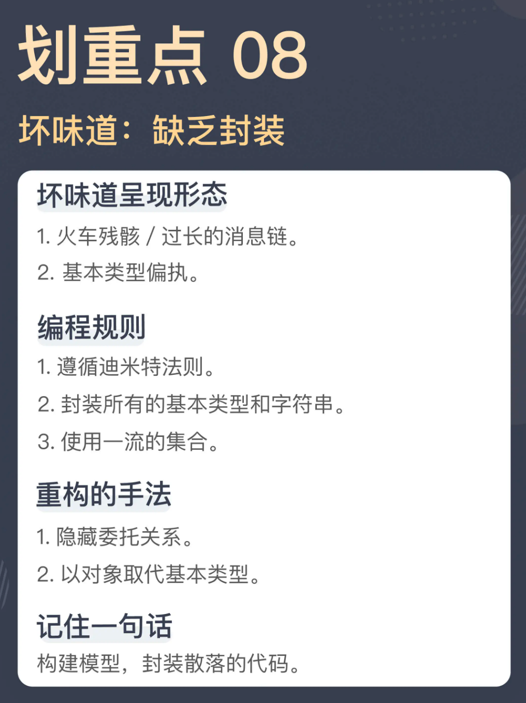

面向对象的封装，关键点是行为



坏代码：命名过于宽泛，不能精准描述，这是很多代码在命名上存在的严重问题，也是代码难以理解的根源所在。

或许这么说你的印象还是不深刻，我们看看下面这些词是不是经常出现在你的代码里：data、info、flag、process、handle、build、maintain、manage、modify 等等。这些名字都属于典型的过于宽泛的名字，当这些名字出现在你的代码里，多半是写代码的人当时没有想好用什么名字，就开始写代码了。我相信，只要稍微仔细想想，类似的名字你一定还能想出不少来。

在一个技术类的项目中，这些技术术语其实就是它的业务语言。但对于业务项目，这个说法就必须重新审视了。

好代码:一个好的名字应该描述意图，而非细节.

好实践：编写可维护的代码要使用业务语言 建立团队的词汇表

章节总结：
不精准的命名；用技术术语命名。

最佳实践：好的命名要体现出这段代码在做的事情，而无需展开代码了解其中的细节，这是最低的要求。再进一步，好的命名要准确地体现意图，而不是实现细节。更高的要求是，用业务语言写代码。


1、命名要能描述功能（或方法）所做的事情，要用具体的（动词+名称）比如 AddChapter
2、一个好的名字应该描述意图，而非细节，比如, StartTranslation
3、不能用技术术语命名，因为接口时稳定的，而实现时易变的，比如不能用 bookList 这样的命名就不够好，而应该用 books
4、实际代码中，技术名称的出现，比如 redis 代表的就是具体的技术实现，而应该用 cache 这样更广泛的词，和第一点正好相反
5、保持团队代码的统一，建立团队的词汇表，并进行代码评审，保证项目命名的统一，也能更好的让业务知识在项目成员中传递

好代码：常见的命名规则： 类名是一个名词，表示一个对象，而方法名则是一个动词，或者是动宾短语，表示一个动作。

一个函数名是 retranslation，其表达的意图是重新翻译，但作为函数名，它应该是一个动词，所以，正确的命名应该是 retranslate。

好实践：在这种情况下，最好的解决方案还是建立起一个业务词汇表，千万不要臆想。

总结时刻：违反语法规则的命名；不准确的英语词汇；英语单词的拼写错误。



复制粘贴是最容易产生重复代码的地方，所以，一个最直白的建议就是，不要使用复制粘贴。真正应该做的是，先提取出函数，然后，在需要的地方调用这个函数。

好带吗一般来说，参数是名词，而函数调用，是动词

写代码要有表达性。把意图准确地表达出来，是写代码过程中非常重要的一环。显然，这里的 if 判断区分的是参数，而非动作。所以，我们可以把这段代码稍微调整一下，会让代码看上去更容易理解：

好代码：

```JS
坏代码

if (user.isEditor()) {
  service.editChapter(chapterId, title, content, true);
} else {
  service.editChapter(chapterId, title, content, false);
}
```

```JS
boolean approved = user.isEditor();
service.editChapter(chapterId, title, content, approved);
```

最佳实践：所以，只要你看到 if 语句出现，而且 if 和 else 的代码块长得又比较像，多半就是出现了这个坏味道。如果你不想所有人都来玩“找茬”游戏，赶紧消灭它。

写代码要想做到 DRY，一个关键点是能够发现重复。

总结时刻这一讲我们讲到重复代码，讲到了几个典型的坏味道：复制粘贴的代码；结构重复的代码；if 和 else 代码块中的语句高度类似。

程序员千万不要复制粘贴，如果需要复制粘贴，首先应该做的是提取一个新的函数出来，把公共的部分先统一掉。



04 | 长函数：为什么你总是不可避免地写出长函数？

一个好的程序员面对代码库时要有不同尺度的观察能力，看设计时，要能够高屋建瓴，看代码时，要能细致入微。

在平铺直叙的代码存在两个典型的问题：

- 把多个业务处理流程放在一个函数里实现；
- 把不同层面的细节放到一个函数里实现。

长函数的缺点：
1。命名问题

任何代码都经不起这种无意识的累积，每个人都没做错，但最终的结果很糟糕

让代码变长的原因：
以性能为由；平铺直叙；一次加一点。



05 | 大类：如何避免写出难以理解的大类？

大类的产生 1.职责不单一

好代码：通常来说，很多类之所以巨大，大部分原因都是违反了单一职责原则。而想要破解“大类”的谜题，关键就是能够把不同的职责拆分开来。

2. 字段未分组



06 | 长参数列表：如何处理不同类型的长参数？

消除长参数列表的手段：将参数列表封装成对象。

一个模型的封装应该是以行为为基础的。

动静分离

不同的数据变动方向也是不同的关注点。这里表现出来的就是典型的动数据（bookId）和静数据（httpClient 和 processor），它们是不同的关注点，应该分离开来。

长参数列表固然可以用一个类进行封装，但能够封装出这个类的前提条件是：这些参数属于一个类，有相同的变化原因。

告别标记：

解决标记参数，一种简单的方式就是，将标记参数代表的不同路径拆分出来。

标记参数在代码中存在的形式很多，有的是布尔值的形式，有的是以枚举值的形式，还有的就是直接的字符串或者整数。无论哪种形式，我们都可以通过拆分函数的方式将它们拆开。在重构中，这种手法叫做移除标记参数（Remove Flag Argument）。

总结时刻:
今天我们讲解的坏味道是长参数列表，它同样是一个“我一说，你就知道是怎么回事”的坏味道。应对长参数列表主要的方式就是减少参数的数量，一种最直接的方式就是将参数列表封装成一个类。但并不是说所有的情况都能封装成类来解决，我们还要分析是否所有的参数都有相同的变动频率。变化频率相同，则封装成一个类。变化频率不同的话：静态不变的，可以成为软件结构的一部分；多个变化频率的，可以封装成几个类。



07 | 滥用控制语句：出现控制结构，多半是错误的提示

代码段的拆分
因为通常来说，for 循环处理的是一个集合，而循环里面处理的是这个集合中的一个元素.所以，我们可以把循环中的内容提取成一个函数，让这个函数只处理一个元素，

```JAVA

public void distributeEpubs(final long bookId) {
  List<Epub> epubs = this.getEpubsByBookId(bookId);
  for (Epub epub : epubs) {
    if (epub.isValid()) {
      boolean registered = this.registerIsbn(epub);
      if (registered) {
        this.sendEpub(epub);
      }
    }
  }
}
```

```JAVA

public void distributeEpubs(final long bookId) {
  List<Epub> epubs = this.getEpubsByBookId(bookId);
  for (Epub epub : epubs) {
    this.distributeEpub(epub)；
  }
}


private void distributeEpub(final Epub epub) {
  if (epub.isValid()) {
    boolean registered = this.registerIsbn(epub);
    if (registered) {
      this.sendEpub(epub);
    }
  }
}
```

if 和 else

在 distributeEpub 里，造成缩进的原因是 if 语句。通常来说，if 语句造成的缩进，很多时候都是在检查某个先决条件，只有条件通过时，才继续执行后续的代码。这样的代码可以使用卫语句（guard clause）来解决，也就是设置单独的检查条件，不满足这个检查条件时，立刻从函数中返回。

**这是一种典型的重构手法：以卫语句取代嵌套的条件表达式（Replace Nested Conditional with Guard Clauses）。**

```JAVA
// JAVA
private void distributeEpub(final Epub epub) {
  if (!epub.isValid()) {
    return;
  }

  boolean registered = this.registerIsbn(epub);
  if (!registered) {
    return;
  }

  this.sendEpub(epub);
}
```

**函数至多有一层缩进**，这是“对象健身操（《ThoughtWorks 文集》书里的一篇）”里的一个规则。

**不要使用 else 关键字。**

无论是嵌套的代码，还是 else 语句，我们之所以要把它们视为坏味道，本质上都在追求简单，因为一段代码的分支过多，其复杂度就会大幅度增加。我们一直在说，人脑能够理解的复杂度是有限的，分支过多的代码一定是会超过这个理解范围。

在软件开发中，有一个衡量代码复杂度常用的标准，叫做圈复杂度（Cyclomatic complexity，简称 CC），圈复杂度越高，代码越复杂，理解和维护的成本就越高。在圈复杂度的判定中，循环和选择语句占有重要的地位。

**重复的 switch**

之所以会出现重复的 switch，通常都是缺少了一个模型。所以，应对这种坏味道，重构的手法是：以多态取代条件表达式（Relace Conditional with Polymorphism）。

```JAVA
interface UserLevel {
  double getBookPrice(Book book);
  double getEpubPrice(Epub epub);
}


class RegularUserLevel implements UserLevel {
  public double getBookPrice(final Book book) {
    return book.getPrice();
  }

  public double getEpubPrice(final Epub epub) {
    return epub.getPrice();
}


class GoldUserLevel implements UserLevel {
  public double getBookPrice(final Book book) {
    return book.getPrice() * 0.8;
  }

  public double getEpubPrice(final Epub epub) {
    return epub.getPrice() * 0.85;
  }
}


class SilverUserLevel implements UserLevel {
  public double getBookPrice(final Book book) {
    return book.getPrice() * 0.9;
  }

  public double getEpubPrice(final Epub epub) {
    return epub.getPrice() * 0.85;
  }
}


class PlatinumUserLevel implements UserLevel {
  public double getBookPrice(final Book book) {
    return book.getPrice() * 0.75;
  }

  public double getEpubPrice(final Epub epub) {
    return epub.getPrice() * 0.8;
  }
}
```

重复的 switch 本质上是缺少了一个模型，可以使用多态取代条件表达式，引入缺少的模型，消除重复的 switch。



08 | 缺乏封装：如何应对火车代码和基本类型偏执问题？

当你必须得先了解一个类的细节，才能写出代码时，这只能说明一件事，这个封装是失败的。

**过长的消息链（Message Chains）**，而有人则给它起了一个更为夸张的名字：火车残骸（Train Wreck），形容这样的代码像火车残骸一般，断得一节一节的。

解决这种代码的重构手法叫隐藏委托关系（Hide Delegate），说得更直白一些就是，把这种调用封装起来：

```JAVA

class Book {
  ...
  public String getAuthorName() {
    return this.author.getName();
  }
  ...
}


String name = book.getAuthorName();
```

**要想摆脱初级程序员的水平，就要先从少暴露细节开始**。声明完一个类的字段之后，请停下生成 getter 的手，转而让大脑开始工作，思考这个类应该提供的行为。

迪米特法则：

- 每个单元对其它单元只拥有有限的知识，而且这些单元是与当前单元有紧密联系的；
- 每个单元只能与其朋友交谈，不与陌生人交谈；
- 只与自己最直接的朋友交谈。

根本的问题是缺乏对封装的理解，而一个好的封装是需要基于行为的，所以，如果把视角再提升一个角度，我们应该考虑的问题是类应该提供哪些行为，而非简简单单地把数据换一种形式呈现出来。

**基本类型偏执**

这种引入一个模型封装基本类型的重构手法，叫做以对象取代基本类型（Replace Primitive with Object）。

总结时刻

这一讲，我们讨论的是与封装有关的坏味道：

过长的消息链，或者叫火车残骸；
基本类型偏执。



09 | 可变的数据：不要让你的代码“失控”

**比可变的数据更可怕的是，不可控的变化**

**缺乏封装再加上不可控的变化，在我个人心目中，setter 几乎是排名第一的坏味道。**

作为这个类的使用者，你并不需要知道这个类到底是怎么实现的。更重要的是，这里的变化变得可控了。虽然审核状态这个字段还是会修改，但你所有的修改都要通过几个函数作为入口。有任何业务上的调整，都会发生在类的内部，只要保证接口行为不变，就不会影响到其它的代码。

消除 setter ，有一种专门的重构手法，叫做移除设值函数（Remove Setting Method）。总而言之，setter 是完全没有必要存在的。

这种想法源自函数式编程这种编程范式。在函数式编程中，数据是建立在不改变的基础上的，如果需要更新，就产生一份新的数据副本，而旧有的数据保持不变。随着函数式编程在软件开发领域中的地位不断提高，人们对于不变性的理解也越发深刻，不变性有效地解决了可变数据产生的各种问题。

解决可变数据，还有一个解决方案是编写不变类。

那么，在实际工作中，我们怎么设计不变类呢？要做到以下三点：

- 所有的字段只在构造函数中初始化；

- 所有的方法都是纯函数；

- 如果需要有改变，返回一个新的对象，而不是修改已有字段。

10 | 变量声明与赋值分离：普通的变量声明，怎么也有坏味道？

**一个变量的初始化是分成了声明和赋值两个部分，而我这里要说的就是，变量初始化最好一次性完成。**

11 ｜

最好的 lambda 应该只有一行代码。

如果一个转换过程中有很多操作怎么办？ 很简单，提取出一个函数。

列表转换的本身就完全变成了一个声明，这样的写法才是能发挥出列表转换价值的写法。

12 ｜不一致的代码：为什么你的代码总被吐槽难懂？

命名中的不一致

类似含义的代码应有一致的名字，一旦出现不一致的名字，通常都不同的含义。

方案中的不一致

15 | 新需求破坏了代码，怎么办？

对一个业务系统而言，实体是其中最核心的部分，对它的改动必须要有谨慎的思考

接口和实体，其实也是一个系统对外界产生影响的重要部分，一个是对客户端提供能力，一个是产生持久化信息。所以，我们必须谨慎地思考它们的变动，它们也是坏味道产生的高发地带。


16 ｜ 什么代码应该被重构

“低内聚”会直接引发的现象是“霰弹式修改（Shotgun Surgery）”

每当需要对某个事情做出修改时，你都必须在许多不同的类内做出许多小修改，那么就可以确定，你所面临的坏味道是霰弹式修改。当需要修改的代码分散在多处，你不但很难找到它们，也很容易忘记某个重要的修改。

而“高耦合”直接引发的现象则是有某种相似性、但又表现不同的“发散式变化（Divergent Change）”：

如果某个类经常因为不同的原因在不同的方向上发生变化，发散式变化就出现了。

这两点有个非常直观的症状：“过长的消息链” 和 “中间人”

｜如果你看到用户向一个对象请求另一个对象，而后者再次请求另一个对象，然后再请求另一个对象……这就是消息链。在实际代码中，你看到的可能是一长串取值函数，或者一长串临时变量。

｜人们可能过度运用委托。你也许会看到某个类接口有一半的函数都委托给其他类，这样就是过度运用。

\*对于“霰弹式修改”，解决的办法是使用“搬移函数”和“搬移字段”，把所有需要修改的代码放进同一个模块；

\*对于“发散式变化”，解决的办法是首先用“提炼函数”将不同用途的逻辑分开，然后用“搬移函数”将它们分别搬移到合适的模块；

\*对于“过长的消息链”，你应该使用“隐藏委托关系”；

\*对于“中间人”，对症的疗法则是“移除中间人”，甚至直接“内联函数”。

缺乏在受控环境下的刻意练习，很难通过工作中的自然积累提升判断力

17 ｜ 常见原因

1. 进行类名命名时，如果不是特别的原因，尽量不要用缩写
