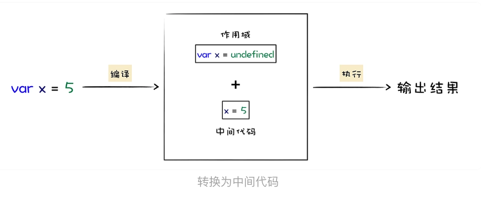
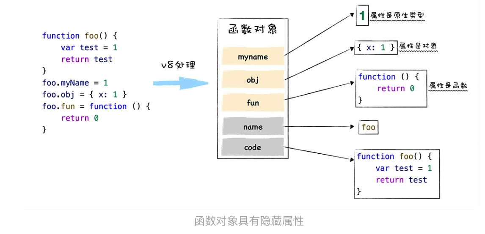
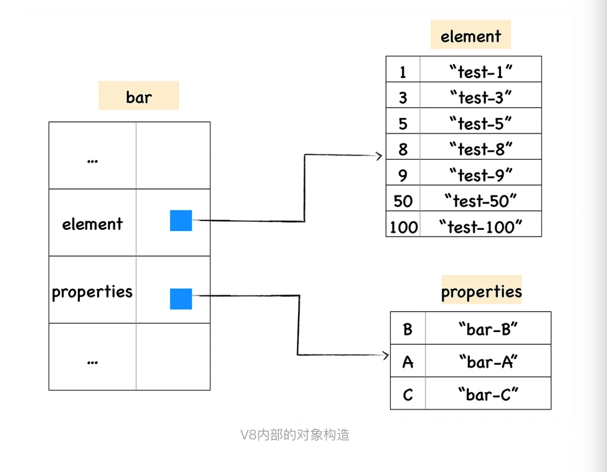
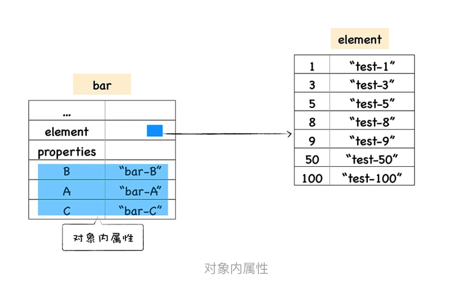
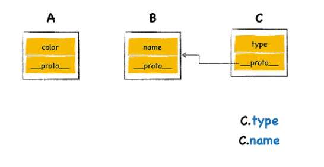
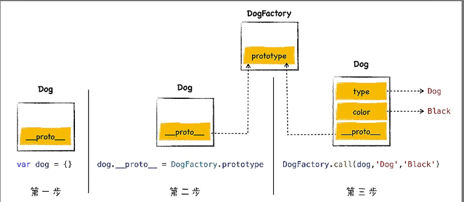

# 图解 Google V8

## 开篇词 | 如何学习谷歌高性能 JavaScript 引擎 V8？

什么是 V8？

V8 是 JavaScript 虚拟机的一种。我们可以简单地把 JavaScript 虚拟机理解成是一个翻译程序，讲人类能够理解的编程语言 JavaScript，翻译成机器能够理解的机器语言。

在 v8 出现之前，所有的 JavaScript 虚拟机所采用的都是解释执行的方法，这是 JavaScript 执行速度过慢的一个主要原因。而 V8 率先引入了即时编译（JIT）的双轮驱动的设计，这是一种权衡策略，混合编译执行和解释执行这两种手段，给 JavaScript 的执行速度带来了极大的提升。

## 如何学习 V8


深入分析过 JavaScript 语言后，我们就可以学习 v8 执行 JavaScript 代码的完整流程了。

编译流水线本身并不复杂，但是其中涉及到了很多技术，诸如 JIT、延迟解析、隐藏类、内联缓存。

在比如 v8 中使用的隐藏类（hide class），这是将 JavaScript 中动态类型转为静态类型的一种技术，可以消除动态类型的语言执行速度过慢的问题。

在比如，v8 实现了 JavaScript 代码的惰性解析，目的是为了加速代码的启动速度，通过对惰性解析机制的学习，可以提高程序性能。

JavaScript 是一种自动垃圾回收的语言。V8 在执行垃圾回收时，会占用主线程的资源，如果我们编写的程序频繁触发垃圾回收，那么无疑会阻塞主线程，

v8 知识点

v8 会将 js 代码转为 字节码，然后有个解释器来执行字节码，如果有块字节码被反复执行，那么 v8 会将字节码转换为二进制机器代码，然后 cpu 直接执行二进制的机器代码。

01 | V8 是如何执行一段 JavaScript 代码的？

v8 的主要核心流程分为编译和执行两步。首先需要将 JavaScript 代码转为低级中间代码或者机器能够理解的机器代码，然后在执行转换后的代码并输出执行结果。



你可以把 V8 看成是一个虚构出来的计算机，也称为虚拟机，虚拟机通过模拟实际计算机的各种功能来实现代码的执行，如模拟实际计算机的 CPU、堆栈、寄存器等，虚拟机还具有它自己的一套指令系统。

高级代码为什么需要先编译在执行？

我们先从 cpu 是怎么执行机器代码讲起，可以把 cpu 看成是一个非常小的运算机器，我们可以通过二进制的指令和 cpu 沟通。

为了完成复杂的任务，工程师们为 cpu 提供了一大堆指令，来实现各种功能。我们把这一大堆指令称为指令集，也就是机器语言。

注意，CPU 只能识别二进制的指令，但是对程序员来说，二进制代码难以阅读和记忆，于是我们又将二进制指令集转换为人类可以识别和记忆的符号，这就是汇编指令集，你可以参考下面的代码：

```asm
1000100111011000  机器指令
mov ax,bx         汇编指令
```

那么你可能会问，CPU 能直接识别汇编语言吗？

答案是“不能”，所以如果你使用汇编编写了一段程序，你还需要一个汇编编译器，其作用是将汇编代码编程成机器代码，具体流程你可以参考下图：


汇编语言比较繁琐的原因：

1. 不同的 CPU 有着不同的指令集
2. 在编写汇编代码时，我们还需要了解和处理器架构相关的硬件知识。

和汇编语言一样，处理器也不能直接识别高级语言所编写的代码。通常要有两种方式来执行这些代码。

第一种是解释执行，需要先将输入的源代码通过解析器编译成中间代码，之后直接使用解释器解释执行中间代码，然后直接输出结果。


第二种是编译执行，采用这种方式，也需要将源代码转换为中间代码，然后我们的编译器再将中间代码编译成机器代码，通常编译成的机器代码是以二进制文件形式存储的，需要执行这段程序的时候直接执行二进制文件就可以了。还可以使用虚拟机将编译后的机器代码保存在内存中，然后直接执行内存中的二进制代码


这就是高级语言的两种基本方式： 解释执行和编译执行。

要执行 c 语言编写的代码，你需要将其编译为二进制文件，然后直接执行二进制文件就可以了。
而对于像 Java 语言、JavaScript 语言等，则需要不同虚拟机，模拟计算机的这个编译执行流程。
执行 Java 语言，需要经过 Java 虚拟机的转换，执行 JavaScript 需要经过 JavaScript 虚拟机的转换。

V8 是怎么执行 JavaScript 代码的？

实际上 v8 并没有采用某种单一的技术，而是混合编译执行和解释执行这两种方式。我们把这种混合使用编译器和解释器的技术称为 JIT（Just In Time）编译技术。

在 v8 启动执行 JavaScript 之前，它还需要准备执行 JavaScript 时所需的一些基础环境，这些基础环境包括了“堆空间”和“栈空间”“全局执行上下文”“全局作用域”“消息循环系统”“内置函数”等，

- JavaScript 全局执行上下文就包含了执行过程中的全局信息，比如一些内置函数，全局变量等信息；

- 全局作用域包含了一些全局变量，在执行过程中的数据都需要存放在内存中；

- 而 V8 是采用了经典的堆和栈的内存管理模式，所以 V8 还需要初始化内存中的堆和栈结构；

- 另外，想要我们的 V8 系统活起来，还需要初始化消息循环系统，消息循环系统包含了消息驱动器和消息队列，它如同 V8 的心脏，不断接受消息并决策如何处理消息。

基础环境准备好之后，接下来就可以向 v8 提交要执行的 JavaScript 代码。

首先 V8 会接收到要执行的 JavaScript 源代码，不过这对 V8 来说只是一堆字符串，V8 并不能直接理解这段字符串的含义，它需要结构化这段字符串。结构化，是指信息经过分析后可分解成多个互相关联的组成部分，各组成部分间有明确的层次结构，方便使用和维护，并有一定的操作规范。

V8 源代码的结构化之后，就生成了抽象语法树 (AST)，我们称为 AST，AST 是便于 V8 理解的结构。

在生成 ast 的过程中，V8 会对源代码进行词法分析和语法分析，词法分析是将源代码分解成一个个 token，语法分析是将 token 组合成 AST。

在生成 ast 的同时，v8 还会生成相关的作用域，作用域中存放相关变量。

有了 AST 和作用域之后，接下来就可以生成字节码了，字节码是介于 AST 和机器代码的中间代码。但是与特定类型的机器代码无关，解释器可以直接解释执行字节码，或者通过编译器将其编译为二进制的机器代码再执行。

好了，生成了字节码之后，解释器就登场了，它会按照顺序解释执行字节码，并输出执行结果。

这其中有优化点，我们在解释器执行字节码的过程中，会记录一些热点代码，如果某个代码块被反复执行，那么这个代码块就是热点代码块，我们可以将其编译为二进制的机器代码，然后直接交给 CPU 执行，这样就可以提高代码的执行效率。（相信你注意到了，我们在解释器附近画了个监控机器人，这是一个监控解释器执行状态的模块，在解释执行字节码的过程中，如果发现了某一段代码会被重复多次执行，那么监控机器人就会将这段代码标记为热点代码。）

当某段代码被标记为热点代码后，v8 就会将这段字节码丢给优化编译器，优化编译器会在后台将字节码编译为二进制代码，然后在对编译后的二进制代码执行优化操作，优化后的二进制代码会被保存在代码缓存中，下次执行这段代码时，就可以直接使用优化后的二进制代码了。

需要注意的是： JavaScript 的对象结构和属性是可以在运行时任意修改的，而经过优化编译器优化过的代码只能针对某种固定的结构，一旦在执行过程中，对象的结构被动态修改了。那么优化之后的代码势必会变成无效的代码，这时候优化编译器就需要执行反优化操作，经过反优化的代码，下次执行时就会回退到解释器解释执行。

跟踪一段实际代码的执行流程

1. 首先代码解析器结构化成 AST.

2. 在生成 AST 的同时，生成作用域，作用域中存放相关变量。

3. 生成了 AST 和作用域之后，就可以使用解释器生成字节码了。

生成字节码后，解释器会执行这段字节码，如果重复执行了某段代码，监控器就会将其标记为热点代码，并提交给编译器优化执行。

总结：

- 初始化基础环境；
- 解析源码生成 AST 和作用域；
- 依据 AST 和作用域生成字节码；
- 解释执行字节码；
- 监听热点代码；
- 优化热点代码为二进制的机器代码；
- 反优化生成的二进制机器代码。

这里你需要注意的是，JavaScript 是一门动态语言，在运行过程中，某些被优化的结构可能会被 V8 动态修改了，这会导致之前被优化的代码失效，如果某块优化之后的代码失效了，那么编译器需要执行反优化操作。

## 答疑

全局执行上下文和全局作用域的关系

执行上下文是运行代码时的基础环境，包括了变量环境，词法环境，this 值，外部环境等内容。

全局执行上下文就是指全局代码执行时的运行环境。

而作用域是一个抽象概念，它主要引用了执行上下文中的变量，以方便查找。

如果全局执行上下文中有块级作用域：
let a=1
｛
let b =7
｝

比如执行上面这样的代码，当执行到大括号里面时，全局执行上下文只有一个，但是作用域却有两个

## 02 | 函数即对象：一篇文章彻底搞懂 JavaScript 的函数特点

JavaScript 中的函数就是一种特殊的对象。 我们可以称为一等公民。

JavaScript 是一门基于对象的语言，可以说 JavaScript 中大部分的内容都是由对象构成的


虽然 JavaScript 是基于对象设计的，但是它却不是一门面向对象的语言 (Object—Oriented Programming Language)，因为面向对象语言天生支持封装、继承、多态，但是 JavaScript 并没有直接提供多态的支持，


基于原型链的继承

只是在对象中添加了一个称为原型的属性，把继承的对象通过原型链接起来，就实现了继承，我们把这种继承方式称为基于原型链继承。

对象的属性值有三种：

1.原始类型

第一种是原始类型 (primitive)，所谓的原始类的数据，是指值本身无法被改变，比如 JavaScript 中的字符串就是原始类型，如果你修改了 JavaScript 中字符串的值，那么 V8 会返回给你一个新的字符串，原始字符串并没有被改变，我们称这些类型的值为“原始值”。

JavaScript 中的原始值主要包括 null、undefined、boolean、number、string、bigint、symbol 这七种。

2.对象类型
对象的属性值也可以是另外一个对象

3.函数类型

如果对象中的属性值是函数，那么我们把这个属性称为方法，所以我们又说对象具备属性和方法

函数的本质

函数是一种特殊的对象，它和对象一样可以拥有属性和值，但是函数和普通对象不同的是，函数可以被调用。

```JS
function foo(){
    var test = 1
}
foo.myName = 1
foo.uName = 2
console.log(foo.myName)
```

既然是函数，那么它也可以被调用，比如函数名加小括号或者匿名函数。

那么在 v8 内部是怎么实现函数的调用的呢？

其实在 v8 内部，会为函数对象添加了两个隐藏属性。



也就是说，函数除了可以拥有常用类型的属性值之外，还拥有两个隐藏属性，分别是 name 属性和 code 属性。

隐藏 name 属性的值就是函数名称，如果某个函数没有设置函数名。

```JS
(function (){
    var test = 1
    console.log(test)
})()
```

该函数对象的默认的 name 属性值就是 anonymous，表示该函数对象没有被设置名称。另外一个隐藏属性是 code 属性，其值表示函数代码，以字符串的形式存储在内存中。当执行到一个函数调用语句时，V8 便会从函数对象中取出 code 属性值，也就是函数代码，然后再解释执行这段函数代码。

函数是一等公民

因为函数是一种特殊的对象，所以在 JavaScript 中，函数可以赋值给一个变量，也可以作为函数的参数，还可以作为函数的返回值。

**如果某个编程语言的函数，可以和这个语言的数据类型做一样的事情，我们就把这个语言中的函数称为一等公民。**

由于函数的“可被调用”的特性

我们知道，在执行 JavaScript 函数的过程中，为了实现变量的查找，V8 会为其维护一个作用域链，如果函数中使用了某个变量，但是在函数内部又没有定义该变量，那么函数就会沿着作用域链去外部的作用域中查找该变量，具体流程如下图所示：


从图中可以看出，当函数内部引用了外部的变量时，使用这个函数进行赋值、传参或作为返回值，你还需要保证这些被引用的外部变量是确定存在的，这就是让函数作为一等公民麻烦的地方，因为虚拟机还需要处理函数引用的外部变量。

```JS
function foo(){
    var number = 1
    function bar(){
        number++
        console.log(number)
    }
    return bar
}
var mybar = foo()
mybar()
```

观察上段代码可以看到，我们在 foo 函数中定义了一个新的 bar 函数，并且 bar 函数引用了 foo 函数中的变量 number，当调用 foo 函数的时候，它会返回 bar 函数。

那么所谓的“函数是一等公民”就体现在，如果要返回函数 bar 给外部，那么即便 foo 函数执行结束了，其内部定义的 number 变量也不能被销毁，因为 bar 函数依然引用了该变量。

我们也把这种将外部变量和和函数绑定起来的技术称为闭包。

03 | 快属性和慢属性：V8 是怎样提升对象属性访问速度的？

在 v8 实现对象存储时，并没有完全采用字典的存储方式，这是主要出于性能的考量。

因为字典是非线性的数据结构，查询效率会低于线性的数据结构。V8 为了提升存储和查找效率，采用了一套复杂的存储策略


常规属性 properties 和排序属性 elements

```JS
function Foo() {
    this[100] = 'test-100'
    this[1] = 'test-1'
    this["B"] = 'bar-B'
    this[50] = 'test-50'
    this[9] =  'test-9'
    this[8] = 'test-8'
    this[3] = 'test-3'
    this[5] = 'test-5'
    this["A"] = 'bar-A'
    this["C"] = 'bar-C'
}
var bar = new Foo()


for(key in bar){
    console.log(`index:${key}  value:${bar[key]}`)
}
```

设置的数字属性被最先打印出来了，并且是按照数字大小的顺序打印的；

设置的字符串属性依然是按照之前的设置顺序打印的，比如我们是按照 B、A、C 的顺序设置的，打印出来依然是这个顺序。

之所以出现这样的结果，是因为在 ECMAScript 规范中定义了数字属性应该按照索引值大小升序排列，字符串属性根据创建时的顺序升序排列。

在这里我们把对象中的数字属性称为排序属性，在 V8 中被称为 elements，字符串属性就被称为常规属性，在 V8 中被称为 properties。

在 V8 内部，为了有效地提升存储和访问这两种属性的性能，分别使用了两个线性数据结构来分别保存排序属性和常规属性，



通过上图我们可以发现，bar 对象包含了两个隐藏属性：elements 属性和 properties 属性，elements 属性指向了 elements 对象，在 elements 对象中，会按照顺序存放排序属性，properties 属性则指向了 properties 对象，在 properties 对象中，会按照创建时的顺序保存了常规属性。

分解成这两种线性数据结构之后，如果执行索引操作，那么 V8 会先从 elements 属性中按照顺序读取所有的元素，然后再在 properties 属性中读取所有的元素，这样就完成一次索引操作。

快属性和慢属性

将不同的属性分别保存到 elements 属性和 properties 属性中，无疑简化了程序的复杂度，但是在查找元素时，却多了一步操作，比如执行 bar.B 这个语句来查找 B 的属性值，那么在 V8 会先查找出 properties 属性所指向的对象 properties，然后再在 properties 对象中查找 B 属性，这种方式在查找过程中增加了一步操作，因此会影响到元素的查找效率。

基于这个原因，V8 采取了一个权衡的策略以加快查找属性的效率，这个策略是将部分常规属性直接存储到对象本身，我们把这称为对象内属性 (in-object properties)。对象在内存中的展现形式你可以参看下图：



采用对象内属性之后，常规属性就被保存到 bar 对象本身了，这样当再次使用 bar.B 来查找 B 的属性值时，V8 就可以直接从 bar 对象本身去获取该值就可以了，这种方式减少查找属性值的步骤，增加了查找效率。

**不过对象内属性的数量是固定的，默认是 10 个**，如果添加的属性超出了对象分配的空间，则它们将被保存在常规属性存储中。虽然属性存储多了一层间接层，但可以自由地扩容。

通常，我们将保存在线性数据结构中的属性称之为“快属性”，因为线性数据结构中只需要通过索引即可以访问到属性，虽然访问线性结构的速度快，但是如果从线性结构中添加或者删除大量的属性时，则执行效率会非常低，这主要因为会产生大量时间和内存开销。

因此，如果一个对象的属性过多时，V8 就会采取另外一种存储策略，那就是“慢属性”策略，但慢属性的对象内部会有独立的非线性数据结构 (词典) 作为属性存储容器。所有的属性元信息不再是线性存储的，而是直接保存在属性字典中。


```JS
function Foo(property_num,element_num) {
    //添加可索引属性
    for (let i = 0; i < element_num; i++) {
        this[i] = `element${i}`
    }
    //添加常规属性
    for (let i = 0; i < property_num; i++) {
        let ppt = `property${i}`
        this[ppt] = ppt
    }
}
var bar = new Foo(30,10)
```

结合上图，我们可以看到，这时候的 properties 属性里面的数据并不是线性存储的，而是以非线性的字典形式存储的，所以这时候属性的内存布局是这样的：

- 10 属性直接存放在 bar3 的对象内 ;
- 90 个常规属性以非线性字典的这种数据结构方式存放在 properties 属性里面 ;
- 10 个数字属性存放在 elements 属性里面。

其他属性

除了 elements 和 porperties 属性之外，V8 还为对象添加了其他属性，比如 map 属性、**proto** 属性。**proto** 属性就是原型，是用来实现 JavaScript 继承的，我们会在下一节来介绍；而 map 则是隐藏类，

总结：

为了提升查找效率，V8 在对象中添加了两个隐藏属性，排序属性和常规属性，element 属性指向了 elements 对象，在 elements 对象中，会按照顺序存放排序属性。properties 属性则指向了 properties 对象，在 properties 对象中，会按照创建时的顺序保存常规属性。

通过引入这两个属性，加速了 V8 查找属性的速度，为了更加进一步提升查找效率，V8 还实现了内置内属性的策略，当常规属性少于一定数量时，V8 就会将这些常规属性直接写进对象中，这样又节省了一个中间步骤。

但是如果对象中的属性过多时，或者存在反复添加或者删除属性的操作，那么 V8 就会将线性的存储模式降级为非线性的字典存储模式，这样虽然降低了查找速度，但是却提升了修改对象的属性的速度。

使用 delete 来删除属性，首先 需要找到该属性是常规还是快属性，如果是常规属性而且是以字典的形式存储的话，查找需要耗时比较久。

04 | 函数表达式：涉及大量概念，函数表达式到底该怎么学？

函数声明与函数表达式的差异

```JS
foo()
function foo(){
    console.log('foo')
}
----------------
foo()
var foo = function (){
    console.log('foo')
}
```


因为语义不同，所以我们给这两种定义函数的方式使用了不同的名称，第一种称之为函数声明，第二种称之为函数表达式。

V8 是怎么处理函数声明的？

我们先来看函数声明，函数声明定义了一个具有指定参数的函数，其声明语法如下所示：

```JS
function name([param,[, param,[..., param]]]) {
   [statements]
}
```

v8 是怎么处理函数声明的？ 在 v8 执行 javascript 的过程中，会先对其进行编译，然后在执行。

```JS
var x = 5
function foo(){
    console.log('Foo')
}
```


编译阶段，如果解析到函数声明，那么 v8 会将这个函数声明转换为内存中的函数对象，并将其放到作用域。同样，如果解析到某个变量声明，也会将其放到作用域中，但是会将其设置为 undefined，表示该变量还未被使用。

然后在 v8 执行阶段，如果使用了某个变量，或者调用了某个函数，那么 v8 便会去作用域查找相关内容。

关于作用域的数据，你也可以使用 d8 来查看，具体操作方式如下：

1. 将这段代码保存到一个文件中，比如 test.js

2. 使用“d8 --print-scopes test.js”命令即可查看作用域中的数据

```JS
Global scope:
global { // (0x7fb62281ca48) (0, 50)
  // will be compiled
  // 1 stack slots
  // temporary vars:
  TEMPORARY .result;  // (0x7fb62281cfe8) local[0]
  // local vars:
  VAR x;  // (0x7fb62281cc98)
  VAR foo;  // (0x7fb62281cf40)


  function foo () { // (0x7fb62281cd50) (22, 50)
    // lazily parsed
    // 2 heap slots
  }
}
```

作用 foo 函数对象被 v8 存放在内存中的堆空间了，这些变量都是在编译阶段被装进作用域中的。

我们把这种在编译阶段，将所有的变量提升到作用域的过程称为变量提升。

了解了变量提升，我们就能解释，为什么可以在函数声明之前调用该函数了，这是因为声明的函数在编译阶段就被提升到了作用域中，在执行阶段。

表达式就是表示值的式子，而语句是操作值的式子。

比如：

```JS

x = 5
```

就是表达式，因为执行这段代码，它会返回一个值。同样，6 === 5 也是一个表达式，因为它会返回 False。

而语句则不同了，比如你定义了一个变量：

```JS

var x
```

这就是一个语句，执行该语句时，V8 并不会返回任何值给你。

同样，当我声明了一个函数时，这个函数声明也是一个语句，比如下面这段函数声明：

```JS

function foo(){
  return 1
}
```

当执行到这段代码时，V8 并没有返回任何的值，它只是解析 foo 函数，并将函数对象存储到内存中。

在 v8 执行 var x = 5 这段代码时，会认为它是两段代码，一段是定义变量的语句，一段是赋值的表达式

```JS

var x = undefined
x = 5
```

首先，在变量提升阶段，V8 并不会执行赋值的表达式，该阶段只会分析基础的语句，比如变量的定义，函数的声明。

而这两行代码是在不同的阶段完成的，var x 是在编译阶段完成的，也可以说是在变量提升阶段完成的，而 x = 5 是表达式，所有的表达式都是在执行阶段完成的。

在变量提升阶段，V8 将这些变量存放在作用域时，还会给它们赋一个默认的 undefined 值，所以在定义一个普通的变量之前，使用该变量，那么该变量的值就是 undefined。

**表达式是不会在编译阶段执行的，**

```JS
function foo(){
    console.log('Foo')
}
```

执行这段代码，并不会输出任何内容，可以肯定的是，函数声明并不是一个表达式，而是一个语句。V8 在变量提升阶段，如果遇到函数声明，那么 V8 同样会对该函数声明执行变量提升操作。

函数也是一个对象，所以在编译阶段，V8 就会将整个函数对象提升到作用域中，并不是给该函数名称赋一个 undefined，理解这一点尤为重要。

总的来说，在 v8 解析 JavaScript 源码的过程中，如果遇到普通的变量声明，那么便会将其提升到作用域中，并给该变量赋值为 undefined，如果遇到普通的变量声明，那么便会将其提升到作用域中，并给该变量赋值为 undefined，如果遇到的是函数声明，那么 v8 会在内存中为声明生成函数对象，并将该对象提升到作用域中。


v8 是怎么处理函数表达式的？

我们在一个表达式中使用 function 来定义一个函数，那么就把该函数称为函数表达式。

函数表达式与函数声明的最主要区别有以下三点：

- 函数表达式是在表达式语句中使用 function 的，最典型的表达式是“a=b”这种形式，因为函数也是一个对象，我们把“a = function (){}”这种方式称为函数表达式；
- 在函数表达式中，可以省略函数名称，从而创建匿名函数（anonymous functions）；

- 一个函数表达式可以被用作一个即时调用的函数表达式——IIFE（Immediately Invoked Function Expression）。

在编译阶段，v8 并不会处理函数表达式，而 JavaScript 中的立即函数 调用表达式正是使用了这个特性来实现了非常广泛的应用

因为小括号之间存放的必须是表达式，所以如果在小阔号里面定义一个函数，那么 V8 就会把这个函数看成是函数表达式，执行时它会返回一个函数对象。

```JS
(function () {
    //statements
})
```

函数立即表达式也是一个表达式，所以在 v8 在编译阶段，并不会为该表达式创建函数对象。这样的一个好处就是不会污染环境，函数和函数内部的变量都不会被其他部分的代码访问到。

在 ES6 之前，JavaScript 中没有私有作用域的概念，如果在多人开发的项目中，你模块中的变量可能覆盖掉别人的变量，所以使用函数立即表达式就可以将我们内部变量封装起来，避免了相互之间的变量污染。

另外，因为函数立即表达式是立即执行的，所以将一个函数立即表达式赋给一个变量时，不是存储 IIFE 本身，而是存储 IIFE 执行后返回的结果。如下所示：

```JS
var a = (function () {
    return 1
})()
```

总结

函数声明和变量声明类似，V8 在编译阶段，都会对其执行变量提升的操作，将它们提升到作用域中，在执行阶段，如果使用了某个变量，就可以直接去作用域中去查找。

不过 V8 对于提升函数和提升变量的策略是不同的，如果提升了一个变量，那么 V8 在将变量提升到作用域中时，还会为其设置默认值 undefined，如果是函数声明，那么 V8 会在内存中创建该函数对象，并提升整个函数对象。

函数表达式也是表达式的一种，在编译阶段，V8 并不会将表达式中的函数对象提升到全局作用域中，所以无法在函数表达式之前使用该函数。函数立即表达式是一种特别的表达式，主要用来封装一些变量、函数，可以起到变量隔离和代码隐藏的作用，因此在一些大的开源项目中有广泛的应用。

```js
(function () {
  //statements
})();

等价于(
  (function () {
    //statements
  })()
);
```

05 ｜原型链：V8 是如何实现对象继承的？

简单地理解，继承就是一个对象可以访问另外一个对象中的属性和方法，比如我有一个 B 对象，该对象继承了 A 对象，那么 B 对象便可以直接访问 A 对象中的属性和方法，你可以参考下图：

其中最典型的两种方式是基于类的设计和基于原型继承的设计。

C++、Java、C# 这些语言都是基于经典的类继承的设计模式，这种模式最大的特点就是提供了非常复杂的规则，并提供了非常多的关键字，诸如 class、friend、protected、private、interface 等，通过组合使用这些关键字，就可以实现继承。

而 JavaScript 的继承方式和其他面向对象的继承方式有着很大区别，JavaScript 本身不提供一个 class 实现。JavaScript 的继承依然和基于类的继承没有一点关系。所以当看到 JavaScript 出现了 class 关键字，不要以为 JavaScript 也是面向对象语言。

JavaScript 仅仅在对象中引入了一个原型的属性，就实现了语言的继承机制，基于原型的继承省去了很多基于类继承时的复杂规则，使得 JavaScript 的继承变得非常简单。

从图中可以看出 v8 的内存快照看到，JavaScript 的每个对象都包含了一个隐藏属性**proto**，我们把该隐藏属性**proto**称之为该对象的原型 (prototype)，**proto** 指向了内存中的另外一个对象，我们就把 **proto** 指向的对象称为该对象的原型对象，那么该对象就可以直接访问其原型对象的方法或者属性。



不要将原型链接和作用域链搞混淆了，作用域链是沿着函数的作用域一级一级来查找变量的，而原型链是沿着对象的原型一级一级来查找属性的。

继承就是一个对象可以访问另外一个对象中的属性和方法，在 JavaScript 中，我们通过原型和原型链的方式来实现了继承特性。

在实际使用者： 虽然现代浏览器都开了一个口子，让 JavaScript 可以访问隐藏属性 _proto_，但是在实际项目中，我们不应该直接通过 _proto_ 来访问或者修改该属性，

首先，这是隐藏属性，并不是标准定义的 ;其次，使用该属性会造成严重的性能问题。

通过 new 的方式创建对象

把 new 后面的函数称之为构造函数。

```JS
function DogFactory(type,color){
    this.type = type
    this.color = color
}

var dog = new DogFactory('Dog','Black')

```

```JS
var dog = {}
dog.__proto__ = DogFactory.prototype
DogFactory.call(dog,'Dog','Black')
```



- 首先，创建了一个空白对象 dog；

- 然后，将 DogFactory 的 prototype 属性设置为 dog 的原型对象，这就是给 dog 对象设置原型对象的关键一步，我们后面来介绍；

- 最后，再使用 dog 来调用 DogFactory，这时候 DogFactory 函数中的 this 就指向了对象 dog，然后在 DogFactory 函数中，利用 this 对对象 dog 执行属性填充操作，最终就创建了对象 dog。

构造函数实现继承

```JS
function DogFactory(type,color){
    this.type = type
    this.color = color
    //Mammalia
    //恒温
    this.constant_temperature = 1
}
var dog1 = new DogFactory('Dog','Black')
var dog2 = new DogFactory('Dog','Black')
var dog3 = new DogFactory('Dog','Black')
```

还记得我们介绍函数时提到关于函数有两个隐藏属性吗？这两个隐藏属性就是 name 和 code，其实函数还有另外一个隐藏属性，那就是 prototype，

每个函数对象中都有一个公开的 prototype 属性，当你将这个函数作为构造函数来创建一个新的对象时，新创建对象的原型对象就指向了该函数的 prototype 属性。

06 ｜作用域链：V8 是如何查找变量的？
