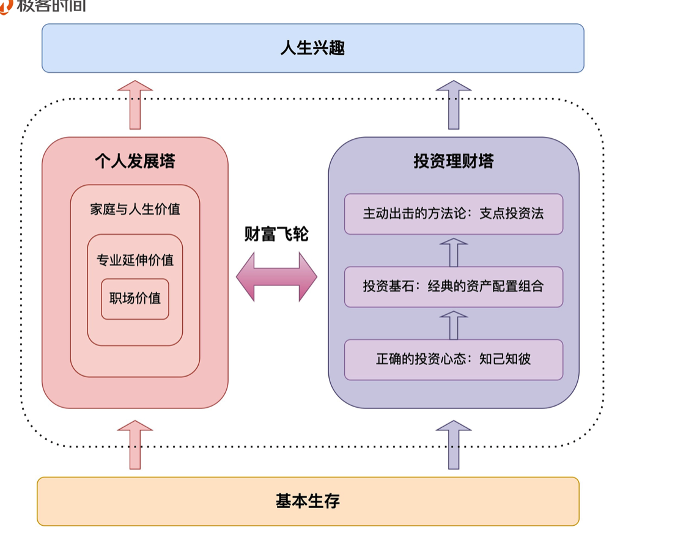
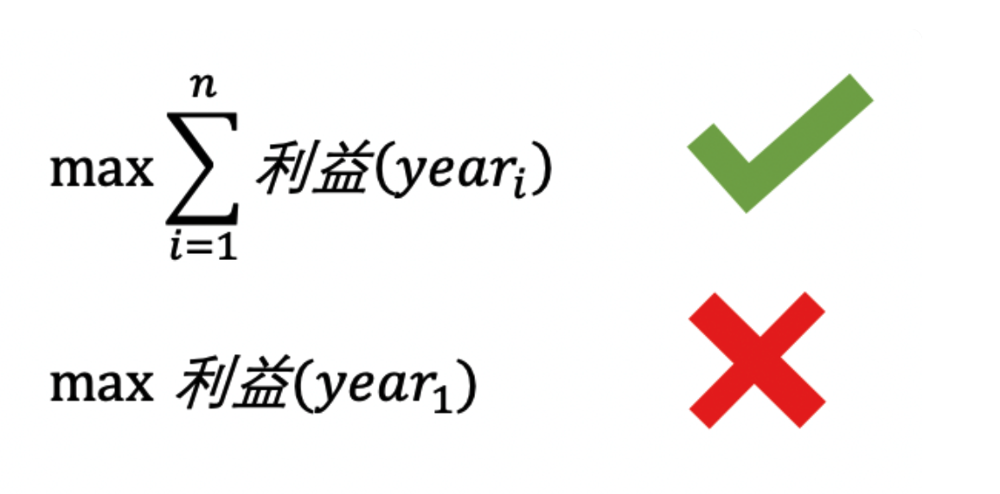
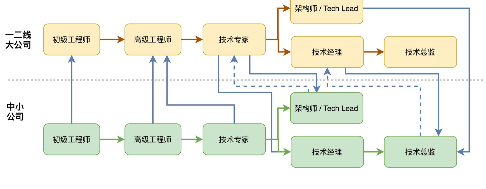
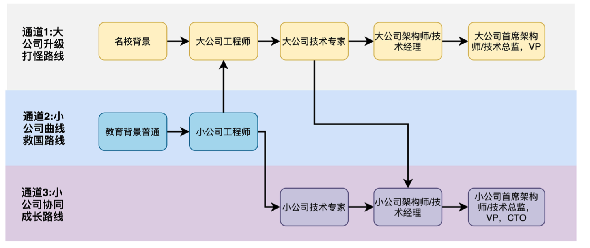
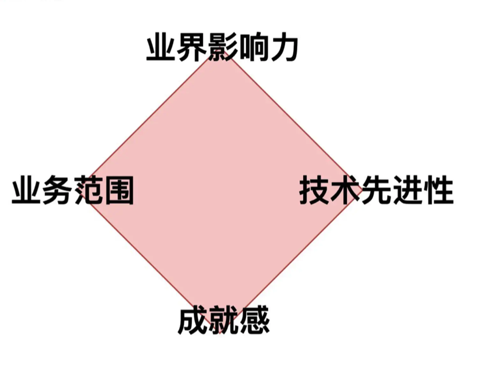
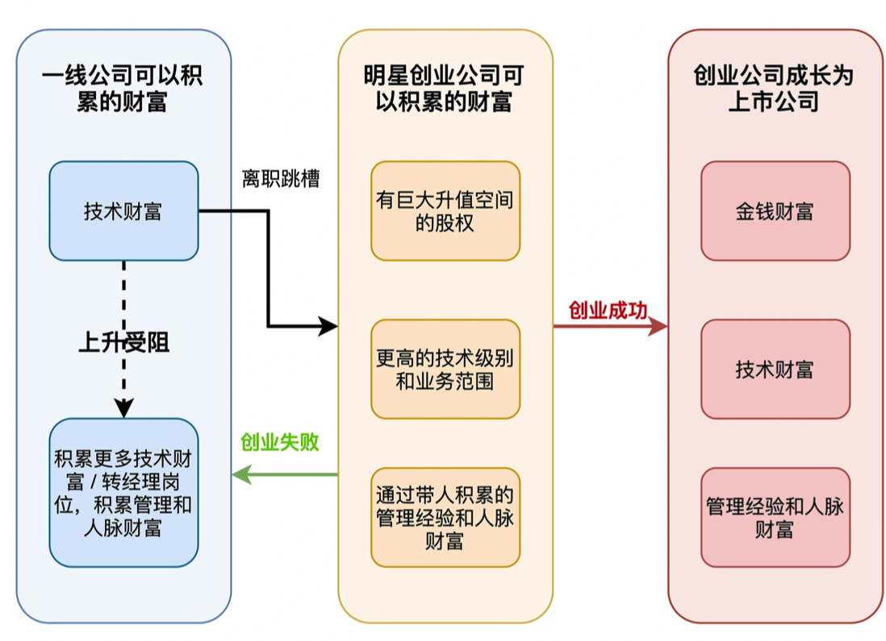
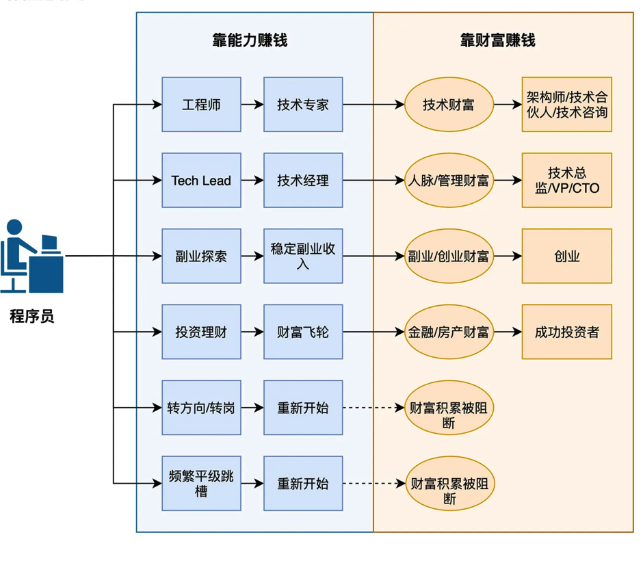
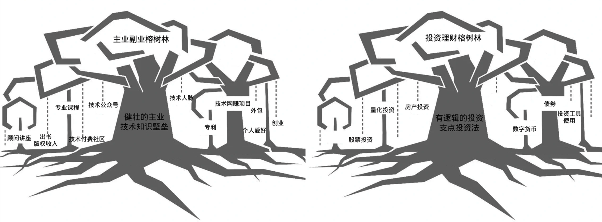
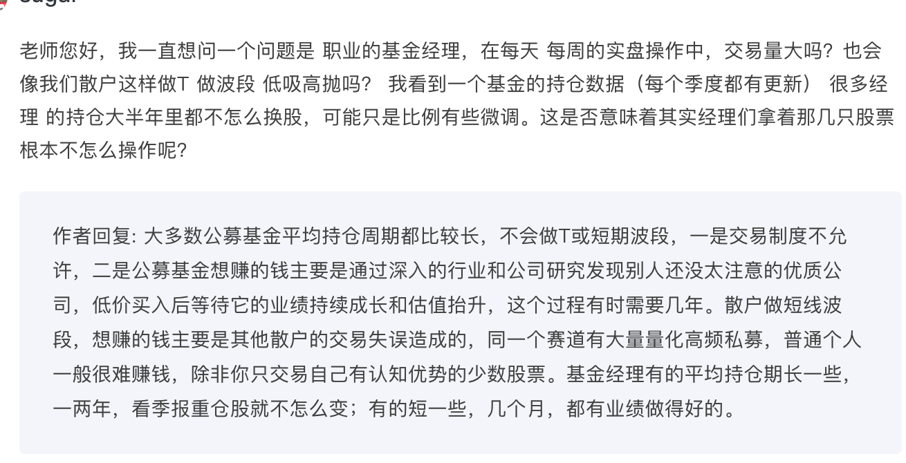

一个真正的聪明人，应该学会用更少的精力去摘到那些生活中的 low hanging fruit。和解决你工作中那些极端刁难人的问题相比，进行有效的财富管理就是“容易摘的果子”。

## 财富双塔

“个人发展”这座塔，总体上是一个人的外向能力，或者说社会性能力的体现。

而“投资理财”这座塔，本质上是一个人内向能力的体现。

对自己的认知，尤其是对自己能力边界和风险承受能力的清晰认知，是比找到一个顶级投资策略，或抢手的投资标的更关键的事。

你开始理财的时候越年轻，你的试错成本就越小；而且，投资心态和投资技巧是需要一定的锻炼来提升的，你开始得越早，今后受益的时间就越长。

投资理财的能力，本质上是一个内向型的能力。加入过多的炒股群，去跟同样不懂的人去交流，不仅毫无意义，而且会让自己的心态更加烦躁。成功的投资者的状态有且只有一个，那就是有一天你发现自己可以通过平和的、有条理的分析得出自洽的投资结论，并依此精确执行，除此之外，别无他法。

第一，绝不混淆工作时间和财富管理的时间，做坚决的隔离，防止精力分散；
第二，跟时间做朋友，保持每天的短时间投入和累计的长时间投入；
第三，坚决固定自己进行财富管理的时间，没有重大的工作和个人意外事件，雷打不动地在财富管理的时间做财富管理的事情。

财富的双塔框架指的是由“个人发展”塔和“投资理财”塔组成的稳固的财富结构；“个人发展”更多需要人的外向型能力，而“投资理财”更多需要人的内向型能力；要尽早让“个人发展”塔和“投资理财”塔互通互助，让财富的飞轮转起来；在工作紧张的情况下，还是要提前隔离出思考和处理财富管理问题的时间，只有这样，才能尽早脱离这种疲于应付的状态。

财富双塔框架，首先说说个人发展方面，写书也就是总结提升和传授经验的事情。也就是说在自己的某个擅长领域进行的总结，让自己进入一个新的阶段的方式。投资理财方面，写书本身也希望能够卖个好销量。这样自己的个人财富就进行了增加，进而能够利用这些财富做些更加对自己有利的事情形成正向循环。

这是典型的非财富型思维，是绝对要杜绝的，压根不知道自己能有什么财富，有哪些可能有的潜力，只希望从别人那要来标准答案，这门课希望大家树立的，就是要从自己的角度出发，找到那些有一定区分度的属于自己的财富，而不要期待从别人那要到标准答案。

写不了书和专栏，搞不来发明专利，没有作者这种影响力和技术能力的人，怎么办
一个简单的例子，我上学的时候曾经帮一位妇产科的护士建立过一个讲育儿知识的网站，人家现在也基本靠后续的发展衣食无忧了。这需要影响力吗？需要成为技术大牛吗？

 有一种思路是要专注 你要是花时间在投资理财上 在专业上的时间就会少 最后一平均 两个方面的能力就会都很普通 你怎么看这种思路
作者回复: 一，绝对不要平均，你应该花90%的时间在你工作上，10%在财富管理上。这门课是要你去摘财富管理的low hanging fruit，不是要你荒废最重要的个人发展塔。

二，如果你分10%的时间财富管理上，就搞的你在工作上很平庸，那只能说明你工作方式方法有很大问题

三，我相信，只要方法得当，时间管理的严格，专注在工作和财富管理有限的点上，你会在两方面都优秀，而不是都普通。

## 个人发展

相比于投资理财，“个人发展”带来的自身价值的增长，才是我们应该首先关注的财富增长极。而且，如果你有很强的个人发展规划能力，自身价值增长带来的收益绝对不会比投资理财低。

提到个人价值，这里还有一个常见的误区，就是把“个人价值”狭隘地理解为“职场价值”。这样的理解，不仅会导致我们错失很多个人发展的机会，而且本质上也造成了职场“内卷”现象。

和“职场价值”密切相连的是“专业延伸价值”。顾名思义，它是由我们的专业能力延伸出来的个人价值。

我们在做好本职工作之外，需要时刻去提升自己的“专业延伸价值”，因为积攒下来的个人价值才是你自己的财富。

要分清楚什么是财富，什么是收入

年薪百万，是你的个人收入；你能够拿到百万年薪的能力，才是你的个人价值，或者说个人财富。

因为一线互联网公司的经验和技术级是职场的财富，而不仅仅是一份工作收入，它是有益于今后整个职业生涯的发展的。

所以我在给同行们提建议的时候，一般都会引导大家从积累职场财富的角度进行思考。你的选择应该建立在至少十年的职业规划，而不是最近三年的收入比较上。

在职业生涯的规划上，财富的积累往往比短期收入的提升更加重要，因为前者能够持续产生长期性的收益。

人的精力确实是有限的，但我们应该关注人生中最重要的那些事情。而践行这个道理的关键点，就在于我们要始终“外包消耗型的工作，积累财富型的资源”。

这里的“消耗型的工作”，指的是那些消耗我们的精力，却无法带来财富积累的工作。典型的就是日常的家务，以及办证、办手续等琐碎的流程性工作。

个人价值由三个同心圆组成，它们由内而外依次是“职场价值”“专业延伸价值”和“家庭与人生价值”。在个人发展的道路上，要分清楚什么是财富，什么是收入。财富是能够持续产生收入的个人价值，而收入是一个瞬时量，是你个人价值带来的经济收益。为了有更多时间和精力积累财富型资源，我们要尽量外包消耗型的工作。专业延伸价值并不是你挖空心思凭空创造出来的，更多是在你个人发展的过程中自然生发而来的，你要做的就是用心抓住它们。

有两件事情是值得做一辈子的，一是在自己的专业方向上精益求精，二是持续提高自己投资理财的能力

## 理财金字塔

“标的”，我们今后还会多次用到它。它指的就是我们投资理财过程中的投资目标

* 固收类投资标的
* 股票类投资标的
* 实物类投资标的
* 新兴投资标的

基金的本质应该是一种投资方式或中介标的。因为基金的最后也是流向固收类、股票类、实物类和新兴类。所以他不应该与这几类并列。

最经典、极易操作的“股债组合”

股债组合”是指主要投资于“股票”和“债券”这两类资产的资产配置组合。其中，60/40 股债配置组合，即 60% 股票和 40% 债券的组合最为经典

投资行为的出发点有且只有一个，那就是“严谨的投资逻辑”。

个人情绪是所有投资者的“公敌”

一种典型的有逻辑且可行的投资方法，支点投资法。

所谓“支点投资法”，就是要先为你所有的投资行为寻找一个逻辑支点，之后随着时间的推移，不断去验证这个支点还存不存在。一旦这个支点消失，就要毅然决然地选择结束这次投资行为。

止盈和止损的本质是什么？

因为无论是“止盈”还是“止损”，都在做同一件事，就是“退出”。而“退出”的原因，有且只有一个，那就是你当初那个投资支点的崩塌。

永久组合 6.8% 的年化收益其实是一个非常优秀的收益率，想要通过主动投资获得超过它的收益率，并不是一件容易的事情；要想通过主动投资真正赚到钱，就必须遵照“严谨的投资逻辑”；“逻辑”和“情绪”是一对严格对立的敌人，在投资过程中，一定要避免由情绪驱使的“无效投资”和“神经错乱”现象；“支点投资法”分为“建仓”“验证”“退出”三个阶段。它的大致过程是：在投资行为发生之前，先寻找一个逻辑支点。之后，随着时间的推移，不断去验证这个支点还存不存在。一旦这个支点消失，就要毅然决然地选择结束这次投资行为；止盈和止损的本质是统一的，就是在投资支点崩塌之后的退出行为。退出时盈利，则是止盈操作；退出时亏损，则是止损操作。

80%资产放到配置，20%的资产主动投资，这样主动投资亏损不会应为仓位太重心态失衡。

这辈子我不可能只靠投资就实现财富自由；
我不可能是那个万中无一的幸运儿，刚开始投资就能稳定盈利；
如果我在投资的时候随意操作，不讲投资逻辑，就算一时靠运气挣到了钱，也早晚会被亏光。

普通投资者的常见误区

误区一：加入多个炒股群，盲从“炒股专家”或电视炒股节目的意见

误区二：盲目自大，频繁短期操作

他总结了两种可以靠频繁短线操作盈利的方式：一是通过高频交易模型，利用大数据、强大的算力、低延迟的交易系统以及交易所的返点实现；二是只交易自己特别熟悉的几只股票，并且有大量交易经验和超出常人的投资天赋。

误区三：谨小慎微，只敢把钱放银行存定期

和专业投资者相比，普通投资者的优势在哪？

优势一：长钱优势个人投资者最大的优势就是长钱优势。这里的“长钱”，指的是可以长期不被挪动，只用于投资的资金。

优势二：专业信息优势

优势三：程序员优势

在个人发展的过程中同样要摆正心态

如果能够在投资过程中，发挥我们程序员的工具优势、模型优势，来构建一些量化的交易算法或者系统，是完全有可能在投资的过程中胜出的。

长期的“摸鱼”行为带来的一定是个人发展的停滞不前，如果公司健康发展也就罢了，一旦出现问题需要裁员，个人发展长期停滞的你根本不具备足够的职场财富，也就会被人才市场无情地抛弃。

一个职业方向好不好，可以从两个维度来判断：从长期来说，要看它的“高度”和“容量”；从短期来说，要看它的“供需关系”。

第一，下决心。按照我们刚才说的原则，从“短期”和“长期”两个维度，确定你未来希望从事的方向。

你的决定一定要建立在充分的分析决策之上；而且，一旦做出这个决定，就不要轻易改变。，所有的工作、学习行为都要围绕着转方向这个目标。

第二，定目标。在确定自己的目标方向后，至少提前一年去看目标职位的 JD（Job Description），列清我们的具体目标。

你需要进行细致的规划，包括需要掌握的工具，需要了解的领域知识，需要准备的面试题等等。然后根据这些具体目标，有的放矢地去扫清转方向过程中的障碍。

第三，攒经验。你当前的工作、学习行为，都应该围绕着新的目标进行调整。

首先推荐看下混沌大学的第二曲线，里面提到两个切换到第二个增长赛道关键点。
一，十倍速变化。
二，击穿阈值。
当要出现新赛道的时候，一般都有一个10倍变化的变量，你一定能发现。我刚12年毕业是oracle dba，但当时注意到mysql的技术文章分享是其他数据库的10倍，评估mysql下一个关键点，主动去学mysql（选择）。
但是要从oracle切换到mysql还是很难的，因为当时mysql dba国内并不多，我自己也没实践，没人带，市面上没系统的课。所以我通读官方文档加阅读源码这条最苦的路子，击穿新赛道的阈值（坚持努力）。
十倍速的变化，大家一定要注意，这是行业变化的一个前置关键点。
击穿阈值，要说的就是只有达到阈值，你的努力才能量变质。

## 08｜职业规划

一般来说，我们每个人都要在工作中度过至少 20 年的时光，因此我们要寻求的应该是整个职业生涯利益的最大化，而不仅仅是最近这一份工作利益的最大化。

对于职业生涯，我们要优化的目标函数是 n 年职业生涯利益的总和，而不是最近一年的职场收益。

如果你想尝试加入中小公司，我有三个建议，可以帮助你有效规避潜在的风险：

尽量去 B 轮之后，已经有稳定商业模式的中小公司。

即使去中小公司，也要寻求不低于业界平均水平的薪资。

尽量去细分领域的头部中小公司，这样还可以保持技术上的先进性

缺啥补啥，高端玩家看重的是职场体验

在职场生涯的前 5 到 10 年完成技术积累后，一个成熟的职场人应该把路越走越宽，能够比较自由地选择接下来的道路，补足曾经没有的职场体验。这才是职场“高端玩家”的理想状态。

在职业生涯的前 5 到 10 年，作为一个初级玩家，你需要做的是踏踏实实地积累自己的技术财富，之后才能在坚实的根基上有更高的、更加理想化的追求。否则，这就不是高端玩家丰富职场体验，而是初级玩家的搏命之旅了。

到底什么是期权和股权？

“股权激励”一般分为两种，一种是直接授予“股权”，一种是授予“期权”。

大部分上市公司对员工的股权激励，基本都是以直接授予 RSU（受限股票单元）的形式实现的。这里提到的 RSU，除了只能在规定的时间点卖出外，跟股民们从交易所买入的股票是一样的。但是，那些处于创业阶段，还未上市的公司，往往会用授予期权的方式来激励员工。

两种方式的区别在于，“期权”并不是实实在在的股权，获得期权的员工不享受股权附带的任何权利。期权仅仅是一种合约，这个合约赋予持有人在某一特定时间段以固定价格购进或售出一种资产的权利。你行使这个权利的行为，叫做“行权”。

通俗点说，期权规定了一个购买股权的价格，你可以在某一时间段内用这个价格购买到股权。比如说，公司授予你了 1000 股期权，行权价格是每股 10 块，行权的时限是从授权日起的四年之内。那么，你就可以在未来四年内，花 10×1000=1 万块 把这些期权变成股权。所以，期权操作的重点是，你需要花钱来行权。

这意味着什么呢？一般来说，公司期权的价格是跟公司当前的估值挂钩的。如果公司的估值不涨，你手里的期权有意义吗？没有。因为你花 1 万块钱买到的股权还是只值 1 万块，没有得到任何收益。

所以，在谈 offer 的时候，如果你要入职的公司有股权激励，一定要搞清楚公司授予你的是股权还是期权。如果是期权，还要弄清楚行权价是多少。如果行权价过高，一定要评估一下这样的期权还有没有意义。这是避免踩坑的最基本操作。

在职业规划中，如何更合理地追求股权收益？

第一，一定要在具备了一定的技术财富后，再去追求股权的收益。

第二，如果你不是职场高端玩家，尽量不要尝试加入初创公司。

第三，不要忽视上市公司的股权升值机会。

仅以口头形式承诺期权，缺少书面的授权方案；在正式 offer 中不写明期权数量和授权细节；在你加入公司后，以各种理由不签署或者推迟签署书面的期权授予协议，不执行当初约定的授权方案。

所以，在拿到股票后，只有在两个时间点卖出是比较合适的。一是刚授权的时候，你不用交资本增值税，可以把这些钱投资到其他地方或者用来消费；二是在授权一年后，短期资本增值税转换成了长期增值税，税率可以大幅降低。

什么时候应该决定离开这家公司？

**当一家公司阻碍了你职场价值的提升，或者说职场财富的积累，那么就可以离开这家公司了。**

第一种情况：你加入这家公司的时候，就是把它当跳板的。

第二种情况：整个行业出现了不可逆转的问题。

第三种情况：当前公司已经无法给你提供任何技术财富和人脉财富。

因为工作难度大而离职，是最差的跳槽理由。

换个角度说，如果是为了逃避问题而跳槽，难道你到了新公司就不会面临挑战吗？要知道，新公司是因为缺人才招聘，招你进来就是为了解决问题的。

**跳槽不是为了逃避问题，而是为了解决问题。**

一味逃避对问题的思考，把所有问题都归结于外部环境，这种做法就是在自欺欺人。只有养成“向内思考”的习惯，找到问题的真正源头，才能找到职场成功的钥匙。

要解决的问题，就是如何进行更快的财富积累。所以，我认为跳槽最好的时间点是刚胜利结束了一个大项目，或者刚实现了一个期待已久的职场目标。

应该怎么选择你的下一站？

其实，你在加入一家公司的时候，就应该想清楚至少三个问题：

我希望在这家公司实现怎样的目标？

当我离开这家公司的时候，应该带着什么收获，或者说以什么样的状态离开？

当我离开之后，我的下一站应该在哪里？

只要你不是富二代，靠能力完成自己的原始财富积累就是一个必须经历的过程。在财富积累的过程中，可能会出现这种情况：有些人因为频繁平级跳槽，甚至频繁更换职业方向，始终冲不破“用能力赚钱”这一圈层，因此终其一生，都只能在财富的初级赛道上打转。

主动思考才能把握住财富机会

“榕树关系”：主业的健壮是一切副业的基础

这个副业是不是建立在我已有的技术 / 知识，或者坚持多年的兴趣爱好高点上的？这个副业能不能让我的主业也获益？这个副业我有没有可能坚持十年以上？

我们一定要明确：买这套房的目的不是赚大钱，而是对冲未来可能出现的风险。这里的风险主要有两个：

确定性风险：通货膨胀。
不确定性风险：限购政策、利率政策、国际环境变化等因素带来的房价暴涨。

普通人的重大投资决策都要以规避风险为第一要务，要严格控制黑天鹅事件可能带来的不能承受的后果。”

首套房的购买逻辑一定是规避风险，而不是投资收益。

房产这个投资标的，它最大的优点和最大的缺点都是流动性差。

第一，尽可能不要在房价暴涨的时候投资。

第二，尽可能在房价进入稳定期后两到三年买房、换房。

**在财富积累阶段要尽量节制消费欲，注重积累的成长。**

从买房的角度看，我已经没有戏了， 
首先： 我肯定只能买刚需，因为没有余钱买投资之后在置换房子（时间周期太长）

不会。只有理财收益率和房贷利率的关系，是影响房贷方式的终极要素。

如果你的稳定理财利率能够高于房贷贷款利率，那么首付少付、还款年限长合适；反之，如果你的稳定理财利率低于房贷贷款利率，那么首付多付、还款年限短合适。

第一件，是根据自己掌握的资金，严格地控制购房预算。

第二件，是尽量少付首付，留一些流动资金

a. 投资理财定投指数基金和少量股票，越早越好。
b. 每月准备20%备用金，以备风险如失业，大环境等不可控因素。

投资于股市的股票型基金；投资于债市的债券型基金；股市债市都投的混合型基金；投资于短期货币市场的货币基金。

我们还可以按照投资的特点，来对基金进行分类，比如完全按照指数比例被动配置的指数型基金，和根据基金经理的理念主动配置的主动型基金等等。

第一步，基于资产配置组合或支点投资法，选择一个你认可的投资赛道。

首先，我们要做的就是选择赛道。选择的依据主要有两个，一是被动的资产配置组合，二是主动的投资支点。

一是基金的本质，二是选择基金的逻辑。选择基金，分为选择投资赛道和选择基金经理两个步骤。

我们先来看第一步，基金筛选。
选择投资赛道有两个依据，一是你的资产配置组合，二是基于支点投资法的主动投资。v

因为股票型基金的短期收益几乎没有持续性

一个简单又较为可靠的基金筛选方法就是看基金评级

接下来看第二步，个基评估

用基金评级结果进行初步筛选，剔除掉成立时间太短、基金经理近期换过、偏行业或主题型的主动股票基金和被动指数型基金，得到 3 到 5 只符合条件的备选基金；把这 3 到 5 只基金放入价格比工具，和沪深 300 指数比较，看哪只价格比的曲线斜率更高，走势更平稳。根据你的风险偏好，选出最适合你的那只基金。当然，这三个步骤也适用于其他任何类别基金的选择过程。

在选择主动股票型基金时，要过滤掉新成立的基金和刚更换过基金经理的基金；价格比指的是基金每日价格（也就是基金净值）与基准指数每日价格的比值；价格比曲线向右上方延伸的坡度越陡峭，意味着超额收益率越高；曲线上的毛刺越少，曲线越平滑，最大回撤就越低，意味着超额收益的稳定性越高；投资美股时，投资 QDII 被动指数基金是一个兼顾收益率和便捷性的选择；投资债券型基金时，注意区分国债基金和信用债基金；在管理投资组合时，每个季度（或者市场出现大幅波动的时候）进行一次资产的再平衡。

是优秀的，每个基金经理关注的方向不一样，风格也不一样。
就好比张坤是种西瓜的，今年刚好是冬天，不在他的收获去。而隔壁种白菜的在收获。你不能现在拔了西瓜苗，去种白菜，这样啥也得不到。一年四季，尊重市场尊重规律。

第一，一些直接或间接的重大负面因素，严重打压了你熟悉的股票的价格。

第一，散户投资者更要保持稳定的心态。

第二，注意支点投资法中支点的出现与崩塌。

长钱优势：要稳定投资心态，基于你的长线投资支点进行投资。做到这一点，你就比那些由于业绩压力，很难沉得住气的专业投资者强很多；专业信息优势：要懂得分析自己掌握了哪些别人很难获取的信息，然后以此构建自己的信息壁垒，指导自己的投资行为；程序员优势：要懂得在自己的投资过程中多用程序整合、处理、分析信息，甚至构建一个简单的量化系统，基于数据进行投资，这是我们程序员独有的优势。

策略：选择好的行业，优质的标的，优秀的基金经理，长期持有，长坡厚雪，静待花开!

建立投资闭环，就是在原来支点投资法的流程中加上复盘环节。长期进行有效复盘的投资者，和从不进行复盘的投资者，在支点投资法的具体应用上有着决定性的差距。

我的复盘结论之一：除非有极强的做空信号，否则散户不要去碰做空交易。
我的复盘结论之二：要在市场疯狂的时候让利润奔跑，选择合适的退出时机。

投资跟踪表分为头脑风暴阶段、支点研究阶段、投资跟踪阶段三大部分，坚持使用它会帮助你成为越来越专业的投资者。

什么是价值投资

价值投资的本质很简单，就是拿你手中的财富去交换更有价值的东西。

价值投资的本质就是利用价格围绕价值波动这一特性，拿你手中的财富去交换更有价值的东西。

价值投资的机会总是会产生的三个原因是：人性的缺陷，宏观经济政策的影响，以及投资者自身的资金约束。

判断投资标的是否被低估的一般方法：使用公司的 PE、PB 等各种估值指标以及估值分位数去判断。

对于没有时间和精力践行价值投资理念的投资者来说，把这个工作外包给价值投资基金经理是一个可行的方法。

趋势跟踪策略就是“追涨杀跌”：当一个资产的价格近期上涨的时候，我们就做多这个品种；当一个资产近期价格下跌的时候，我们就做空这个品种

那么，为什么趋势跟踪策略能让我们赚到钱呢？这个策略的底层逻辑是什么呢？

简单来说，支撑趋势跟踪策略的底层逻辑有三个，分别是信息的传播过程，经济或产业周期的存在，以及投资者情绪的推动。

趋势指标 1：近期涨幅

趋势指标 2：双均线系统

趋势指标 3：布林带

趋势交易，是右侧交易的一种。强调纪律。增加止损和分批建仓可以在降低回撤，提升夏普率。

追涨策略，我做的少，但是一些明显的周期股机会其实蛮好做的。比如这几年我做过的猪周期，有色周期，券商。这些股票同质化高，商品没啥差异。而且有反身性。比如券商牛市的时候，股价大涨，业绩也大涨形成戴维斯双击，但是熊市就会戴维斯双杀，标的波动空间大（一般预判涨幅要大于30%）才有利可图。所以先小仓位试探趋势是否形成，强调：基本上所以的策略都不要all in。在每一个突破点加仓。并设置最高点回撤8%离场获利。收益是不错的。

情绪归情绪，操作上还是要坚持自己长期相信的方法论，不能因为一时的得失盲目变更。

爱你所爱，行你所行，听从你心，无问西东

个世界当然是不完美的，这个时代也不是对所有人都公平。但我要说的是，成年人的世界里没有人是轻松的。当你觉得生活真的太难了，实在是坚持不下去了，其实你的领导、同学、朋友都在面临着这样或那样的难题，因为这就是生活的真相。但是，有的人在看清真相之后，选择了唉声叹气、消极逃避、“佛系”“躺平”，而有的人还是会用极大的热情去面对这个世界。如果你是后者，那你就是罗曼·罗兰笔下的“英雄”

