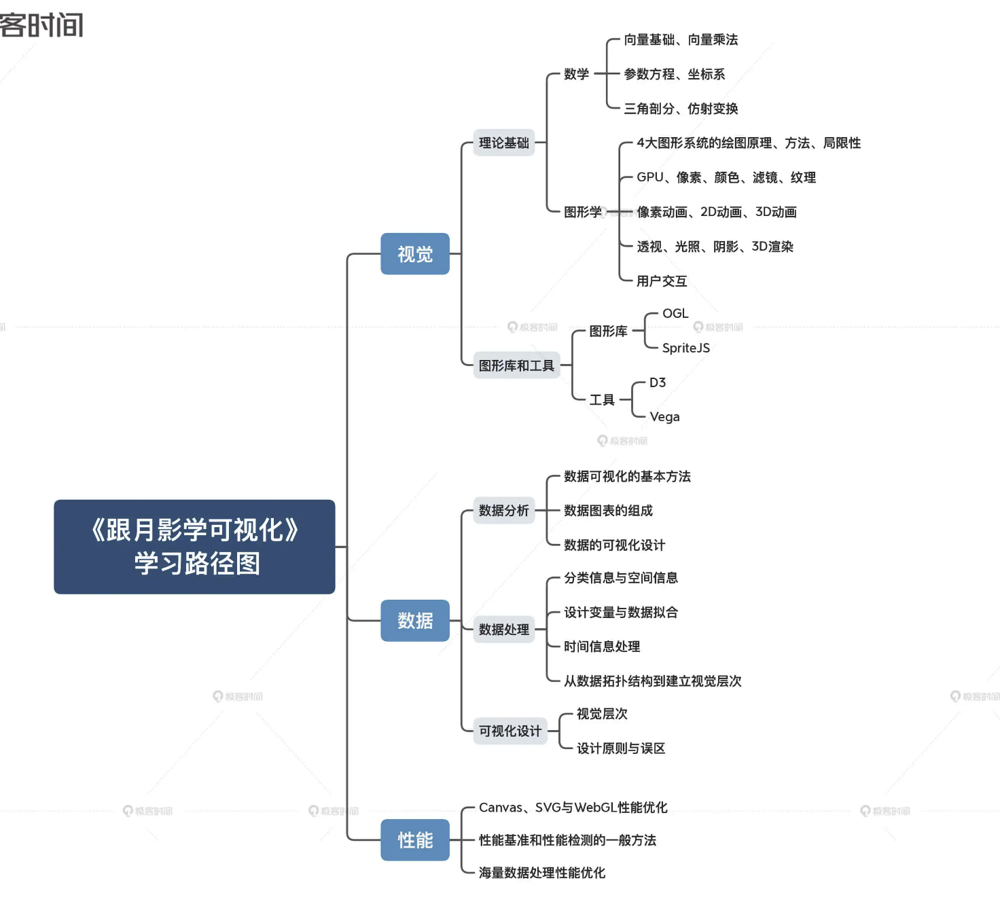
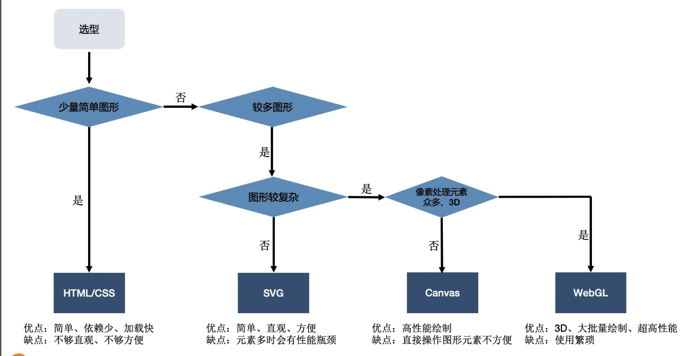

##

我们不能停留在可视化现有的库、框架和工具的使用层面上，必须深入技术栈的底层，充分理解数据，掌握视觉呈现相关的技术和基本原理。打好基础之后，再系统地学习可视化领域的方法论，才能提高解决问题的能力


可视化的视觉主要设计四个部分，分别是理论基础、图形系统、图形库和工具

视觉部分的理论基础就是数学和图形学




Web 开发以呈现块状内容为主，所以 HTML 是更合适的技术。而可视化开发因为需要呈现各种各样的形状、结构，所以，形状更丰富的 SVG 以及更底层的 Canvas2D 和 WebGL 就是更合适的技术了。

其次，Web 开发着重于处理普通的文本和多媒体信息，渲染普通的、易于阅读的文本和多媒体内容，而可视化开发则着重于处理结构化数据，渲染各种相对复杂的图表和图形元素。

就是 Web 开发的前端主要还是关注内容和样式，图形的渲染和绘制是由浏览器底层来完成的，而可视化前端则可能要深入底层渲染层，去真正地控制图形的绘制和细节的呈现。

可视化与 Web 前端一样，最终都是以图像呈现在浏览器上，因此有许多通用的方法论。

二者都使用 JavaScript，而且都是浏览器端的 JavaScript。

可视化领域的工具：

我们可以把这些工具大体上分为四类，分别是：
专业呈现各种类型图表的图表库；
专业处理地图、地理位置的可视化地理库；
专业处理视觉呈现的渲染库；
以及处理数据的数据驱动框架。

如果要绘制更加复杂的地图，比如，一座城市的交通线路和建筑物三维模型，或者一个园区的立体建筑模型等等，我们可能要依赖专业的 GIS 地图库。社区中比较成熟的 GIS 库也不少，比较常见的像 Mapbox、Leaflet、Deck.gl、CesiumJS 等等。

如果要绘制其他更灵活的图形、图像或者物理模型，我们常用的一些图表库就不一定能完成了。这个时候，我们可以用 ThreeJS、SpriteJS 这样比较通用的渲染库（实际上图表库或 GIS 地图库本身底层渲染也基于这些渲染库）。我们可以选择通用的图形库，比如，2D 渲染可以选择 SpriteJS，3D 渲染可以选择 ThreeJS、BabylonJS 以及 SpriteJS3D 扩展等等。

除了这些库之外，还有一类比较特殊的库，比如 D3.js，它属于数据驱动框架。那什么是数据驱动框架呢？这是一种特殊的库，它们更专注于处理数据的组织形式，而将数据呈现交给更底层的图形系统（DOM、SVG、Canvas）或通用图形库（SpriteJS、ThreeJS）去完成。

## 浏览器中实现可视化的四种方式

1. 传统的 html+CSS

2. SVG

3. Canvas2D

4. WebGL

用 GPU 渲染各种复杂的 2D 和 3D 图形。值得一提的是，WebGL 利用了 GPU 并行处理的特性，这让它在处理大量数据展现的时候，性能大大优于前 3 种绘图方式。

浏览器的渲染引擎在工作时，要先解析 HTML、SVG、CSS，构建 DOM 树、RenderObject 树和 RenderLayer 树，然后用 HTML（或 SVG）绘图。当图形发生变化时，我们很可能要重新执行全部的工作，这样的性能开销是非常大的。


一般情况下，Canvas2D 绘制图形的性能已经足够高了，但是在三种情况下我们有必要直接操作更强大的 GPU 来实现绘图。第一种情况，如果我们要绘制的图形数量非常多，比如有多达数万个几何图形需要绘制，而且它们的位置和方向都在不停地变化，那我们即使用 Canvas2D 绘制了，性能还是会达到瓶颈。这个时候，我们就需要使用 GPU 能力，直接用 WebGL 来绘制。

第二种情况，如果我们要对较大图像的细节做像素处理，比如，实现物体的光影、流体效果和一些复杂的像素滤镜。由于这些效果往往要精准地改变一个图像全局或局部区域的所有像素点，要计算的像素点数量非常的多（一般是数十万甚至上百万数量级的）。这时，即使采用 Canvas2D 操作，也会达到性能瓶颈，所以我们也要用 WebGL 来绘制。

第三种情况是绘制 3D 物体。因为 WebGL 内置了对 3D 物体的投影、深度检测等特性，所以用它来渲染 3D 物体就不需要我们自己对坐标做底层的处理了。那在这种情况下，WebGL 无论是在使用上还是性能上都有很大优势。

## 要点总结

HTML+CSS 的优点是方便，不需要第三方依赖，甚至不需要 JavaScript 代码。如果我们要绘制少量常见的图表，可以直接采用 HTML 和 CSS。它的缺点是 CSS 属性不能直观体现数据，绘制起来也相对麻烦，图形复杂会导致 HTML 元素多，而消耗性能。

SVG 是对 HTML/CSS 的增强，弥补了 HTML 绘制不规则图形的能力。



canvas2d 绘图是通过自身的 api，gpu 是浏览器底层调用的，不受开发者控制。webgl 不一样，将数据写入帧缓冲之后，最终通过 WebGLProgram 来执行 shader 完成图形渲染，所以 webgl 能够自己控制 gpu 渲染。

有很多图形计算，webgl 是可以放在 shader 里面去计算的，这样比用 js 计算快，这就是 gpu 和 cpu 计算的区别。

另外为什么 threejs 的自定义的 shader 会更好，也是因为我们可以在 shader 中完成一些计算，还有 threejs 精灵默认的 shader 是根据材质生成的，里面的计算也是依照一些规则来给出的。自定义 shader 更灵活。

## 如何用 canvas 绘制 几何图形

1. canvas 的 html 属性宽高为画布宽高，css 样式宽高为样式宽高

在实际绘画中，如果我们不设置 canvas 元素的样式，那么 canvas 元素的画布宽高就会等于它的样式宽高的像素值，也就是 512px。

画布宽高决定了可视区域的坐标范围，所以 canvas 将画布宽高和样式宽高分开的做法，能更方便地适配不同的显示设备

2. canvas 的坐标系

canvas 的坐标系是以左上角为原点，向右为 x 轴正方向，向下为 y 轴正方向，单位是像素。

3. canvas 的绘图 api

canvas 的绘图 api 有两类，一类是绘制状态的 api，另一类是绘制图形的 api。

获取 canvas 上下文对象

```js
canvas.getContext("2d");
```

我们拿到的 context 对象上会有许多 API，它们大体上可以分为两类：

一类是设置状态的 API，可以设置或改变当前的绘图状态，比如，改变要绘制图形的颜色、线宽、坐标变换等等；

另一类是绘制指令 API，用来绘制不同形状的几何图形。

其中，context.rect 是绘制矩形的 Canvas 指令，它的四个参数分别表示要绘制的矩形的 x、y 坐标和宽高。在这里我们要绘制的正方形宽高都是 100，所以后两个参数是 100 和 100。

那在实际绘制之前，我们还有一些工作要做。我要将正方形填充成红色，这一步通过调用 context.fillStyle 指令就可以完成。然后，我们要调用一个 beginPath 的指令，告诉 Canvas 我们现在绘制的路径。接着，才是调用 rect 指令完成绘图。最后，我们还要调用 fill 指令，将绘制的内容真正输出到画布中。这样我们就完整了绘制，绘制的效果和代码如下：

```JS
//JavaScript

const rectSize = [100, 100];
context.fillStyle = 'red';
context.beginPath();
context.rect(0.5 * canvas.width, 0.5 * canvas.height, ...rectSize);
context.fill();
```

移动图形中心

1. 通过 translate 方法移动图形中心

第一种做法是，我们可以让 rect 指令的 x、y 参数，等于画布宽高的一半分别减去矩形自身宽高的一半。这样，我们就把正方形的中心点真正地移动到画布中心了。代码如下所示：

```JS
//JavaScript
context.rect(0.5 * (canvas.width - rectSize[0]), 0.5 * (canvas.height - rectSize[1]), ...rectSize);
```

2.  第二种做法是，我们可以先给画布设置一个平移变换（Translate），然后再进行绘制。代码如下所示

```JS
//JavaScript

context.translate(-0.5 * rectSize[0], -0.5 * rectSize[1]);

```

第一种方式很简单，它直接改变了我们要绘制的图形顶点的坐标位置，但如果我们绘制的不是矩形，而是很多顶点的多边形，我们就需要在绘图前重新计算出每个顶点的位置，这会非常麻烦。第二种方式是对 Canvas 画布的整体做一个平移操作，这样我们只需要获取中心点与左上角的偏移，然后对画布设置 translate 变换就可以了，不需要再去改变图形的顶点位置。不过，这样一来我们就改变了画布的状态。如果后续还有其他的图形需要绘制，我们一定要记得把画布状态给恢复回来。好在，这也不会影响到我们已经画好的图形。

那怎么把画布状态恢复回来呢？恢复画布状态的方式有两种，第一种是反向平移。
反向平移的原理也很简单，你可以直接看下面的代码。

```JS
//JavaScript
// 平移context.translate(-0.5 * rectSize[0], -0.5 * rectSize[1]);... 执行绘制

// 恢复context.translate(0.5 * rectSize[0], 0.5 * rectSize[1]);
```

除了使用反向平移的恢复方式以外，Canvas 上下文还提供了 save 和 restore 方法，可以暂存和恢复画布某个时刻的状态。其中，save 指令不仅可以保存当前的 translate 状态，还可以保存其他的信息，比如，fillStyle 等颜色信息。 而 restore 指令则可以将状态指令恢复成 save 指令前的设置。操作代码如下：

```JS

//JavaScript

context.save(); // 暂存状态
// 平移
context.translate(-0.5 * rectSize[0], -0.5 * rectSize[1]);

... 执行绘制

context.restore(); // 恢复状态
```

在操作之前呢，我们先引入一个概念层次结构数据 （Hierarchy Data），它是可视化领域的专业术语，用来表示能够体现层次结构的信息，例如城市与省与国家。一般来说，层次结构数据用层次关系图表来呈现。

首先，我们讲了利用 Canvas 绘制几何图形，这个过程很简单，不过依然有 3 点需要我们注意：在 HTML 中建立画布时，我们要分别设置画布宽高和样式宽高；在建立坐标系时，我们要注意 canvas 的坐标系和笛卡尔坐标系在 y 轴上是相反的；如果要把图形绘制在画布中心，我们不能直接让 x、y 的坐标等于画布中心坐标，而是要让图形中心和画布中心的位置重叠。这个操作，我们可以通过计算顶点坐标或者 平移变换来实现。

# 03 | 声明式图形系统：如何用 SVG 图形元素绘制可视化图表？

SVG 的全称是 Scalable Vector Graphics，可缩放矢量图，它是浏览器支持的一种基于 XML 语法的图像格式。

利用 svg 绘制几何图形，svg 属于声明式绘图系统，它的绘制方式和 canvas 不同。

```JS
<svg xmlns="http://www.w3.org/2000/svg" version="1.1">
  <circle cx="100" cy="50" r="40" stroke="black"
  stroke-width="2" fill="orange" />
</svg>
```

svg 元素是 SVG 的根元素，属性 xmlns 是 xml 的名字空间。那第一行代码就表示，svg 元素的 xmlns 属性值是"http://www.w3.org/2000/svg"，浏览器根据这个属性值就能够识别出这是一段 SVG 的内容了

svg 元素下的 circle 元素表示这是一个绘制在 SVG 图像中的圆形，属性 cx 和 cy 是坐标，表示圆心的位置在图像的 x=100、y=50 处。属性 r 表示半径，r=40 表示圆的半径为 40。

通过 svg 元素设置 viewBox 属性，来改变 svg 的坐标系。如果设置了 viewBox 属性，那 svg 内部的绘制就是相对于 svg 坐标系的了。

```JS

if(children) {
    const group = document.createElementNS('http://www.w3.org/2000/svg', 'g');
    for(let i = 0; i < children.length; i++) {
      draw(group, children[i], {fillStyle, textColor});
    }
    parent.appendChild(group);
  }
```

SVG 的 g 元素表示一个分组，我们可以用它来对 SVG 元素建立起层级结构。而且，如果我们给 g 元素设置属性，那么它的子元素会继承这些属性。

最后，如果下一级没有数据了，那我们还是需要给它添加文字

```JS

else {
    const text = document.createElementNS('http://www.w3.org/2000/svg', 'text');
    text.setAttribute('fill', textColor);
    text.setAttribute('font-family', 'Arial');
    text.setAttribute('font-size', '1.5rem');
    text.setAttribute('text-anchor', 'middle');
    text.setAttribute('x', x);
    text.setAttribute('y', y);
    const name = node.data.name;
    text.textContent = name;
    parent.appendChild(text);
  }
```

首先，我们要给 SVG 的根元素添加 mousemove 事件，添加代码的操作很简单，你可以直接看代码。

```JS

 let activeTarget = null;
  svgroot.addEventListener('mousemove', (evt) => {
    let target = evt.target;
    if(target.nodeName === 'text') target = target.parentNode;
    if(activeTarget !== target) {
      if(activeTarget) activeTarget.setAttribute('fill', 'rgba(0, 0, 0, 0.2)');
    }
    target.setAttribute('fill', 'rgba(0, 128, 0, 0.1)');
    activeTarget = target;
  });

```

我们知道，SVG 作为一种浏览器支持的图像格式，既可以作为 HTML 内嵌元素使用，也可以作为图像通过 img 元素加载，或者绘制到 Canvas 内。

而用 SVG 绘制可视化图形与用 Canvas 绘制有明显区别，SVG 通过创建标签来表示图形元素，然后将图形元素添加到 DOM 树中，交给 DOM 完成渲染。

使用 DOM 树渲染可以让图形元素的用户交互实现起来非常简单，因为我们可以直接对图形元素注册事件。但是这也带来问题，如果图形复杂，那么 SVG 的图形元素会非常多，这会导致 DOM 树渲染成为性能瓶颈。

04 | GPU 与渲染管线：如何用 WebGL 绘制最简单的几何图形？

一个通用计算机图形系统主要包括 6 个部分，分别是输入设备、中央处理单元、图形处理单元、存储器、帧缓存和输出设备。

光栅（Raster）：几乎所有的现代图形系统都是基于光栅来绘制图形的，光栅就是指构成图像的像素阵列。

像素（Pixel）：一个像素对应图像上的一个点，它通常保存图像上的某个具体位置的颜色等信息。

帧缓存（Frame Buffer）：在绘图过程中，像素信息被存放于帧缓存中，帧缓存是一块内存地址。

CPU（Central Processing Unit）：中央处理单元，负责逻辑计算。

GPU（Graphics Processing Unit）：图形处理单元，负责图形计算。


首先，数据经过 CPU 处理，成为具有特定结构的几何信息。然后，这些信息会被送到 GPU 中进行处理。在 GPU 中要经过两个步骤生成光栅信息。这些光栅信息会输出到帧缓存中，最后渲染到屏幕上。


这个绘图过程是现代计算机中任意一种图形系统处理图形的通用过程。它主要做了两件事，一是对给定的数据结合绘图的场景要素（例如相机、光源、遮挡物体等等）进行计算，最终将图形变为屏幕空间的 2D 坐标。二是为屏幕空间的每个像素点进行着色，把最终完成的图形输出到显示设备上。这整个过程是一步一步进行的，前一步的输出就是后一步的输入，所以我们也把这个过程叫做渲染管线（RenderPipelines）。
