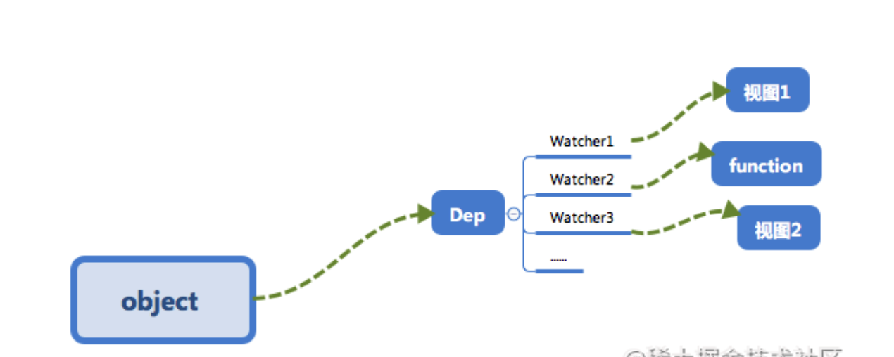
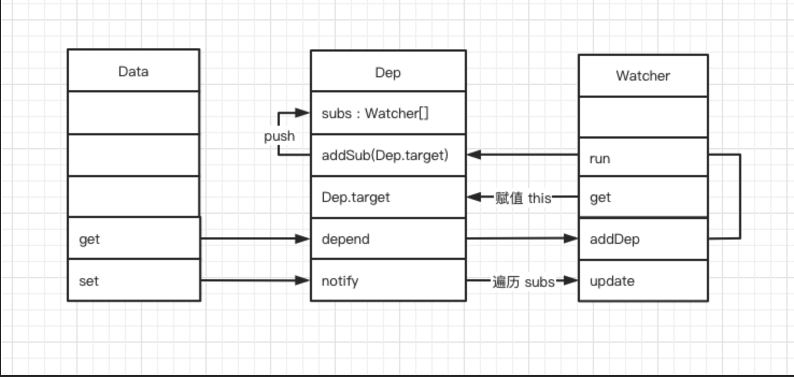

# Vue 面试

## 响应式原理

```JavaScript
function defineReactive(obj, key, val){
    Object.defineProperty(obj, key, {
        enumerable: true,       /* 属性可枚举 */
        configurable: true,     /* 属性可被修改或删除 */
        get: function reactiveGetter () {
            return val;         /* 实际上会依赖收集，下一小节会讲 */
        },
        set: function reactiveSetter (newVal) {
            if (newVal === val) return;
            cb(newVal);
        }
    });
}
```

```javascript
function observer (value) {
    if (!value || (typeof value !== 'object')) {
        return;
    }
    
    Object.keys(value).forEach((key) => {
        defineReactive(value, key, value[key]);
    });
}
```

我们用observer来封装一个vue

```javascript
class Vue {
    /* Vue构造类 */
    constructor(options) {
        this._data = options.data;
        observer(this._data);
    }
}
```

这样哦们只要new 一个对象， 就会将data中的数据进行“响应式”化

## 依赖收集



### 订阅者Dep

    主要是用来存放Watcher 观察者对象

```javascript
class Dep {
    constructor () {
        /* 用来存放Watcher对象的数组 */
        this.subs = [];
    }

    /* 在subs中添加一个Watcher对象 */
    addSub (sub) {
        this.subs.push(sub);
    }

    /* 通知所有Watcher对象更新视图 */
    notify () {
        this.subs.forEach((sub) => {
            sub.update();
        })
    }
}
```

### 观察者 watcher

```javascript
class Watcher {
    constructor () {
        /* 在new一个Watcher对象时将该对象赋值给Dep.target，在get中会用到 */
        Dep.target = this;
    }

    /* 更新视图的方法 */
    update () {
        console.log("视图更新啦～");
    }
}

```

进行依赖收集

```javascript
function defineReactive(obj, key, val){
    // 一个dep对象
    const dep = new Dep();
    Object.defineProperty(obj, key, {
        enumerable: true,
        configurable: true,
        get: function reactiveGetter () {
            /* 将Dep.target（即当前的Watcher对象存入dep的subs中） */
            dep.addSub(Dep.target);
            return val;         
        },
        set: function reactiveSetter (newVal) {
            if (newVal === val) return;
            /* 在set的时候触发dep的notify来通知所有的Watcher对象更新视图 */
            dep.notify();
        }
    });
}
class Vue {
    constructor(options) {
        this._data = options.data;
        observer(this._data);
        /* 新建一个Watcher观察者对象，这时候Dep.target会指向这个Watcher对象 */
        new Watcher();
        /* 在这里模拟render的过程，为了触发test属性的get函数 */
        console.log('render~', this._data.test);
    }
}
```

Object.defineProperty 的 set/get 方法处理的事情，那么「依赖收集」的前提条件还有两个：

1.触发 get 方法；
2.新建一个 Watcher 对象

这个我们在 Vue 的构造类中处理。新建一个 Watcher 对象只需要 new 出来，这时候 Dep.target 已经指向了这个 new 出来的 Watcher 对象来。
而触发 get 方法也很简单，实际上只要把 render function 进行渲染，那么其中的依赖的对象都会被「读取」，这里我们通过打印来模拟这个过程，读取 test 来触发 get 进行「依赖收集」。

「依赖收集」的过程，配合之前的响应式原理，已经把整个「响应式系统」介绍完毕了。其主要就是 get 进行「依赖收集」。set 通过观察者来更新视图，配合下图仔细捋一捋，相信一定能搞懂它！



## 实现一个vnode

```javascript
class VNode {
    constructor (tag, data, children, text, elm) {
        /*当前节点的标签名*/
        this.tag = tag;
        /*当前节点的一些数据信息，比如props、attrs等数据*/
        this.data = data;
        /*当前节点的子节点，是一个数组*/
        this.children = children;
        /*当前节点的文本*/
        this.text = text;
        /*当前虚拟节点对应的真实dom节点*/
        this.elm = elm;
    }
}
```

参数的解释 第一个是 标签， 第二是数据 是一个对象， 第三个是子节点的信息

```javascript
function render () {
    return new VNode(
        'span',
        {
            /* 指令集合数组 */
            directives: [
                {
                    /* v-show指令 */
                    rawName: 'v-show',
                    expression: 'isShow',
                    name: 'show',
                    value: true
                }
            ],
            /* 静态class */
            staticClass: 'demo'
        },
        [ new VNode(undefined, undefined, undefined, 'This is a span.') ]
    );
}
```

创建空结点：

```javascript
function createEmptyVNode () {
    const node = new VNode();
    node.text = '';
    return node;
}
```

创建文本节点：

```javascript
function createTextVNode (val) {
  return new VNode(undefined, undefined, undefined, String(val));
}
```

克隆一个vnode节点：

```javascript
function cloneVNode (node) {
    const cloneVnode = new VNode(
        node.tag,
        node.data,
        node.children,
        node.text,
        node.elm
    );
    return cloneVnode;
}
```

template 模版是怎样通过Compile编译的
compile 编译可以分成 parse、optimize 与 generate 三个阶段

parse 会用正则等方式将template模版中进行字符串解析，得到指令、class、style等数据，形成ast

parsehtml
首先我们需要定义个pasehtml函数，在里面我们循环解析template字符串

parseStartTag 用来解析起始标签

optimize

因为path的过程实际上是将vnode节点进行一层一层的比对，让后将“差异化”更新到视图上。

那么我们就需要为静态的节点做上一些「标记」，在 patch 的时候我们就可以直接跳过这些被标记的节点的比对，从而达到「优化」的目的。

```javascript
{
    'attrsMap': {
        ':class': 'c',
        'class': 'demo',
        'v-if': 'isShow'
    },
    'classBinding': 'c',
    'if': 'isShow',
    'ifConditions': [
        'exp': 'isShow'
    ],
    'staticClass': 'demo',
    'tag': 'div',
    /* 静态标志 */
    'static': false,
    'children': [
        {
            'attrsMap': {
                'v-for': "item in sz"
            },
            'static': false,
            'alias': "item",
            'for': 'sz',
            'forProcessed': true,
            'tag': 'span',
            'children': [
                {
                    'expression': '_s(item)',
                    'text': '{{item}}',
                    'static': false
                }
            ]
        }
    ]
}

```

isStatic

实现isStatic函数，传入一个node判断该node是否是静态节点。判断的标准是当type为2则是非静态节点，如果存在 if 或者 for这样的条件的时候（表达式节点），也是非静态节点。

```javascript
function isStatic (node) {
    if (node.type === 2) {
        return false
    }
    if (node.type === 3) {
        return true
    }
    return (!node.if && !node.for);
}
```

markStatic

markStatic 为所有的节点标记上 static，遍历所有节点通过 isStatic 来判断当前节点是否是静态节点，此外，会遍历当前节点的所有子节点，如果子节点是非静态节点，那么当前节点也是非静态节点。

```javascript
function markStatic (node) {
    node.static = isStatic(node);
    if (node.type === 1) {
        for (let i = 0, l = node.children.length; i < l; i++) {
            const child = node.children[i];
            markStatic(child);
            if (!child.static) {
                node.static = false;
            }
        }
    }
}

```

markStaticRoots

```JS
function markStaticRoots (node) {
    if (node.type === 1) {
        if (node.static && node.children.length && !(
        node.children.length === 1 &&
        node.children[0].type === 3
        )) {
            node.staticRoot = true;
            return;
        } else {
            node.staticRoot = false;
        }
    }
}
```

```javascript
function optimize (rootAst) {
    markStatic(rootAst);
    markStaticRoots(rootAst);
}
```

generate
generate 会将 AST 转化成 render funtion 字符串，最终得到 render 的字符串以及 staticRenderFns 字符串

```javascript
function generate (rootAst) {
    const code = rootAst ? genElement(rootAst) : '_c("div")'
    return {
        render: `with(this){return ${code}}`,
    }
}
```

数据状态更新时的差异diff及patch机制

跨平台

```javascript
const nodeOps = {
    setTextContent (text) {
        if (platform === 'weex') {
            node.parentNode.setAttr('value', text);
        } else if (platform === 'web') {
            node.textContent = text;
        }
    },
    parentNode () {
        //......
    },
    removeChild () {
        //......
    },
    nextSibling () {
        //......
    },
    insertBefore () {
        //......
    }
}
```

```javascript
function insert (parent, elm, ref) {
    if (parent) {
        if (ref) {
            if (ref.parentNode === parent) {
                nodeOps.insertBefore(parent, elm, ref);
            }
        } else {
            nodeOps.appendChild(parent, elm)
        }
    }
}
```

vue 支持原生事件 和 dom 事件
platformModules createPatchFunction 的时候
遍历我们的hooks
invokeCreateHook 时机

1. 在createChildren
2. 创建组件的时候

invokeUpdateHook

这两个都会执行 updateDomListeners 方法
判断： oldVnode 是不是都有on属性
