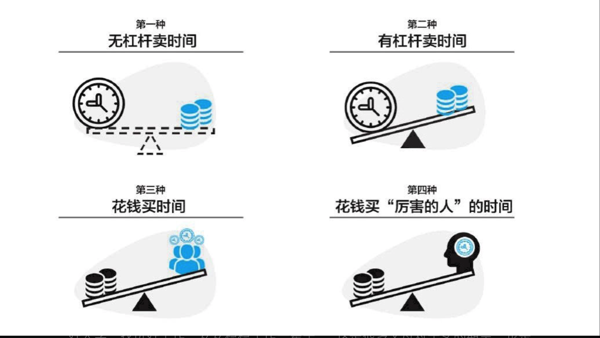

# 人生护城河

把自己视为一家公司，则商业思维可以启发我们的人生之路。如同一家公司，我们个人也需要有愿景、战略、价值观、商业模式、竞争策略，并致力于打造自己的“护城河”。
如果每个人都是一家公司，那么我们可以用“终局”思维去看：人和人的最终差别体现在表面，比如影响力、财富、健康，但其根源在于深层次的原因。其中最深层次的原因就包括各自“人生商业模式”的差异。

人生商业模式大体上可分为四种：第一，无杠杆卖时间，即单位时间只能卖一次，且只能卖给一个人，公司的雇员和小企业主（包含小型淘宝店家）一般属于这一类；第二，有杠杆卖时间，即单位时间可以卖多次，且可以卖给多人，卖出的份数和客户数与杠杆比例相关，杠杆比例基本受制于其个人品牌，艺术家一般属于这一类；第三，花钱买时间，真正的企业家属于这一类，他们获利的秘密在于“他人的时间和他人的金钱”，这就是企业家借贷和雇人的致富秘密；第四，花钱买“厉害的人”的时间，价值投资者则属于这一类。

大部分人辛苦一辈子，依然与财务自由无缘，根本原因不在于他们不幸运、不努力，而在于他们选择了错误的人生商业模式——无杠杆卖时间，即被雇佣。“上个好大学，找份好工作，安安稳稳工作一辈子”

第一，看不到财务自由的希望，除了想方设法去挣更多的工资，没有其他出路。每个月都陷入“等发薪日”的状态，所在公司可能已经很出名了，自己的努力程度也足够，但就是攒不下太多钱，家里可称为“资产”的也不多。

第二，所有工作选择都必须以“涨工资”为第一标准，无论是在公司内调整还是出去寻找机会。然而，随着年龄渐长，年薪渐高，能“继续涨工资”的工作机会越来越少。自己无力改变环境，但因为离不开这份薪水只能无奈地待在原地，放弃去追求自己真正的理想。

第三，在兴趣爱好上的投入捉襟见肘，虽然家人可能很支持自己发展兴趣，但是每次拿出一大笔钱来购买相机、电脑以及其他电子产品时，还是有一些歉疚感。所以更多的时候都是压抑自己这方面的欲望，到最后则慢慢放弃了兴趣爱好本身。

一门心思挣工资的发展道路会让人在 30 ～ 40 岁陷入严重焦虑，这个年龄段的焦虑主要来自职业发展的“停滞”和对自己财务状况的担心。虽然很多人可能一直拿着相对不错的“高薪”，但是整个家庭的财务状况还是惨不忍睹，资产很少，存款也寥寥无几。

你可能会问“钱去哪里了？”，而真相是：收入项只有一份工资，但是支出项数不清。我们把日常生活开销和一些大型消费累加在一起就会发现，工资的确只够支付这些支出。如果不刻意控制支出，就不可能有更多的结余。但是，严控支出的感觉非常差，这就像为了减肥而过分限制进食。

很多人会默认选择“被雇佣”这种商业模式的原因无外乎：

未知因素。无论是成为艺术家、企业家还是投资者，都是更难的选择，缺少标准的通路，前途未知，而且在早期回报极少，让人煎熬。所以，大多数人选择了“被雇佣”的商业模式，因为这是最容易的选择，也是最安全的选择。

做微信公众号，坚持写作，是让自己像艺术家那样去生存；把几乎所有闲钱都投资股票，是希望自己成为一个投资者；在工作中更加追求成为一个“合伙人”、一个合作者，并以这种心态对待老板、同事和客户。因为这样的转变，我的路越来越宽，人生的支撑点和对外的连接点也越来越多。

从单一的雇员，到成为艺术家、企业家以及投资者的过程并非是一蹴而就的，突变几乎是不可能的，而且即使发生一般都不是好事，而是源于外力的压迫。但是，只要你从内心认识到：“被雇佣”是一条越走越难、越走越窄、越走你的竞争对手越多（相对于机会）、越走收益与风险越不成正比的道路，你就应该放弃被雇佣的执念，选择其他三条康庄大道中的至少一条。

当你的意识发生根本改变，即使表面上还是做雇员，但是内心深处和行动方面，都可以向“合伙人”去转变，自己的心态会越来越积极，也会越来越“不唯上”。你会更加在意客户、组员的满意度。

我们在竞争之外还有选择，即尽量回归初心，找到自己真正的优势，并且在执行时尽可能避开不必要的竞争。

从不必要的竞争中摆脱出来

1。 回归初心。 一定要问自己为什么做这件事情 2. 围绕优势 人生最终要做的事情是扬长避短，当然，作为必要手段，你需要“知长知短”，即真正了解自己的优势和不足。
3。着眼长期 长线思维是把我们从竞争泥潭拉出来的利器

其实没有固定的人生导师，重要的是第一要知道自己想要什么，第二要善于不断地学习。这样的话你会不断从身边、书上找到值得你学习的人。比如在投资方面，我了解自己的性格，也知道自己想要什么，我喜欢踏实地挣钱，喜欢有预期，而不是靠运气，所以自然会喜欢巴菲特、查理·芒格、段永平。”

你需要深入地理解 filter（过滤器，请参考《长尾理论》），最有效的信息来源依次是：① 亲身体验；② 和优秀的人交流；③ 看经典图书；④ 网媒。并且我认为，媒体不是最重要的，你内心的地图（mind map）才是最重要的。在得到你想要的之前，你得知道自己到底想要什么。当你知道自己想要什么的时候，你想要的会纷至沓来。这是一种更为有效的信息获取方式。”

我们的人生就是要不断探索自己的内心，知道自己想要什么，把想要的写下来，变成一套标准，按照标准去选择与自己相处的东西，没有遇到达标的物品时就静静等待，直到合适的物品、合适的机会、合适的人或者合适的工作出现。不断在生活中提高自己的标准，不断得到自己想要的品质生活和理想工作，最终达成“内心（想要的）—标准—行动—结果”的统一。

有哪些事情非边际成本递减？边际成本固定甚至变大的事情更多，生活中随处可见，比如很多朋友都有开一家咖啡馆、自己做老板、养花喂猫的理想。但是，开一家小店恰恰是边际成本固定的例子。你需要这家店有多少产出，你就得投入多少时间和精力，甚至也许因为选址不当或者定位偏差，你投入的更多精力未必能获得更多产出。

边际成本不变的还有日复一日的重复性工作。如果工作内容始终保持一样，那么你的技能也不会被动提高。如果没有主动学习的意识，那么重复工作这件事情也是一个没有边际效应的事情。你想挣钱，就得去上班；你不上班，就不能挣到钱；你想挣更多的钱，就得更加努力。这看起来天经地义，但是其背后的问题就是没有边际效应。终有一天，你的体力和精力会走下坡路，那么你的收入也会随之下降。这是大多数人习以为常的生活。

大家都习以为常的生活，其实有着巨大的陷阱。你可以轻松地免于思考方向，看起来安全、放松，但巨大的危机必然会出现。人的大脑中有一种天生的得过且过的倾向，所以，“不见棺材不落泪，不到黄河不死心”才会成为很多人的必然命运

正确的事情就是做边际成本递减的事情。这几年，我一直坚持去做的，都是边际成本递减的事情。这些事情开始看起来傻，但是有希望。一直尽力去少做的，就是拿时间去换钱的事情，这些事情开始看起来有诱惑，却是越走路越窄、越干越不划算的事情。

“滚雪球理论”里包含几个重要的关键词，我的理解如下。雪量丰厚——表明这的确是一个长期赚钱，而且非常赚钱的生意。长期都不赚钱的生意，其公司的股票很难是好的选择。长长的坡道——表明这个生意是一个可以长期经营的生意，而不是一个速朽的生意。投资股票时，要远离那些只有短期生命力的生意。平缓的坡道——表明这个生意是一个可以稳定经营的生意，没有大起大落，不像过山车，让人惊心动魄。

其实价值投资的滚雪球理论，可以推广到人生的其他事情上。那些对你人生真正重要、需要长期经营的事情，无论是感情、人情，还是你自己一生的事业，都可以用滚雪球理论去指导经营。

第一是你擅长的（但并非你喜欢的）；第二是有需求的；第三是能长期经营的。

有什么样的事情你可以做 30 年？

一是从目标本身出发。无论是写作、演讲还是投资，都需要大量的学习以获得间接经验，同时需要大量的调研、体验以获得直接经验。

二是从财务自由和财富自由的角度来看。财务自由的前提是你的被动收入超过日常生活花销。要实现这点，要么提高你出售时间的单价，要么把一份时间多卖很多份。无论哪个方法，你都需要有更多的自由时间来精心打磨自己的作品，让它配得上更高的单价或者更多销量。

至于财富自由，其本质是不需要通过出卖时间来换取财富，甚至你要从一个“卖时间的人”变成“买时间的人”。想达到这个水准，你更需要改变自己对于时间的看法：时间尤其是自由时间是你一生最重要的资源。

怎样理解自由时间？自由时间具备两个要素：

第一是自己可支配，而不受外界和他人的过多干预与指派；
第二是目的性要很强，自由不是什么也不干，或者想什么就做什么，而是去做那些自己必须做的事情。所谓的自由时间，就是自己真正可以全权支配、全权负责，以完成自己使命为前提的时间。

基于“长期+不变”的长线思维，找到最值得去做的事情，投入最多的资源去努力，最好一开始大家都不理解。

年轻人如何获得闲钱

1.有一种策略非常简单，就是让自己挣钱的速度大于花钱的速度，再加上一段时间的积累。这就是父母经常教育我们的以量入为出为主要特征的攒钱。但这种积攒是才能和时间的函数，能力强，时薪高；积累时间长，钱袋子才充实。这也是很多人选择的道路，因为稳妥、可预期。

如何让自己挣钱的速度大于花钱的速度？

1. 跳上合适的平台，获得溢价。

2.选择能让自己延迟满足的工作。

很多人都喜欢能即时满足的事情，所以手机上的游戏、朋友圈以及抖音这些能满足大众即时消费需求的 App 吞噬了人们大量的时间。

3. 开辟新的收入渠道。

过高的职业收入绝对是影响个人快速进步的最大障碍，因为这会让你患得患失，看到好机会时陷于既得利益，而无法做出明智的选择。

数着发薪日，等待发工资解决下个月的生活所需是我们职业起步时的状态，但不要让它成为整个职业生涯的常态。因为一旦如此，无论工资高低，你都会与财务自由无缘。

在“八小时”之外获得可观收入的秘诀在于：千万不要再贱卖自己的时间。

三种收入从何而来

当只有一份收入时，意味着你会面临如下问题：

1.你会担心工作安全问题：有层出不穷的新人比你年轻，能力比你强，体力比你好，工资要求比你低；或者目前能力不如你，但是每天比你能多花 4 个小时在公司，反正单身，回家也没事情。

2. 你有职业的天花板：大家都想升职，因为要想加薪，必须升职。但是，在一个金字塔型的职场结构中，任何时候能升到上一级的都是少数。

3. 你缺少自由的时间：“从世界那么大，我想出去转转”曾引爆朋友圈，据此就能看出职场的大多数人经常做一个白日梦，叫“想来一场说走就走的旅行”。

4. 你担心年龄问题：为公司拼搏，一不小心奔四了，当朋友圈谈论着“单位里那些超过 40 岁的人去哪里了”的时候，你难道真的不焦虑吗？

5. 你惧怕通货膨胀：收入增长能赶上通货膨胀的人不多吧？

6. 你烦恼于无限多的开支和唯一收入之间的反差：开始养自己，后来养老婆，再后来养孩子，同时还得养老人。开源节流从何谈起呢？哪个你能下得了手去节流呢？

怎么办：

1. 本职工作的收入

这项收入让你付房租、房贷、车贷、每日的饭钱、小孩子的奶粉钱等。总之，这是你日常生活最重要的经济来源。

2. 第二收入

第二收入是在利益和时间上完全不与本职工作冲突的额外收入。在第二收入中，你为自己工作。现在是一个非常好的时期，每个人只要愿意，都可以以一技之长找到愿意为之付费的粉丝或者客户。

3. 投资产生的收入。

无论是本职工作还是第二收入，都是“加法”，就是一个月加一个月地挣钱。而只有投资，是指数运算，可以在本金不断扩大的基础上保持增速。

4. 投资产生的收入。

无论是本职工作还是第二收入，都是“加法”，就是一个月加一个月地挣钱。

几乎每个人都需要三种收入：本职工作的收入，用来满足基本生活所需；第二收入，用来玩和发展兴趣，扩大第二收入以满足自己的精神需求和长期发展的需求；投资收益，用来使自己免除“老无所养”的烦恼。

所有的人都在出售自己的时间。

财富自由有好几种模式，获得额外收入是一个非常典型的例子，而获得额外收入的具体方式，就包括写书、做知乎 Live。

不要觉得这种事情获得的收入低就忽略它们。人如果能抵住眼前的诱惑，放眼长远，你会发现，这些小小的收益代表着一种完全不同的赚钱模式。

《稀缺》一书中揭示穷人为何而穷的原因：他们并非是因为单纯地缺钱，而是因为缺钱导致了有限的注意力带宽被占用，从而丧失了提高心智和决策力的机会。

天底下只有四种事：重要且紧急的、不重要且不紧急的、不重要但紧急的、重要但不紧急的。

专业：

1. （1）有专业的技能：比如用户界面的设计能力、编程能力、策划能力、项目管理能力。

2. （2）有专业的态度：比如守时、守信、着装专业、言谈举止得体等。

我特别在意的人才有一种特质：始终保持入职之时的初心。这体现在三个方面：永远能放下虚名，回到自己的本源；永远有好奇心，关心问题的本质；永远真诚，不势利。总结成一句：无论出发多久，都知道自己为何出发。

流的年轻人要求真、向上、存善。永远不要用自己的原则去换利益（如升职加薪）。不要追求被领导同事喜欢，要追求被领导同事尊敬。追求被喜欢意味着你得不断地去妥协，追求被尊敬意味着你可以始终如一。定位要鲜明，能力要突出，能做到“你可以不喜欢我，但你得用我，因为我无可替代，我值这份薪水”。

如果你在意自由，这就是你想要的自由！人在职场上，应该是腰杆越来越硬，而不是越来越没有原则。

一个人在职场的价值，与巴菲特对于公司股票的价值判断类似，“短期是投票计，长期是称重计”。

你短期的收益，可能来自某位老板是否和你看对眼，长期的收益却来自自己的技能、视野和影响力。

技能代表基本价值，视野代表做出明智选择的能力，影响力代表着个人未来空间的大小。

我们要做的是把每一家我们所服务的公司，都当成完善自己的平台，用以提升自己的技能，扩展自己的视野，发展更大范围的影响力。

当你的能力高过工作所需，视野超越公司年度计划，影响力大于公司办公楼范围时，你会越来越自由，越来越值得人尊敬。

从月薪转变到时薪

（1）看清自己真正的市场价格

要追求高时薪胜过追求高年薪。当你明白你的真正价格是时薪时，你会逼迫自己要么在这个领域精进，要么换一个跑道，去那个高时薪的跑道赛跑（或者领跑）。

（2）更好地处理工作与生活的平衡

在年薪思维下，你的整个生命被雇主拥有，你回报雇主的唯一办法就是更长的工作时长和更大的工作强度。这是一种完全出卖自己时间的模式，对长期发展很不利。因为所有的雇主都希望你能替他挣回更多的收入，超出他对你的付出，但是没有人会考虑你的健康、生活、家庭和长期发展。

3）认真地思考自己的未来：在月薪和年薪模式下，你往往持一个打工心态，但是如果换作时薪心态，你就会将自己视为一个独立个体、一个私人公司，和公司之间是平等合作的关系。

4）真正拥有时间的自由：人生最终的自由就是选择的自由，选择的自由就是时间的自由，时间的自由首先来自高时薪，最终来自投资。

对我而言，所谓的理想工作必须要回答好如下三个问题。第一，做什么？第二，与谁一起做？第三，能否发挥自己的优势？

第一，做有潜力的事情。第二，与自己佩服的人一起做。第三，充分发挥自己的优势。

（1）做有潜力的事情。“势比人大”，在风口初期选择合适的位置很重要

（2）与自己佩服的人一起做。查理·芒格有一句名言：“别兜售你自己不会购买的东西。别为你不尊敬和敬佩的人工作。只跟你喜欢的人做同事。

（3）充分发挥自己的优势。木桶原理很重要，但木桶原理并非让你一味去补短。

它是告诫你：不要让你的短板影响到自己优势的发挥。人贵有自知之明，一定要知道自己的不足，也要非常清楚自己擅长什么。永远不要用自己的短处去和别人的长处相比。想办法找到合适的环境，做合适的事情，把自己的优势发挥到极致。

（1）加强和领导的沟通。沟通不是阿谀奉承，而是去完成一个使命，即让领导相信，自己会努力工作，给领导“长脸”。能帮助领导成功在先的人，职业生涯一般都会有好运气，也会有贵人相助。与领导沟通，不用去专门“讨欢心”，完全可以有自己的态度。能力越强的领导，越喜欢有自己态度的员工。沟通可以主动一些，适度频繁一些。

2）围绕核心优势打造护城河。职场上的每个人都需要有自己的护城河，这个并非事情的边界，而是你最突出的优势。记住一点，你在职场的竞争力不取决于你能做多少件事情，而在于建立“个人品牌认知”。与竞争优势相关的事情，是你要争取的事情；与此无关的事情，是你需要回避的事情，因为你很难做好。

（3）稳扎稳打，求深而非广。不要总想着伸手扩张地盘，越伸手，越容易碰触到边界以及同事敏感的神经。其实好好把自己眼前的一亩三分地经营好，做得深入扎实，做出水平，就一定会得到领导的青睐，机会也会源源不断地光顾你，而无需你特意去争抢。

少花心思“勾心斗角”，多花心思做自我提升，并且加强社交和沟通，让你的努力和进步一览无余地展现在大家面前。

## 如何在工作中提升认知能力在工作中

，认知能力几乎决定一切，在 VIE 三角形（Vision-Insight-Execution，愿景—洞察—执行）中，认知能力是隐形的引擎。愿景来自认知能力，新的洞察加强认知能力，甚至执行本身也来源于更深刻的认知（所有在执行阶段的犹豫和反复都表明认知需补全）

1）上手体验产品、服务和情境。
（2）找客户沟通。
（3）找厉害的人沟通。
(4) 读好书

（5）不断提问
（6）不断地收敛。
（7）学习框架，运用框架，建立框架。

一个人应该做自己最擅长的事情，而且最好越钻越深，使之达到特别擅长的程度。这项策略适用于业务平稳发展的公司，因为变化不多，也不剧烈。

职场的核心技能——预期

管理职场上的一大要事就是预期管理。并非能力本身决定了你的职场评价，而是能力、预期管理和运气一起决定了你的职场成长阶梯。

但预期管理尤其是工作中的预期管理是一门艺术，而非科学或者技术。我们先来看价值投资中的一个概念：能力圈。

工作中无疑可以采取这种策略，即只在自己的能力圈以内游走，这样做的好处显而易见，你承接每一项工作的决定都是你深思熟虑之后的结果，你会分析自己的优劣势和这个项目的匹配度。你会回顾自己过往是否有类似的项目经验，如果之前做过类似的事情，自己的优势正好是决定此事成败的关键因素，那你可以信心十足地接受这项工作；如果有一个条件不具备，比如以前从来没做过类似的项目，或者决定这个项目成败的关键能力你不具备，你就应该果断地说“No”。不要觉得对自己的老板说“No”很难为情，一个及时的“No”远胜于后期无法完成的尴尬。

什么样的任务该接，什么样的任务不该接？判断标准无非两条：第一，完成这个工作所需的能力距离自己的能力圈边界有多远；第二，这件事情本身的难度有多大？如果距离自己的能力圈边界不远，同时事情本身的难度不大，则可以放手一搏；如果是距离能力圈边界比较远，或者事情本身难度很大，那就要慎重考虑了！当然，如果既距离自己能力圈边界比较远，同时事情难度很大，最好的答案就是“No”，别怕难为情。

所谓职场规划，核心实践就是要不断地提升专业技能，提升人品。

第一，自己一定要有一技之长，如果所有关键的事情都是自己做，那么你不是管理者。如果所有关键的事情都是别人做，那么你是传声筒。

第三空间是一个你与自己真正相处的时间和空间，可以做一些重要但不紧急的事情。重要但不紧急的事情包括运动、阅读、写作、画画、冥想、投资理财等。

我的愿望就是每天有三个 30 分钟：第一个 30 分钟用于运动，第二个 30 分钟用于写作，第三个 30 分钟用于阅读。之前我为 30 分钟运动已经找到了固定的时段。而顿悟之后，30 分钟的写作和 30 分钟的阅读时间也找到了。

对于我们人生发展至关重要的事情，我们一定要找到固定的空间和时间，每天去做。这就是为关键的少数事情创建固定的、舒适的第三空间。这一点是时间管理的关键。

（1）把你人生最重要的 1 ～ 3 件事列出来，注意，一定是那些重要但不紧急的，比如健身、写作和阅读。一开始可以是一件，但不要超过三件，超过三件你就很难去完成了

（2）找到那些与自己独处的时间，比如早起之后、下班路上或者睡觉之前。

（3）一定不要影响第一空间和第二空间——第一空间是你的家庭，第二空间是你的工作场所或学校。不要让第三空间影响你的家庭生活或工作、学习，这个是大前提，如果为了强调第三空间而本末倒置，会引起家庭关系和工作绩效方面的问题。

（4）每一个第三空间只匹配一件具体的、重要但不紧急的事情。强调一下，只匹配一件，在这个第三空间里要对这件事情全情投入。

（5）采用合适的工具。我们需要有合适的工具来辅助自己，让自己变得更强。

（6）阶段性做一个总结

7）一定要多写多记录 不管你的写作能力如何，一定要锻炼写作，写作是思想的催化剂，写作能让你的头脑更加有序，更加有创造力。要把自己与第三空间相处的经历写下来，以此不断提升第三空间的使用效率。

一是 Why，即为什么要与世界重新建立连接？

二是 How，即如何与世界重新连接？

我总结过自己购物的第一考虑因素，并非买得起或者喜欢，而是是否能高频使用，即是否能给一个物品匹配上足够的时间资源才是我做购物决策的第一考虑要素。

人生迟早会输，会向命运认输，但寻找命运之域使人之所以为人，使你之所以为你，寻找命运之域使我们在认输之前保有尊严。

升维思考是从具体问题中跳出来，尝试去解决更高层的问题、更长期的问题、根本的问题，甚至是更多人的问题。乍一看，我们在提升问题的难度，但是通过升维，我们会忽略掉一些无关紧要的细节，聚焦在真正关键的问题上，这样反而简化了问题。并且通过升维，问题本身的意义得以深化，我们被迫做更深刻的思考，而改变本身的动力也更为持久

当你眼中只有当下、只有自己时，烦恼、焦虑甚至是痛苦可能会让你无法呼吸，找不到出路。

（1）如果你一直在做研发，那么研发的思维习惯对你而言就是一个盒子。（2）如果你一直在做财务，那么财务的工作惯例对你而言就是一个盒子。（3）如果你一直在国企，那么国企的氛围对你而言就是一个盒子。当然，如果你一直在外企，那么外企文化对你而言也是一个盒子。（4）如果你很少出国，那么国内的环境对你而言就是一个盒子。（5）如果你很宅，很少出北京，那么北京的各种环境（自然、人文和网络等）对你而言就是一个盒子。

如果工作、生活就这样一直熟悉下去，即使发展，也是线性匀速的再发展，一切结果都在掌握之中，这该多好！

但是，从历史的角度看，这种盒子注定要被打破。

（1）你身边的年轻人

（2）技术发展的力量。

人们习惯忽视量变，在质变的时候则被打得措手不及。

（3）黑天鹅的力量。
虽然我们无法预测这种黑天鹅事件何时会再次发生，但这种事件一旦发生，会影响每个人的生活。你是否有能力挺过这种事件，从而具备反脆弱的能力？如果经济危机爆发，你是否有能力挺过减薪、裁员甚至几个月找不到合适的工作？

（4）颠覆式的创新。

舒适区理论把人的生存环境分为舒适区、延展区和恐慌区三个区域。成长的最佳方式是从舒适区走入延展区，扩展自己的能力范围。但是人们常犯的错误是一直希望待在舒适区，直到外力打破平衡，被迫一下子进入恐慌区。

在第一本书里，他给读者提供的建议是抵制其他人的心智影响和操控；在新著中，他给读者的建议是充分运用各种方法去影响别人的决策。

所以，我们要“明智地忘记”，忘记那些应该忘记的东西，但是从过去的重要错失和错误中能学到新的认知，从而避免在未来遭遇类似的错失，这种明智的忘记，就是复盘。虽然忘记不可避免，但是复盘能确保我们从这种忘记中抢救出一些珍贵的碎片，帮助我们赢得更好的未来。

第一，不要轻易忘记关键的错误。第二，不要纠结于对与错，而是要把重点放在“我能从这种错误中学到什么”，最好深刻到刷新认知。

第三，克服锚定心理，这只是人类天性中容易犯的诸多错误之一，在《思考，快与慢》一书中有更多类型的心理误区。只要能克服某种典型的心理和思维误区，就能有长足的进步。

现代人有两个切肤之痛，第一是在无关小事上分散太多注意力；第二是在关键大事上缺乏行动力，投入资源也不够。悲剧的是，这两件事情经常同时出现在一个人身上。而学会复盘，学会明智地忘记，会帮你克服这两个切肤之痛。

人和人最本质的差别就一项：心智模式（mindset）。《终身成长》一书的作者把心智模式分为成长型心智和固定型心智。如果你是成长型心智，那么眼下的痛苦境遇正好是考验你的时刻。

人的劣根性在于：给点糖就会觉得生活很甜蜜，缺少足够的动力去面对人生是残酷的这一本质。

不如意主要来自哪些方面呢？来自自己偶尔犯下的错误，来自不期而遇的意外，这两个因素是不如意的主要因素。

意外是不期而遇的事情，错误是你主观因素导致的问题。

为什么会发生错误根本原因就一句话：主客观不一致，实际发生的事情跟预想的不一样。举几个例子。

（1）我们无法掌控生命。我们的基因、一些意外，都是我们不可掌控的。

（2）我们不了解自己。对身体、心理、智力方面的各种规律我们都知之甚少

（3）我们不如自己预想的那么好

（4）世界变化太快，而我们还停留在原地。

怎样从错误与意外中吸收能量在心理方面，有三个要素。
（1）坚信如果错误与意外不能打败自己，只能让自己更强，就像我们自身免疫力的形成过程。（2）接受现实，而非掩盖。比如当信用卡逾期发生的时候，不要想着通过不正当手段来抹去不良信用记录，而是彻底反思问题，提出措施。
（3）要分析内在原因，分析心理原因，分析潜意识的原因。比如信用卡发生逾期，内在原因是缺乏内在安全感，以及内心倾向于免费的服务而非付费的服务。

怎样通过实践来吸收能量首先，一定要把错误与意外之事写下来。写下来是让你不要忘记这件事情，让你接受这件事情，让你知道这件事情已经发生，不要否认它。其次，一定要说出来。说出来，是一个自我对话的过程，如果有人愿意倾听，对你来说是非常好的过程；如果没有人愿意倾听，你对着你家的宠物去讲，也是一个自我面对的过程；或者用录音笔、手机录下来，也是一种非常好的实践。最后，一定要分析内在的原因，包括心理和深层次的原因，然后通过行动去解决深层次的问题。

“面对 bug 的三部曲”是：
（1）如何防止同样的问题再次发生？
（2）如何用自动的机制防止这个问题再次发生？
（3）如何避免他人犯同样的错误？

首先要确保大方向正确，你需要与最关心这件事情的人沟通，了解他的期望，由此确定整件事情的大方向。方向感是在迷雾中最重要的筹码，有了方向感，即使暂时看不清眼前的路，依然会非常有信心、有动力去做。

在大方向清楚的前提下，如何确定脚下的路呢？因为是全新的事情，所以没有什么经验可以借鉴，内心更多的是疑问，不知道该如何开始第一步。此时最好的突破方法是去尝试，比如可以去做两类事情：一是参加各个团队的会议，了解大家在做什么，了解大家在目前的工作中碰到了哪些困难，有什么是需要你去负责解决的；二是约关键的人聊天，把你对大方向的理解和对具体细节的困惑与这些同事沟通。如果很多人碰巧也在思考同样的问题，这时候问题就变得简单了：对于同一种问题的思考变成了你们之间最好的沟通桥梁。

此外，在面对全新挑战时，勇敢迈出第一步很重要。我曾看过查理·芒格的一篇访谈，其中有一个问题：“您觉得一个人怎样生活才更有意义？”芒格说：“其实挺简单的，过好每一天就行了。如果要做个好人，就坚持每天都做个好人，一天只能过一次，坚持到足够的天数就变成好人了，也就会有好的生活。如果想戒酒，就坚持每天不喝酒，坚持到足够多的天数就戒酒了。如果想要过一个有意义的人生，就把每天过得有意义，坚持足够的天数，人生就会变得有意义。”

关于成长秘诀，其实最重要的是要抓住一闪而过的念头或者机会，开始宝贵的第一步。

如果你从来没有尝试过长时间每日重复一件事情，你对查理·芒格这段话的理解可能会落到“坚持”二字上。但是通过多次实践你会发现，所谓的坚持最重要的其实是开始第一步。而且这第一步必须在今日踏出，而非明日或“回头”，更不是“等条件成熟时”。

最好的办法就是现在行动，最晚今天内行动，开始做一件你一直想做却一直没有做的事情，去尝试直面一个你必须面对但以前一直在逃避的巨大挑战。放下一切不做的借口，向前一步，去看新世界。

为什么向前一步最重要？因为所有坚持的秘诀都来自正向反馈，而反馈的获得必须通过实践，有了亲身体验才会有反馈，可能是正向反馈，也可能是负向反馈。对于正向反馈的事情，你自然愿意第二天继续做。如果是负向反馈，你可能需要调整

（1）向前一步；（2）寻找裂缝；（3）力出一孔；（4）日拱一卒。

（1）冥想。

（2）充足的睡眠。

（3）运动。

（1）要向亲人敞开心扉。

（2）和同事朋友沟通。

（3）和老板沟通。

焦虑就像一种幽灵，它发挥作用的机制就是惊扰你的内心，让你更加担忧，从而加重症状

一个启发：内心平衡需要从自身找答案。

这种失衡的根本原因一是欲望，二是压力，其实本质上还是欲望。

第二个启发：每天都可以坚持做一些小事。

我经常做一些小事，比如快走、冥想，这些事情都让我受益匪浅。

即每个生命都自有其意义，我们的使命就是发现这种意义并且活出这个意义。发现意义的方式有三种：第一种是工作（做自己真正喜欢的事情）；第二种是爱（关爱他人）；第三种则是经历苦难。

苦难并非必需，如果可以逃避自然应该避开。但是当苦难不可避免地到来时，我们应该选择直面。因为苦难意味着生命给我们提出了一个问题。认真回答这个问题有助于我们理解生命的意义。

这是缺少阅读目的（reading purpose）的表现。我们都反对功利性的阅读，但是，功利性不等于目标，目标也不等于功利性。不能因为反对功利性阅读而放弃对于阅读目标的审视和设立。阅读必须有目的，没有目的的随机阅读，除了放松大脑，其他一无是处。

从哪些方面寻找阅读的目的？以下方面可供参考。

第一，最近的困惑，比如关于学习效率的，关于二人感情的，关于亲子关系的。任何困惑都可以作为阅读的目的，困惑越深，这个目的就越明确。

第二，希望精进的领域，比如心理学、编程或茶艺。

第三，打算输出的领域，比如你要做一个知乎 Live，你想写一本书，你想做视频博客（vlog）。输出会倒逼输入，会逼着你去大量阅读。以终为始，重新去推演自己的阅读目标，以便更好地阅读，更有效地阅读，更多地阅读。

第一，动机，就是你为何做这件事情。从根本上来说，我觉得无论男女，一辈子要做的事情都是要保持吸引力，任何处于社群中的生物都有一个根本的诉求——获得关注。从动物性而言，这是生命延续的关键；从社会性而言，这是我们自我价值的核心诉求。而无论是聪明的脑子，还是健康的身体，都是保持吸引力的关键。

第二，反馈，即通过做这件事情你获得了什么好处。对此最好能够比较及时地反馈。

第三，习惯，即是否能有“最小化的坚持”。

安分守己，等着被岁月收割；不安分，则不断收获岁月的财富。人生，就要不安分；人生，必须终身学。

书中讲所有游戏都有四个决定性特征：目标、规则、反馈系统和自愿参与。

目标（Goal）指游戏玩家努力达成的具体成果，它吸引了玩家的注意力；

规则（Rules）为玩家如何实现目标做出限制；

反馈系统（Feedback System）即时告诉玩家距离目标还有多远，浅层次的反馈手段包括点数、级别、得分等，深层次的反馈则会激发更深刻的情感；

自愿参与（Valuntary Participation）则要求所有玩家都了解并愿意接受目标、规则和反馈。

一件事情之所以能坚持下来，不是因为远大志向，而是有正向激励。

在激励机制的三要素中，目标好立，规则好写，难的是反馈系统。而从另一方面来说，如果有效的反馈系统一旦建立，则整个激励机制会趋于完善，从而你能更加容易学会一项新技能，养成一个好习惯。

激励机制没有那么复杂，但有好坏高下之分。高明的激励机制通过短期的、外部的激励（为简单起见，我们称之为“浅激励”），逐步触发长期的、内在的激励（同理，我们称之为“深激励”），最后再发展出惩罚机制（也有人称之为“成瘾”，但运动成瘾、写作成瘾是好事）。

浅激励是走向好习惯的第一步，深激励是形成习惯的平原区，坚持下去，可以发展到惩罚机制，而惩罚机制是形成稳定习惯的标志。如果你想学习的技能总是无法开始，或者总是半途而废，不妨仔细分析一下背后的激励机制是否有问题，尤其是目标、规则和反馈系统这三个要素。

句话概括：工薪阶层的单一收入与消费主义的叠加。表现为收入单一，没有投资和收入多样化的意识。这逼迫我开始面对惨淡的现实：必须正视严峻的形势（自己不年轻了），解决本质问题（财务自由）。

具体的生活经济来源来自写作及其衍生收入；投资的钱只是为了增值，短期并不用作生活开支；工资的收入分文不动地积攒下来，作为家庭的备用金，多出的部分变为持续投资的资金来源。

首先，关于家庭财政问题，工薪阶层无论挣多少钱，都不会觉得自己收入高。一次大幅涨薪带来的愉悦和满足感，会在三个月内消失殆尽。根本原因不是绝对薪水的高低，而是家庭收入结构的问题：一项收入支撑多重支出。不改变这个根本问题，单纯地追求高薪就是一条路走到黑。

其次，在职业发展上，很多聪明的人缺少真正的智慧，因为没有机会探索“我究竟想要什么”。他们忙碌地工作、忙碌地生活、忙碌地追求，却把欲望和恐惧当成了自己内心最本质的需求。我以前的工作节奏可以用“不在开会，就在开会的路上”来概括，那时候身体是忙碌的，但内心充满了不安。忙的时候还好说，一旦稍微有一些空闲，可以仔细想想这种模式的未来时，我就不寒而栗。当然，因为片刻喘息之后又得去忙碌，所以忙碌成了麻醉剂，让人忘掉了这终极的烦恼：这样下去何时是一个头？

一旦你开始思考终极的烦恼，那么出路很简单：必须学会“不安分”，必须在你画地为牢的人生中找到新的可能。而这种突破一般发生在每年的春节前后。

第一个问题的答案很清晰，如果你的终极目标是财务自由的话，很少有人能靠薪水达成；第二个问题的答案只有你自己最清楚，提示一点：必须找到你的第一心愿，而不是几个不重要的心愿，其余的所有选择必须服从于第一心愿。

当你已经陷入这样的窘境，有怎样的解决之道？其实说清楚 Why 是最关键的，关于 What 和 How，有简单提示如下。第一，收入方面，从只追求高薪转移到调整收入结构上。第二，职业方面，延迟满足感，追求真正的成就感。与一个正在升起的平台共同成长，共同成就，共同成功。无论是第一种还是第二种方式，都需要你跳出自己固有的思维圈套。安分守己只有死路一条，我们能选择的就是：打破常规，不安分。安分守己，只能等着被岁月收割；不安分，则会不断收获岁月的财富。人生，就要不安分。

当然，有一件事情确认不适合量少高频而适合量大低频，那就是投资，此处不表。

常生活和工作中，发散和收敛是长期并存的两种状态。比如我们在头脑风暴讨论问题时，一般都是一个发散的过程。特别是在头脑风暴期间，要鼓励大家充分地发散，所以有一个基本原则是不许批评，即无论任何人提出任何天马行空的想法，与会的其他人都不得批评，以此来鼓励新想法的提出。

所谓的学习者，是能在一天的忙碌之后，主动收敛的人。收敛很多时候是反人性的，需要极大的勇气和自律。但收敛的意识和能力，正是区分厉害的人和普通人的试金石。我们经常说，厉害的人是能一针见血、指出关键问题的人。这里的一针见血指的就是收敛，能在诸多的线索、可选的答案中直达要害，并且能推动大家认同自己的认知。

## 悦纳自己

我的人生中也曾充满很多艰难的“二选一”，但是后来我找到了一个有效的办法，再也没有过分纠结过。这个办法就是“以终为始”，把眼光拉到足够远的未来，看看自己那时候的状态，如果喜欢那种状态，就坚持现在的生活，如果不喜欢那时候的状态，就立刻着手改变。

你在追求一个错误的目标，你在试图追求别人定义的成功，而不是真正地去思考自己来到这世上的原因。你还没有认识到自己的独一性，以及这种独一性的价值。

我们以往错误的地方在于花太多时间从外部去获取认可，期盼获得足额的回报。殊不知，我们最应该关注的是自己的内在。把我们最大的优势发挥到极致，让我们对自己的状态最满意，外界的评价也好，回报也罢，你不求自来。所谓“内圣外王”，“内圣”是因，“外王”是果。因果关系理顺后，你自然就知道该在什么地方发力了

如果这些朋友能多一项独立的收入来源，无论是来自兴趣，还是来自投资理财，上述情况就会发生根本性的改变。

没有人不在意自由，但是只有少数的人才有资格享有自由。这种资格以有多份收入为前提。如果你只有工资一项收入，无论这项收入有多高，也是不自由的。这是很多职场精英、公司高管缺少独立意志的根本原因。所以，在你追求职业发展的同时，一定不要忘记给自己的人生多找一个支柱。这个支柱可以不炫目，但是要足以支撑你保持独立的精神、自由地思考和表达的权力。
