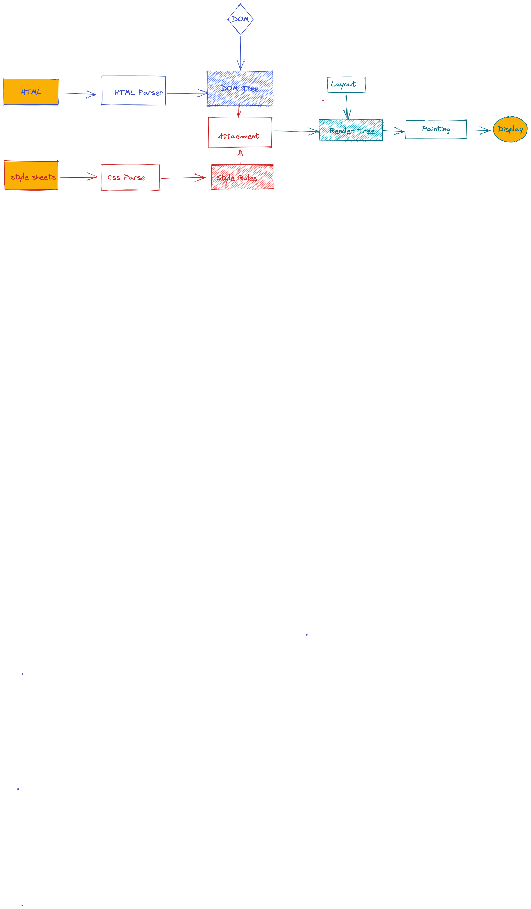

## css会堵塞渲染吗

**css并不会阻塞DOM树的解析，但是css加载会阻塞DOM树渲染。**

### 原因

因为你加载css的时候，可能会修改下面DOM节点的样式，如果css加载不阻塞DOM树渲染的话，那么当css加载完之后，DOM树可能又得重新重绘或者回流了，这就造成了一些没有必要的损耗。所以我干脆就先把DOM树的结构先解析完，把可以做的工作做完，然后等你css加载完之后，在根据最终的样式来渲染DOM树，这种做法性能方面确实会比较好一点。

## 总结

1. css加载不会堵塞DOM的解析
2. css加载会堵塞DOM的渲染
3. js可能会操作之前的DOM节点和Css样式，因此浏览器会维持html中css和js的顺序。因此，样式表会在后面的js执行前先加载执行完毕。所以css会阻塞后面js的执行。

对于浏览器来说，页面加载主要有两个事件，一个是DOMContentLoaded，另一个是onLoad。而onLoad没什么好说的，就是等待页面的所有资源都加载完成才会触发，这些资源包括css、js、图片视频等。

而DOMContentLoaded，顾名思义，就是当页面的内容解析完成后，则触发该事件。那么，正如我们上面讨论过的，css会阻塞Dom渲染和js执行，而js会阻塞Dom解析。那么我们可以做出这样的假设

###

css加载会阻塞后面的js

第一部分 自我介绍完 聊了下文本 协同合作的方案
第二部分 输入一串url到渲染页面所涉及到的知识点  https 和加密方案  css会堵塞dom吗 重排 重绘 区别

回流必将引起重绘，而重绘不一定会引起回流

第三部分 编程题  this的指向和变量提升
第四部分 vue和react有什么不同 讲讲fiber 讲讲为什么改成fiber
第五部分编程题  输出一个等待3秒 总共4次的函数
