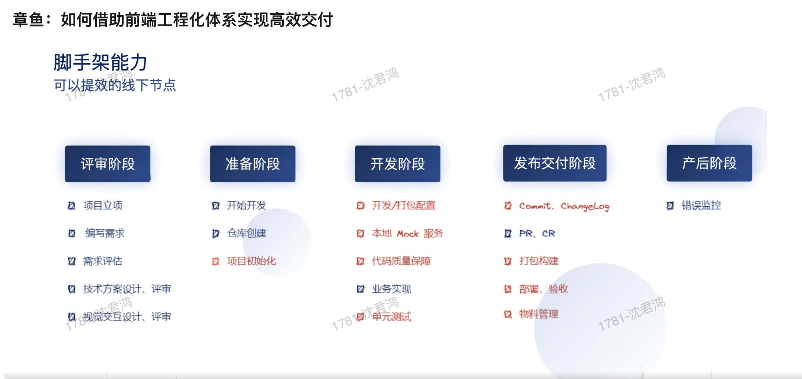

# 为什么选择了 qiankun

- single-spa
  single-spa 是一个用于前端微服务化的 JavaScript 前端解决方案 (本身没有处理样式隔离， js 执行隔离) 实现了路由劫持和应用加载。也是比较早的作出微前端的框架，下面的几个框架也是借鉴了不少内容。
  通过主项目提供注册逻辑、子应用提供三个协议接入方法和打包格式
  single-spa 只是实现了加载器、路由托管。沙箱隔离并没有实现。因此它只支持单应用的场景。

- qiankun
  这个框架是阿里出品的，也是比较早的微前端处理方式。总结来说它有以下特点：

简单——任意 js 框架均可使用。微应用接入像使用接入一个 iframe 系统一样简单，但实际不是 iframe。
完备——几乎包含所有构建微前端系统时所需要的基本能力，如 样式隔离、js 沙箱、预加载等。
生产可用——已在蚂蚁内外经受过足够大量的线上系统的考验及打磨，健壮性值得信赖。

---

qiankun 方案
qiankun 方案是基于 single-spa 的微前端方案。
特点

html entry 的方式引入子应用，相比 js entry 极大的降低了应用改造的成本；
完备的沙箱方案，js 沙箱做了 SnapshotSandbox、LegacySandbox、ProxySandbox 三套渐进增强方案，css 沙箱做了 strictStyleIsolation、experimentalStyleIsolation 两套适用不同场景的方案；
做了静态资源预加载能力；

不足

适配成本比较高，工程化、生命周期、静态资源路径、路由等都要做一系列的适配工作；
css 沙箱采用严格隔离会有各种问题，js 沙箱在某些场景下执行性能下降严重；
无法同时激活多个子应用，也不支持子应用保活；
无法支持 vite 等 esmodule 脚本运行；

EMP 方案
EMP 方案是基于 webpack 5 module federation 的微前端方案。
特点

webpack 联邦编译可以保证所有子应用依赖解耦；
应用间去中心化的调用、共享模块；
模块远程 ts 支持；

不足

对 webpack 强依赖，老旧项目不友好；
没有有效的 css 沙箱和 js 沙箱，需要靠用户自觉；
子应用保活、多应用激活无法实现；
主、子应用的路由可能发生冲突；

## 如何设计一个前端项目

因此我们在设计一个项目的时候，需要重点关注：

技术方案的设计和选型。

多人协作和团队规范的制订。

## 技术方案设计和选型

从 0 开始搭建一个项目，常常需要考虑以下的技术选型：

1. 前端框架和脚手架。

2. 状态管理工具。

3. 路由管理工具。

4. 代码构建和编译工具。

## 技术选型的影响因素

一般来说，从头开始搭建前端项目，首先要思考几个问题。

项目规模如何、功能交互是否复杂、面向哪些用户？

是否存在多人协作？团队规模大概是怎样的？

团队成员技术栈如何？对新技术的接受程度怎样？

是否有现有的技术方案可以参考？是否需要进行调整？

### 为什么要考虑这些问题呢？

项目规模和功能交互会影响框架和工具的选型，比如轻量项目可能 React/Vue 框架比较灵活，大型项目还可以使用 Angular 全家桶。

用户体系会影响系统兼容性的倾向，比如用户受众年龄偏大，则需要考虑使用机型性能可能相对较差、需兼容的机型品牌比较多。

存在多人协作需要考虑完善团队规范，同时尽量使用工具来保证流程规范。

团队技术栈倾向同样影响技术选型，如果有现成的技术方案和项目案例，可以考虑是否符合实际需要，使用团队成员熟练的工具可以避免很多踩坑的过程。

## 使用一致的代码开发规范

可以使用一些工具来确保代码符合规范：

1. 使用 Eslint 检测代码规范；

2. 使用 Prettier 自动化格式代码；

3. 使用 Git Commit Hooks 拒绝不符合规范的代码提交；

4. 使用流水线检测出不规范的代码，并拒绝合入主干分支；

5. 使用流水线检测出不规范的代码，并拒绝进入发布流程。

### 制定合适的代码流程规范

一般来说，开发流程会包括：

1. Git 创建分支过程：分支的命名，是否需要关联需求单或是 BUG 单。

2. Git 提交代码过程：检查代码是否符合规范，只允许合格的代码（Eslint 规范、单测覆盖率等）进行提交。

3. 分支提交过程：需要进行交叉 Code Review，对方同意后才允许合入代码。

4. 合入主干过程：对代码进行自动化构建和测试，功能正常且符合规范的代码才可合入主干。

5. 代码发布过程：自动拉取主干分支，创建发布分支，对代码进行自动化构建和测试，正常后会开始进入灰度发布流程。

通过自动化的工具我们同样可以确保以上流程按预期进行，很多团队也会使用持续集成（continuous integration，简称 CI）和持续部署（continuous deployment，简称 CD）。CI/CD 在项目中的落地，很多时候会表现为流水线的开发模式。

1. 系统质量的下降

1.1 项目频繁地调整（新增或者更换）开发人员，由于不熟悉项目，每个新加入的小伙伴都可能会埋下新的 Bug；
1.2 系统功能新增和迭代、不断壮大，各个模块间的耦合增加、复杂度增加，如果没法掌握系统的所有细节，很可能牵一发而动全身，产生自己认知以外的 Bug。

为了降低系统的复杂度，当项目发展到一定阶段的时候，会对系统进行局部或是整体的架构调整，比如模块的拆分、各个模块间的依赖解耦、引入新的状态管理工具、重复逻辑进行抽象和封装，等等。

1. 用户反馈问题跟进和定位；

2. 线上 Bug 修复和紧急发布；

3. 处理系统的监控告警，排查异常问题；

4.新功能灰度发布过程，自测、产品验证功能、提测、修复 Bug、灰度发布等各个流程都需要人工操作和主动关注；

4. 为了保证系统质量，需要完善自动化测试能力，包括单元测试、UI 测试、集成测试等；

5.项目成员的调整，需要进行工作的交接、指导对方的工作内容等。

### 提升系统质量： 项目设计和架构优化

1. 引入新的技术和工具的同时，需要考虑是否能兼容原有设计、团队成员熟悉成本、改造的工作量和预期的效果，选择性价比合适的方案落地。

2. 团队成员增加，沟通成本和对规范的理解出现差异。使用工具（Eslint/Prettier/Git hooks 等）将团队规范进行落地，保证开发过程中使用一致的技术栈、代码规范以及公共物料库（组件库、工具库），降低团队的沟通成本，确保代码的可读性和可维护性。

3. 项目功能模块过多，需要进行模块的拆分和解耦。将一些职责独立的模块进行拆包，使用 monorepo 或是 multirepo 的方式进行管理，模块可自行对技术方案、依赖关系梳理、变更、测试、发布等环节进行闭环，从而降低各个模块间的相互影响，降低系统的复杂度。

4. 项目代码量和文件数的增加，除了进行拆包以外，还需要更新或是优化项目构建工具（使用增量编译、使用 Tree-shaking、升级 Webpack 版本等），减少代码编译、打包等过程的耗时，提升开发效率。

5. 进行自动化测试能力的覆盖，补齐单模块的功能测试、各个模块间的集成测试、UI 组件的界面测试、接口的模拟环境测试、性能测试等。在每次系统发布的时候都可以自动化进行回归测试，避免某个改动影响了其他的功能模块、带来了认知以外的风险，确保系统质量不受影响。

6. 搭建完善的监控体系，在系统灰度、发布、线上运行的过程中可实时观察系统质量，配合告警能力及时发现问题并进行解决，保证系统运行的稳定性。

提升开发效率：项目研发和发布流程优化

## 项目研发和发布流程优化的核心点在于：将一切需要手动操作和关注的内容自动化。

从主干创建分支，开始进入开发；

开发完成后，补充相关自动化测试（单元测试、集成测试、UI 测试等）；

进行自动化测试的回归，确保系统整体功能能正常运行；

构建代码，部署测试环境，进入产品体验和测试流程；

修复产品体验问题和 Bug，并重复 2~4 步骤；

代码验证完成，进行团队内代码 Review 后，更新主干的分支，并进行代码构建和自动化回归测试；

根据团队 Git 规范（比如 Git Flow 流程），准备发布；

先进行版本灰度，灰度过程中登录监控系统关注各个指标是否有异常；

如果监控系统出现异常，进行问题定位，并在 Bug 修复之后返回到步骤 2；

灰度过程无异常，进行全量发布，发布完后同样观察监控系统是否有异常；

全量发布完成，结束需求单，并将版本进行归存（使用分支或者 git tag）。

---

持续集成（CI）：目的是让产品可以快速迭代，同时还能保持高质量。

持续部署（CD）：目的是代码在任何时刻都是可部署、可进入生产阶段。

## 模块耦合严重

1. 模块职责和边界定义不清晰，导致模糊的工作可能存在多个模块内；

2. 各个模块没有统一管理，导致模块在状态变更时需要手动通知相关模块；

3. 模块间的通信方式设计不合理，导致全局事件满天飞、A 模块内直接调用 B 模块等问题，隐藏的引用和事件可能导致内存泄漏。

解局之道：

1.项目规模调整后，对现有架构设计进行分析，如果不再合适则需要进行及时调整和优化。 2. 使用模块解耦的技术方案，将各个模块统一交由框架处理。 3. 梳理各个模块的职责，明确每个模块负责的工作和提供的功能，确定各个模块间的边界和调用方式。

常见考点:
• 冒泡 / 快排 - 排序类算法
• LRU / 排列组合 - 应⽤类算法
• 链表 / 堆 / 栈 / 树 / 图 - 数据结构类算法
• 分治 / 动规 - 算法思想
• 深度优先 / ⼴度优先

前端工程化体系实现高效交付

### 如何进行合理的分工排期

进行工作量评估的过程可以分为三步：

1. 确认技术方案，以及分工合作方式；

2. 拆分具体功能模块，分别进行工作量评估，输出具体的排期时间表；

3. 标注资源依赖情况和协作存在的风险，进行延期风险评估。

当我们确认好技术方案之后，需要针对实现细节拆分具体的功能模块，分别进行工作量的预估和分工排期。否则可能面临分工不明确、接口协议未对齐就匆忙开工、最终因为各种问题而返工等情况。

我们在进行工作量评估的时候，可以精确到半天的工作量预期。对独自开发的项目来说，同样可以通过拆解功能模块这个过程，来思考具体的实现方式，也能提前发现一些可能存在的问题，并相应地进行规避。

提供完整的工作量评估和排期计划表（精确到具体的日期），可以帮助我们有计划地推进项目。在开发过程中，我们可以及时更新计划的执行情况，团队的其他人也可以了解我们的工作情况。

工作量评估和排期计划表的另外一个重要作用，是通过时间线去严格约束我们的工作效率、及时发现问题，并在项目结束后可针对时间维度进行项目复盘。

为了确保项目能按照预期进行，我们还要对可能存在的风险进行分析，提前做好对应的准备措施
