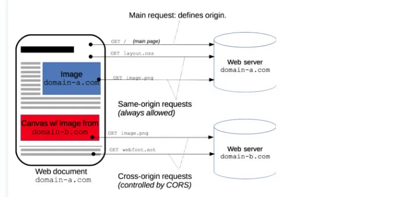

# 360 金融面试题

## 一面

1.  函数柯里化的理解和运用

函数柯里化就是生成一个闭包的环境, 然后在特定输入中输出东西

2.  防抖节流手写代码

```js
//去抖动
const debounce = (fn, wait) => {
  var timerId = null;

  return function () {
    if (timerId) {
      clearTimeout(timerId);
    }
    timerId = setTimeout(() => {
      fn.apply(this, arguments);
    }, wait);
  };
};
```

```js
// 节流
const throttle = (fn, wait) => {
  var lastTime,
    wait = wait || 0;
  return function () {
    var currentTime = +new Date();
    if (currentTime - lastTime > wait) {
      lastTime = currentTime;
      fn.apply(this, arguments);
    }
  };
};
```

3.  zoom 和 scale 区别，造成其差异的原因

- zoom 的缩放是相对于左上角的；而 scale 默认是居中缩放；
- zoom 的缩放改变了元素占据的空间大小；而 scale 的缩放占据的原始尺寸不变，页面布局不会发生变化；

4.  js 和 node 中 eventloop 机制分别是什么，其运行结果有什么差异

js 的 eventloop 是宏任务与微任务 差别点在于 node 上面有 i/o 的读写 process.env 的环境, js 中 队列中的一个宏任务进行完毕, 才会去执行微任务. 如此反复, 而 node 中, 则是所有宏任务执行完毕 才回去执行微任务.

5.  vue nextTick 原理，为什么优先使用 microtask 处理

[vue 源码分析之 nextTick.md](../../源码/vue/vue2/vue%20源码分析之%20nextTick.md)

6.  vue keep-alive 原理，LRU 缓存原理

[vue 源码分析之 keep-alive.md](../../源码/vue/vue2/vue%20源码分析之%20keep-alive.md)

7.  浏览器请求缓存机制

浏览器请求缓存机制 先判断是强缓存还是协商缓存，根据 cache-control 和 expries 去判断如果都过期的话 再去请求服务器 进行协商缓存 etag 和 last-modifiy 判断

8.  浏览器状态码有哪些，301 和 302 表现在客户端的区别，浏览器对 301 和 302 的处理有什么不同

200 404 500 301 302 304
301 是永久重定向 302 是临时重定向

301 跳转对查找引擎是一种对照驯良的跳转编制，也是查找引擎能够遭遇的跳转编制，它告诉查找引擎，这个地址弃用了，永远转向一个新地址，可以转移新域名的权重。而 302 重定向很容易被搜索引擎误认为是利用多个域名指向同一网站，那么你的网站就会被封掉，罪名是“利用重复的内容来干扰 Google 搜索结果的网站排名”。

301 重定向
当浏览器接收到服务端 301（永久）重定向返回码时，会将 original_url 和 redirect_url1 存储在浏览器缓存中，当再次请求 original_url 时，浏览器会从本地缓存中读取 redirect_url1 直接进行跳转，不再请求服务端。

在浏览器未清理缓存或缓存未失效的情况下，即使服务端将重定向地址修改为 redirect_url2，浏览器依然会跳转到 redirect_url1。

302 重定向
当浏览器接收到服务端 302（临时）重定向返回码时，不会进行缓存。每次请求 original_url 时，都会请求一下服务端。

301 永久重定向

所以浏览器会进行 2 次请求。第一次返回 301/302

服务器响应 状态码为 301+ location 为新的 url

浏览器会再次请求新的 URL

服务器一定要重定向而不是直接发送用户想看的网页呢，

1. 用不同地址会造成缓存友好性变差，当一个页面有好几个名字时， 它可能会在缓存里出现好几次
2. 搜索引擎排名有关，会将不同的地址带到同一个网站排名下。
3. http 网站跳转到 https 网站
4. 二级域名跳转到主域名，<http://www.abc.com> 跳转到 <http://abc.com>
5. 404 页面失效跳转到新的页面

302 临时重定向

302 使用的情况不太常见，因为这是个临时性的跳转，暂时性的把页面 A 跳转到页面 B，但是最终还会使用页面 A，这个情况一般就是网站短时间内进行改版，在不影响用户体验的情况下，临时把页面跳转到临时页面。

304 文件未变化

401 未登录

401 unauthorized，表示发送的请求需要有通过 HTTP 认证的认证信息

403 资源不可用

forbidden 通常由于服务器上文件或目录的权限设置导致, 比如 IIS 或者 apache 设置了访问权限不当

9.  如何区分简单请求和复杂请求，options 请求在什么场景下会出现，其作用是什么



看有没有发 options 请求, 非 get 请求下, 进行权限的预请求.
浏览器必须首先使用 OPTIONS 方法发起一个预检请求（preflight request），从而获知服务端是否允许该跨源请求。服务器确认允许之后，才发起实际的 HTTP 请求。在预检请求的返回中，服务器端也可以通知客户端，是否需要携带身份凭证（包括 Cookies 和 HTTP 认证相关数据）。

当请求满足下述任一条件时，即应首先发送预检请求（使用 OPTIONS）：

```js
1、使用了下面任一 HTTP 方法：
PUT
DELETE
CONNECT
OPTIONS
TRACE
PATCH
2、人为设置了对 CORS 安全的首部字段集合之外的其他首部字段。该集合为：
Accept
Accept-Language
Content-Language
Content-Type (but note the additional requirements below)
DPR
Downlink
Save-Data
Viewport-Width
Width
3、Content-Type 的值不属于下列之一:
application/x-www-form-urlencoded
multipart/form-data
text/plain
```

请求方法不是 get head post
post 的 content-type 不是 application/x-www-form-urlencode,multipart/form-data,text/plain [也就是把 content-type 设置成"application/json"]
请求设置了自定义的 header 字段: 比如业务需求，传一个字段，方面后端获取，不需要每个接口都传

例如设置了 post 请求的 content-type：application/json,就会发生预请求

在 CORS 中，可以使用 OPTIONS 方法发起一个预检请求，服务器基于从预检请求获得的信息来判断，以检测实际请求是否可以被服务器所接受。

10. 现在有一个能装 5 升水的桶和一个能装 3 升水的桶，问如何利用这两个桶装 4 升水

先把五升水 加到三升桶里 求出 2 升高度, 在把五升桶加到三升的同样高度, 求出两个两升.

11. 算法题：洗牌算法

```js
Solution.prototype.shuffle = function () {
  const nums = this.nums.slice(0);
  let n = nums.length;

  // 产生的结果有 n! 种可能
  for (let i = 0; i < n; i++) {
    // 从 i 到 n-1 随机选一个
    const rand = randOne(i, n - 1);
    console.log("rand: ", rand);
    // 交换nums数组i和rand下标的两个元素
    [nums[i], nums[rand]] = [nums[rand], nums[i]];
  }

  return nums;
};

// 获取闭区间 [n, m] 内的一个随机整数
function randOne(n, m) {
  return Math.floor(Math.random() * (m - n + 1)) + n;
}
```

12. 算法题：在一个 int 型数组中，找出所有符合条件的三元组[a,b,c]，满足 a+b+c=0。要求时间复杂度不得超过 O(n^2)

    [三数求和](../../算法/15#三数之和.js)

## 二面

这一面主要聊项目，完成之后随便问了几个问题，最后让手写了两个 leetcode hard 算法题

1.  移动端 h5 适配方案，1px 边框问题如何解决

可以在 font-size：1 基础上 采用 transform( scaleX（0。5）scaleY（0。5）)

2.  移动端点击一个按钮，一共会触发哪些事件，它们的触发先后顺序是怎样的

捕获 目标 冒泡

3.  首屏加载的性能指标有哪些，它们分别的意义是什么，如何优化首屏加载速度

首屏加载的指标有白屏时间， 用户可操作时间 ， 首次渲染时间。
用户可操作时间，代表页面已经显示，但是还不能够交互
白屏时间，指用户能够看到内容的时间

优化首屏加载速度可以从一下几个角度来：

网络层面: 首先 dns-prefer, 预解析 dns. 接着就是采用更快的连接方式例如 http2.0 或者 http3.0, 采用它们的新特性达到更快的网络连接.

从解析方面: 首先是减少包的大小： 我们可以采用异步加载组件的方式，将包进行拆分，减少包的提交大小，只加载出首屏需要用到的包.
可以先预加载出骨骼屏幕, 提升用户体验

4.  手写算法：鸡蛋掉落问题。

你有 K 个鸡蛋和一栋 N 层楼的建筑。你可以取一个鸡蛋从任意楼层扔下，查看鸡蛋是否会摔碎；若鸡蛋被摔碎，你就不能再扔它。现已知存在楼层 F，小于等于 F 的楼层落下的鸡蛋都不会碎，大于 F 的楼层落下落下的鸡蛋都会碎。问找到这个 F 最少要扔多少次鸡蛋。(详情见 leetcode 887 题)

5.  手写算法：编辑距离。

给你两个单词 word1 和 word2，计算将 word1 转为 word2 所使用的最少操作数。你可以对一个单词进行如下三种操作：插入一个字符、删除一个字符、替换一个字符(详情见 leetcode 72 题)

## 三面

1.  flutter 和原生安卓/iOS 开发的区别，怎么看待 flutter 的前景，其缺陷是什么

flutter 是 google 开发的新语言框架 是用 dart 写的 其底层采用了新的模版引擎，在性能方面非常出色，缺陷是组建嵌套不利于阅读

2.  jsBridge 原理，webview 如何实现和 native 通信

3.  已缓存未过期的文件，如何强制刷新

我们可以改变它的 hash 值,达到 last-modified 更新

f5 强制刷新

4.  js 的数组和对象，在 v8 中分别是如何处理的，异同点是什么

5.  数组有哪些内置属性

内置的属性有: length prototype

6.  前后台通信时，如何保证敏感数据不被第三方窃听获取。对加密算法有什么了解
    我们可以采用 https 连接, 由客户端和服务端约定生成的公钥和私钥对数据进行非对称加密,在采用 hash 对数据进行 hash 加密.

7.  oAuth2.0 的登录详细流程

单点登录

keycloak 与其他 sso 解决方案一样，使用 cookie 来跟踪 sso 会话，如果用户登录到 application2，他将在其浏览器拥有 Keycloak SSO cookie. 因此当用户第一次访问 Application1 的 因为他没有会话，他会被重定向到 keyclock 登录页，keycloak 会注意到 sso cookie 在哪里并且是有效的，所以将用户视为登录用户，不会呈现任何登录 UI，只是将其重定向回 Application1

8.  对 git flow 了解吗，应该如何使用
